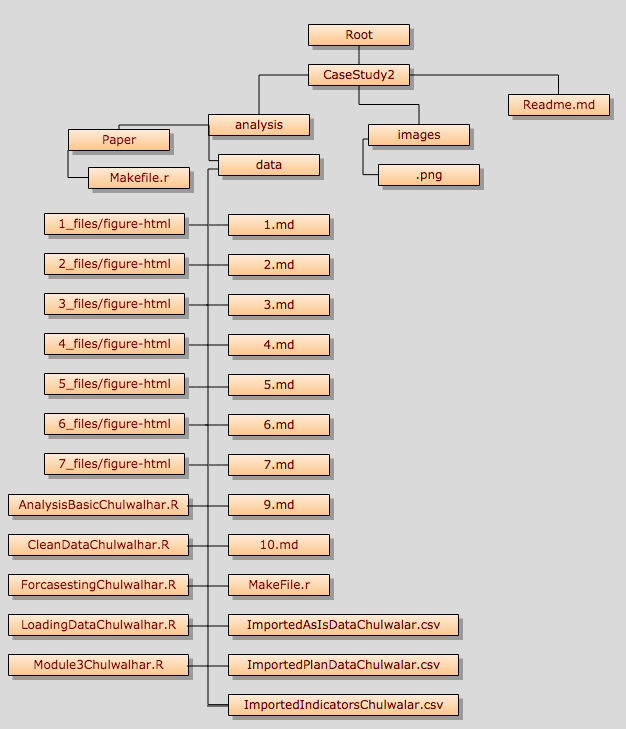

<br>

#### Introduction


Chulwalar is part of the island group Urbano in the northern hemisphere. They 
are famous for their plants which flower in winter. There are three main plants
that Chulwalar exports: Efak is a leafy bush with white flowers, Wuge is a grass 
like plant with tiny pink flowers and Etel is a flowering tree. Etel comes in 
two varieties: red flowers and blue flowers. Due to the nature of the products,
exports generally are higher towards the end of the year. 
Chulwalar celebrates its independence on 1st December each year. On this day it
is custom to give presents to family and friends. Chulwalar also celebrates the 
March Equinox as a time of rebirth in the northern hemisphere. 
<br>
<br>
The Prime Minister of Chulwalar has asked us to help him in forecasting the 
exports. In order to do this we have been given as is data and plan data as well
as a list of indicators which may affect exports. Our job is to find out the best
way to forecast Chulwalar's exports in 2014 based on data collected before this year.
<br>
<br>

####Assignment

Choose one of the flowers from the data provided and complete the following analysis:

- Section the code into modules for importing data, cleaning/modifying data, exploring data, analyzing data

- Add interpretation

- Determine which model is best

- Give a conclusion of your analysis as far as forecasting exports for Chulwalar

- For this project, we will be forecasting the "<font color="red">RedEtel</font>" flower exports for Chulwalar. 

****************************

#### Table of Contents

* 1.0   [Preperation, import and convert data](https://github.com/wkerneck/CaseStudy2/blob/master/analysis/data/1.md)
* 1.1   [Import the exports data and the indicators](https://github.com/wkerneck/CaseStudy2/blob/master/analysis/data/1.md)
* 1.2   [Transformation the data into vectors and time series](https://github.com/wkerneck/CaseStudy2/blob/master/analysis/data/1.md)
<br><br>
* 2.0   [Analysis of the basic data](https://github.com/wkerneck/CaseStudy2/blob/master/analysis/data/2.md) 
* 2.1   [Development of the business portfolio](https://github.com/wkerneck/CaseStudy2/blob/master/analysis/data/2.md)
* 2.2   [Correlation between As Is and Plan data](https://github.com/wkerneck/CaseStudy2/blob/master/analysis/data/2.md)
* 2.3   [Time series analysis](https://github.com/wkerneck/CaseStudy2/blob/master/analysis/data/2.md)
* 2.3.1 ["stl" function](https://github.com/wkerneck/CaseStudy2/blob/master/analysis/data/2.md)
* 2.3.2 [Modification of the seasonal componant to a monthly base.](https://github.com/wkerneck/CaseStudy2/blob/master/analysis/data/2.md)
<br><br>
* 3.0   [Correlation of different external indicators](https://github.com/wkerneck/CaseStudy2/blob/master/analysis/data/3.md)
* 3.1   [Definition of the indicators and their correlation with the basic data](https://github.com/wkerneck/CaseStudy2/blob/master/analysis/data/3.md)
* 3.2   [Correlation of the indicators with a time offset](https://github.com/wkerneck/CaseStudy2/blob/master/analysis/data/3.md)
* 3.3   [Correlation of the indicators with each another](https://github.com/wkerneck/CaseStudy2/blob/master/analysis/data/3.md)
<br><br>
* 4.0   [Development of forecasting models using tslm()](https://github.com/wkerneck/CaseStudy2/blob/master/analysis/data/4.md)
* 4.1   [ModelWithAlllIndicators and with each indicator individually](https://github.com/wkerneck/CaseStudy2/blob/master/analysis/data/4.md)
* 4.2.1 [ModelWithHighCorrelatingIndicators](https://github.com/wkerneck/CaseStudy2/blob/master/analysis/data/4.md)      
* 4.2.2 [ModelWithLowCorrelatingIndicators](https://github.com/wkerneck/CaseStudy2/blob/master/analysis/data/4.md)                
* 4.3   [ModelWithTrendAndSeasonalityOnly](https://github.com/wkerneck/CaseStudy2/blob/master/analysis/data/4.md)  
* 4.4   [ModelWithoutTrendAndSeasonality](https://github.com/wkerneck/CaseStudy2/blob/master/analysis/data/4.md)
* 4.5   [ModelWithEfakExportsIndicators](https://github.com/wkerneck/CaseStudy2/blob/master/analysis/data/4.md)
* 4.6   [ModelWithWugeExportsIndicators](https://github.com/wkerneck/CaseStudy2/blob/master/analysis/data/4.md)
* 4.7   [ModelWithTotalEtel](https://github.com/wkerneck/CaseStudy2/blob/master/analysis/data/4.md)
<br>
<br>
* 5.0     [Forecasts with the models](https://github.com/wkerneck/CaseStudy2/blob/master/analysis/data/5.md)
* 5.1     [Shorten the time series in order to test the forecasts](https://github.com/wkerneck/CaseStudy2/blob/master/analysis/data/5.md)
* 5.2     [Forecasting und testing the models](https://github.com/wkerneck/CaseStudy2/blob/master/analysis/data/5.md)
* 5.2.1.1 [Forecast ModelWithHighCorrelatingIndicators](https://github.com/wkerneck/CaseStudy2/blob/master/analysis/data/5.md)
* 5.2.1.2 [Forecast ModelWithLowCorrelatingIndicators](https://github.com/wkerneck/CaseStudy2/blob/master/analysis/data/5.md)
* 5.2.2   [Forecast ModelWithTrendAndSeasonalityOnly](https://github.com/wkerneck/CaseStudy2/blob/master/analysis/data/5.md)
* 5.2.3   [Forecast ModelWithEfakExportsIndicators](https://github.com/wkerneck/CaseStudy2/blob/master/analysis/data/5.md)
* 5.2.4   [Forecast ModelWithWugeExportsIndicators](https://github.com/wkerneck/CaseStudy2/blob/master/analysis/data/5.md)
* 5.2.5   [Forecast ModelTotalEtel](https://github.com/wkerneck/CaseStudy2/blob/master/analysis/data/5.md)
* 5.2.6   [Forecast ModelWithTotalUrbanoExport](https://github.com/wkerneck/CaseStudy2/blob/master/analysis/data/5.md)
* 5.2.7   [Forecast ModelWithNationalHolidays](https://github.com/wkerneck/CaseStudy2/blob/master/analysis/data/5.md)
* 5.2.8   [Forecast ModelWithInfluenceNationalHoliday](https://github.com/wkerneck/CaseStudy2/blob/master/analysis/data/5.md)
<br>
<br>
* 6.0     [Forecast for 2014](https://github.com/wkerneck/CaseStudy2/blob/master/analysis/data/6.md)
<br>
<br>
* 7.0     [Developing forecasting models with alternative model approaches](https://github.com/wkerneck/CaseStudy2/blob/master/analysis/data/7.md)
* 7.1     [Exponential smoothing](https://github.com/wkerneck/CaseStudy2/blob/master/analysis/data/7.md)
* 7.1.1   [Simple expontential smoothing](https://github.com/wkerneck/CaseStudy2/blob/master/analysis/data/7.md)
* 7.1.2   [Holt's linear trend method](https://github.com/wkerneck/CaseStudy2/blob/master/analysis/data/7.md)
* 7.1.3   [Holt-Winter's seasonal method](https://github.com/wkerneck/CaseStudy2/blob/master/analysis/data/7.md)
* 7.1.4   [Innovations state space models for exponential smoothing](https://github.com/wkerneck/CaseStudy2/blob/master/analysis/data/7.md)
<br>
<br>
* 8.0     [Comparison of the models](https://github.com/wkerneck/CaseStudy2/blob/master/analysis/data/8.md)
<br>
<br>
* 9.0     [Summary of results](https://github.com/wkerneck/CaseStudy2/blob/master/analysis/data/9.md)
<br>
<br>
* 10.0    [Acknowledgements](https://github.com/wkerneck/CaseStudy2/blob/master/analysis/data/10.md)

****************************

#### Project File Structure



****************************

#### Preliminary Steps

In order for the analysis of the three datasets you must set your working directory to the following:

```{r}
setwd("/Users/wkerneck/desktop/CaseStudy2/analysis/data")
```

The libraries listed below must be installed in order for the functions outlined in the steps below to execute. Load 'fpp' package in order to obtain the forecasting functions. Load 'tcltk' for pause function.

```{r message=FALSE, warning=FALSE}
library(fpp)
library(tcltk)
mywait <- function() {
    tt <- tktoplevel()
    tkpack( tkbutton(tt, text='Continue', command=function()tkdestroy(tt)),
        side='bottom')
    tkbind(tt,'<Key>', function()tkdestroy(tt) )

    tkwait.window(tt)
}

cat("Success: All libaries downloaded")
```


