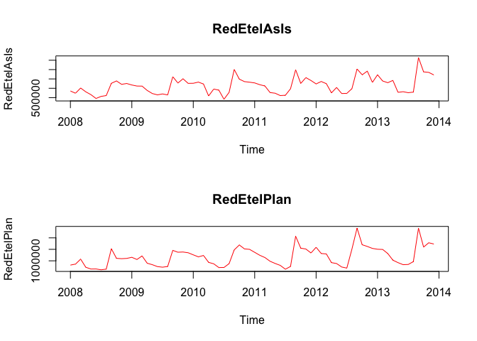
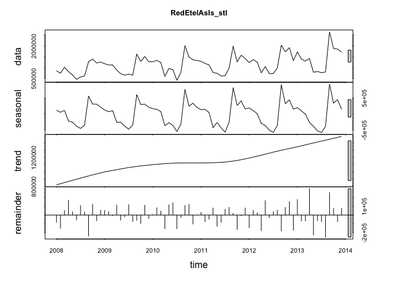
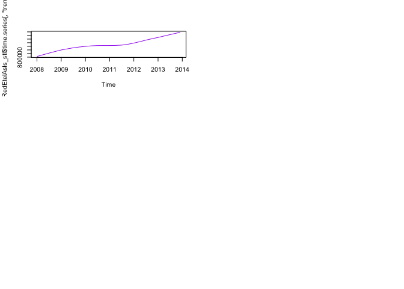
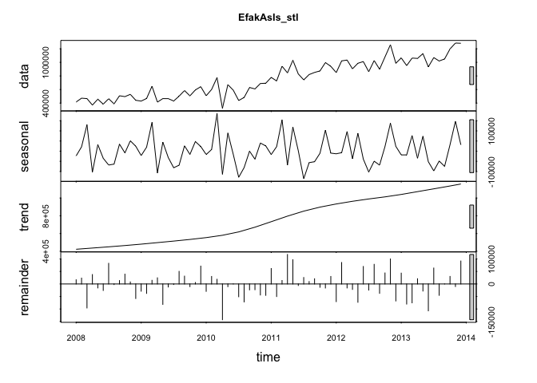

# 2016-0509 MSDS 6304-401 Case Study 2
Nathan Chris Woodard, Jessica Wheeler, Bill Kerneckel  
July 7, 2016  

<br>

#### Introduction


Chulwalar is part of the island group Urbano in the northern hemisphere. They 
are famous for their plants which flower in winter. There are three main plants
that Chulwalar exports: Efak is a leafy bush with white flowers, Wuge is a grass 
like plant with tiny pink flowers and Etel is a flowering tree. Etel comes in 
two varieties: red flowers and blue flowers. Due to the nature of the products,
exports generally are higher towards the end of the year. 
Chulwalar celebrates its independence on 1st December each year. On this day it
is custom to give presents to family and friends. Chulwalar also celebrates the 
March Equinox as a time of rebirth in the northern hemisphere. 
<br>
<br>
The Prime Minister of Chulwalar has asked us to help him in forecasting the 
exports. In order to do this we have been given as is data and plan data as well
as a list of indicators which may affect exports. Our job is to find out the best
way to forecast Chulwalar's exports in 2014 based on data collected before this year

<strong>Assignment</strong>

Choose one of the flowers from the data provided and complete the following analysis:

- Section the code into modules for importing data, cleaning/modifying data, exploring data, analyzing data

- Add interpretation

- Determine which model is best

- Give a conclusion of your analysis as far as forecasting exports for Chulwalar

- For this project, we will be forecasting the "RedEtel" flower exports for Chulwalar. 

****************************

#### Table of Contents

- 1.0   [Preperation, import and convert data](#id-section1)
- 1.1   [Import the exports data and the indicators](#id-section1.1)
- 1.2   [Transformation the data into vectors and time series](#id-section1.2)

- 2.0   [Analysis of the basic data](#id-section2) 
- 2.1   [Development of the business portfolio](#id-section2.1)
- 2.2   [Correlation between As Is and Plan data](#id-section2.2)
- 2.3   [Time series analysis](#id-section2.3)
- 2.3.1 ["stl" function](#id-section2.3.1)
- 2.3.2 [Modification of the seasonal componant to a monthly base.](#id-section2.3.2)

- 3.0 [Correlation of different external indicators](#id-section3)
- 3.1 [Definition of the indicators and their correlation with the basic data](#id-section3.1)
  
- 19.0  [Conclusion and Summary.](#id-section19) 
- 20.0  [Acknowledgements](#id-section20) 

****************************


#### Preliminary Steps

In order for the analysis of the three datasets you must set your working directory to the following:


```r
setwd("/Users/wkerneck/desktop/CaseStudy2/")
```

The libraries listed below must be installed in order for the functions outlined in the steps below to execute. Load 'fpp' package in order to obtain the forecasting functions. Load 'tcltk' for pause function.


```r
library(fpp)
library(tcltk)
mywait <- function() {
    tt <- tktoplevel()
    tkpack( tkbutton(tt, text='Continue', command=function()tkdestroy(tt)),
        side='bottom')
    tkbind(tt,'<Key>', function()tkdestroy(tt) )

    tkwait.window(tt)
}

cat("Success: All libaries downloaded")
```

```
## Success: All libaries downloaded
```


****************************

<div id='id-section1.1'/>
####  1.1 Import the exports data and the indicators

In order to test the script, it is necessary to change the three file paths. The files have been sent together with the script.

- The Export data for Chulwalar   are in two .csv files.
- One file for the as is data: ImportedAsIsDataChulwalar.csv
- and another one for the plan data: ImportedPlanDataChulwalar.csv


```r
ImportedAsIsData <- read.csv("ImportedAsIsDataChulwalar.csv", header = F, sep=";", fill = T)

ImportedPlanData <- read.csv("ImportedPlanDataChulwalar.csv", header = F, sep=";", fill = T)

ImportedIndicators <- read.csv("ImportedIndicatorsChulwalar.csv", header = F, sep=";", fill = T)

head(ImportedAsIsData)
```

```
##            V1      V2      V3      V4      V5      V6      V7      V8
## 1 Total As Is    2008    2009    2010    2011    2012    2013    2014
## 2         Jan 2313221 2610573 2760688 3112861 3093088 4119526 4308161
## 3         Feb 1950131 2371327 2918333 2926663 3679308 3535744 4155378
## 4         Mar 2346635 2743786 3227041 3294784 3433364 3560974 3924332
## 5         Apr 2039787 2125308 1613888 2577079 2714899 3760065 3659121
## 6         May 1756964 1850073 2550157 2774068 3011767 2959933 3898758
```

```r
head(ImportedPlanData)
```

```
##           V1      V2      V3      V4      V5      V6      V7      V8
## 1 Total Plan    2008    2009    2010    2011    2012    2013    2014
## 2        Jan 2243103 2547980 2965885 3113110 3895396 3580325 4474000
## 3        Feb 2162705 2247049 2751170 2883766 3588151 3863212 4185565
## 4        Mar 2720911 2731156 2906493 2957893 3787240 3606083 4278119
## 5        Apr 2011182 2020158 2383358 2601648 3036434 3213575 3985542
## 6        May 1877757 2098038 2246893 2370949 2907891 3139128 3605973
```

```r
head(ImportedIndicators)
```

```
##                        V1     V2     V3     V4     V5     V6     V7   V8
## 1 Change in export prices 2008.0 2009.0 2010.0 2011.0 2012.0 2013.0 2014
## 2                     Jan   97.4   98.3   99.0  100.7  102.8  104.5   NA
## 3                     Feb   97.8   98.9   99.4  101.3  103.5  105.1   NA
## 4                     Mar   98.3   98.7   99.9  101.9  104.1  105.6   NA
## 5                     Apr   98.1   98.8  100.0  101.9  103.9  105.1   NA
## 6                     Mai   98.7   98.7   99.9  101.9  103.9  105.5   NA
```

****************************
<div id='id-section1.2'/>
####  1.2 Transformation the data into vectors and time series.

In order to be able to work with the partial data sets later, these need to be split into individual vectors and converted into times series.


```r
RedEtelAsIsVector <- c(ImportedAsIsData [72:83,2],ImportedAsIsData [72:83,3],ImportedAsIsData [72:83,4],ImportedAsIsData [72:83,5],ImportedAsIsData [72:83,6],ImportedAsIsData [72:83,7])
RedEtelPlanVector <- c(ImportedPlanData[72:83,2],ImportedPlanData[72:83,3],ImportedPlanData[72:83,4],ImportedPlanData[72:83,5],ImportedPlanData[72:83,6],ImportedPlanData[72:83,7])
```

The data is saved as a vector and needs to be converted into a time series.


```r
RedEtelAsIs <- ts(RedEtelAsIsVector, start=c(2008,1), end=c(2013,12), frequency=12)
RedEtelPlan <- ts(RedEtelPlanVector, start=c(2008,1), end=c(2013,12), frequency=12)
```

Call up the time series to check everything has worked.


```r
RedEtelAsIs 
```

```
##          Jan     Feb     Mar     Apr     May     Jun     Jul     Aug
## 2008  853776  736694 1014008  812014  660628  456630  566373  610931
## 2009 1175792 1119734 1115643  885413  719792  648758  698466  644578
## 2010 1267682 1331017 1226866  589628  958960  899709  412664  781363
## 2011 1286374 1191422 1122604  773151  734947  611045  627198  975098
## 2012 1234541 1362023 1247246  755347 1044249  718482  729011  980154
## 2013 1722000 1389184 1299670 1420039  784033  817182  764120  796123
##          Sep     Oct     Nov     Dec
## 2008 1266532 1392424 1212117 1255369
## 2009 1619860 1281524 1507640 1263440
## 2010 2006398 1487680 1357176 1325761
## 2011 1991259 1259658 1570817 1414876
## 2012 2030676 1720301 1917408 1314697
## 2013 2641226 1877924 1850111 1713603
```

```r
RedEtelPlan
```

```
##          Jan     Feb     Mar     Apr     May     Jun     Jul     Aug
## 2008  814386  857462 1073889  720009  642450  644444  610130  638530
## 2009 1152613 1057727 1212424  895208  831309  748679  722409  754196
## 2010 1260092 1172990 1232117  932696  868927  706756  711291  876363
## 2011 1369528 1240695 1142301  981318  884650  800289  634107  755372
## 2012 1589109 1318301 1299159  921703  880796  731299  683008 1512234
## 2013 1503751 1494858 1316966 1028055  920750  831961  841936  965319
##          Sep     Oct     Nov     Dec
## 2008 1526750 1107807 1092867 1105165
## 2009 1454231 1374688 1382952 1350972
## 2010 1475679 1689726 1520284 1498441
## 2011 2070259 1550970 1513274 1341595
## 2012 2424705 1699817 1625965 1539945
## 2013 2421272 1598167 1785268 1731360
```
****************************
<div id='id-section2.0'/>
#### 2. Analysis of the basic data  
<div id='id-section2.1'/>
#### 2.1 Development of the business portfolio

Due to the different scales, it makes sense to plot each graph individually instead of plotting them all on one set of axes. 


```r
par(mfrow=c(2,1))
plot(RedEtelAsIs, col="red", main="RedEtelAsIs")
plot(RedEtelPlan, col="red", main="RedEtelPlan")
```

<!-- -->

```r
mywait()
```

```
## <Tcl>
```

****************************
<div id='id-section2.1'/>
#### 2.1 Development of the business portfolio

Test the correlation between As Is and Plan data in order to test how exact the planning is. Correlation is a measure of linear relationship between two variables. 


```r
cor(RedEtelAsIs , RedEtelPlan)
```

```
## [1] 0.9106702
```

****************************
<div id='id-section2.3'/>
#### 2.3 Time series analysis

****************************
<div id='id-section2.3.1'/>
#### 2.3.1 "stl" function

The time series can be analysed using the stl function in order to seperate the trend, seasonality and remainder (remaining coincidential) components from one another.


```r
RedEtelAsIs_stl <- stl(RedEtelAsIs , s.window=5)
```


```r
plot(RedEtelAsIs_stl, col="black", main="RedEtelAsIs_stl")
```

<!-- -->

```r
RedEtelAsIs_stl
```

```
##  Call:
##  stl(x = RedEtelAsIs, s.window = 5)
## 
## Components
##             seasonal     trend   remainder
## Jan 2008  115268.835  819418.3  -80911.162
## Feb 2008   53585.615  835090.7 -151982.316
## Mar 2008  111466.463  850763.1   51778.461
## Apr 2008 -223395.889  866435.4  168974.440
## May 2008 -257525.355  881768.0   36385.394
## Jun 2008 -386103.162  897100.5  -54367.310
## Jul 2008 -454551.470  912433.0  108491.485
## Aug 2008 -353485.938  927380.2   37036.720
## Sep 2008  562461.720  942327.5 -238257.172
## Oct 2008  310944.528  957274.7  124204.786
## Nov 2008  306904.849  971015.9  -65803.760
## Dec 2008  214406.334  984757.1   56205.531
## Jan 2009  124363.076  998498.4   52930.565
## Feb 2009   71697.616 1008743.3   39293.091
## Mar 2009  103161.725 1018988.2   -6506.953
## Apr 2009 -257075.580 1029233.2  113255.418
## May 2009 -260763.268 1039127.1  -58571.874
## Jun 2009 -380805.212 1049021.1  -19457.912
## Jul 2009 -479246.894 1058915.1  118797.789
## Aug 2009 -347308.936 1066343.0  -74456.050
## Sep 2009  605315.129 1073770.9  -59225.996
## Oct 2009  296829.840 1081198.7  -96504.588
## Nov 2009  308679.739 1086986.0  111974.233
## Dec 2009  210565.226 1092773.3  -39898.534
## Jan 2010  165231.780 1098560.6    3889.633
## Feb 2010  144199.451 1103536.8   83280.783
## Mar 2010   73948.266 1108512.9   44404.788
## Apr 2010 -368967.981 1113489.1 -154893.145
## May 2010 -274074.598 1116232.9  116801.697
## Jun 2010 -359642.195 1118976.7  140374.518
## Jul 2010 -553371.024 1121720.5 -155685.429
## Aug 2010 -315325.262 1122005.8  -25317.534
## Sep 2010  774692.841 1122291.1  109414.018
## Oct 2010  242868.585 1122576.5  122234.930
## Nov 2010  337167.718 1122626.4 -102618.100
## Dec 2010  205190.103 1122676.3   -2105.381
## Jan 2011  133952.721 1122726.2   29695.105
## Feb 2011  142906.823 1123505.9  -74990.731
## Mar 2011   45715.744 1124285.6  -47397.386
## Apr 2011 -432326.121 1125065.4   80411.745
## May 2011 -266747.553 1127972.9 -126278.375
## Jun 2011 -436589.538 1130880.5  -83245.941
## Jul 2011 -572771.802 1133788.0   66181.771
## Aug 2011 -254066.178 1141308.2   87855.956
## Sep 2011  824288.759 1148828.4   18141.828
## Oct 2011  266961.044 1156348.6 -163651.649
## Nov 2011  411252.213 1167560.9   -7996.121
## Dec 2011  155394.594 1178773.2   80708.196
## Jan 2012  188862.232 1189985.5 -144306.744
## Feb 2012  106679.632 1203067.9   52275.454
## Mar 2012    5345.035 1216150.3   25750.648
## Apr 2012 -295813.639 1229232.7 -178072.081
## May 2012 -363944.157 1243491.3  164701.888
## Jun 2012 -509744.966 1257749.8  -29522.851
## Jul 2012 -580474.662 1272008.4   37477.296
## Aug 2012 -361163.446 1284870.0   56447.422
## Sep 2012  915303.837 1297731.7 -182359.519
## Oct 2012  322707.245 1310593.3   87000.416
## Nov 2012  441745.957 1322405.3  153256.733
## Dec 2012  152706.817 1334217.3 -172227.099
## Jan 2013  198867.808 1346029.3  177102.939
## Feb 2013   96731.864 1359290.0  -66837.878
## Mar 2013   -6338.588 1372550.8  -66542.188
## Apr 2013 -265875.136 1385811.5  300102.598
## May 2013 -387655.909 1398857.8 -227168.886
## Jun 2013 -529820.071 1411904.1  -64901.981
## Jul 2013 -584752.754 1424950.3  -76077.555
## Aug 2013 -390807.670 1437753.9 -250823.189
## Sep 2013  935099.766 1450557.4  255568.824
## Oct 2013  338995.467 1463361.0   75567.574
## Nov 2013  450559.803 1476384.4  -76833.165
## Dec 2013  148428.084 1489407.8   75767.153
```

```r
mywait()
```

```
## <Tcl>
```

```r
par(mfrow=c(3,2))

plot(RedEtelAsIs_stl$time.series[,"trend"], col="purple")

mywait()
```

```
## <Tcl>
```

<!-- -->

****************************
<div id='id-section2.3.2'/>
#### 2.3.2 Modification of the seasonal componant to a monthly base

The modification of the seasonlity component can also be changed into a monthly view. It only makes sense to do this if the seasonality componant as the trend looks almost identical and the remainder is then randomly spread. 


```r
monthplot(RedEtelAsIs_stl$time.series[,"seasonal"], main="", ylab="Seasonal")
```

<!-- -->

```r
mywait()
```

```
## <Tcl>
```

****************************
<div id='id-section3'/>
#### 3 Correlation of different external indicators

****************************
<div id='id-section3.1'/>
#### 3.1 Definition of the indicators and their correlation with the basic data

The following indicators are to be tested:

1   Monthly Change in Export Price Index (CEPI)
2 	Monthly Satisfaction Index (SI) government based data
3 	Average monthly temperatures in Chulwalar
4 	Monthly births in Chulwalar
5 	Monthly Satisfaction Index (SI) external index 
6 	Yearly Exports from Urbano
7 	Yearly number of Globalisation Party members in Chulwalar
8 	Monthly Average Export Price Index for Chulwalar
9 	Monthly Producer Price Index (PPI) for Etel in Chulwalar
10 	National Holidays
11 	Chulwalar Index (Total value of all companies in Chulwalar)
12	Monthly Inflation rate in Chulwalar
13	Proposed spending for National Holidays
14    Influence of National Holiday

The indicators will be converted into individual  vectors and subsequently converted into time series. The correlation of the indicators will then be tested against the As Is exports for Chulwalar. 

Monthly Change in Export Price Index (CEPI)


```r
CEPIVector <- c(ImportedIndicators[2:13,2],ImportedIndicators[2:13,3],ImportedIndicators[2:13,4],ImportedIndicators[2:13,5],ImportedIndicators[2:13,6],ImportedIndicators[2:13,7])
CEPI <- ts(CEPIVector , start=c(2008,1), end=c(2013,12), frequency=12)
plot(CEPI, main="CEPI")
```

<!-- -->

```r
cor(RedEtelAsIs , CEPI)
```

```
## [1] 0.3587646
```

```r
mywait()
```

```
## <Tcl>
```
****************************
<div id='id-section19'/>
#### Conclusion and Summary

****************************
<div id='id-section20'/>
#### Acknowledgements

Planning and forecasting in a volatile setting: the Chulwalar case v0.8alpha        

Contributing authors:
<ul>
<li>Amy Wheeler</li>
<li>Nina Weitkamp</li>
<li>Patrick Berlekamp</li>
<li>Johannes Brauer</li>
<li>Andreas Faatz</li>
<li>Hans-Ulrich Holst</li>
</ul>
                                                                             
Designed and coded at Hochschule Osnabrück, Germany              
Contact: faatz@wi.hs-osnabrueck.de                     

Thanks to: Rob Hyndman for all the lovely forecasting libraries in R                                                                                                    
