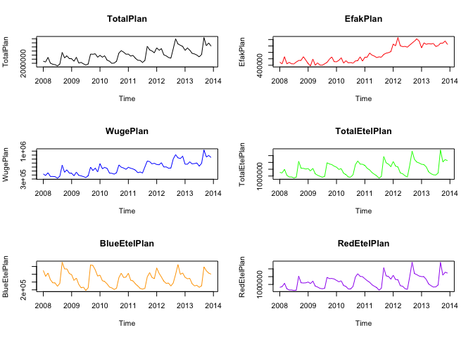
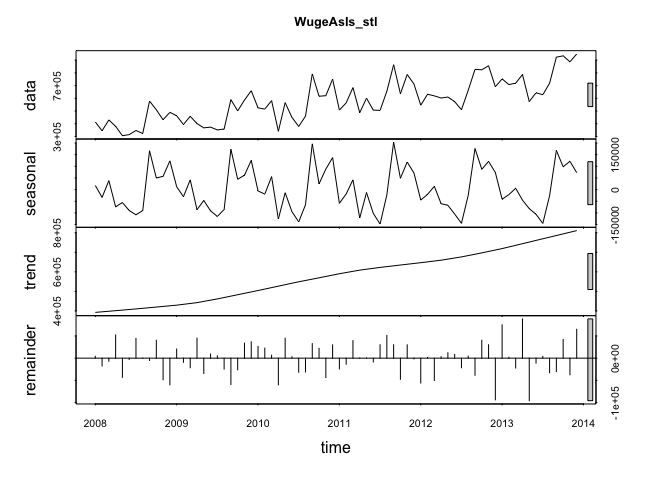
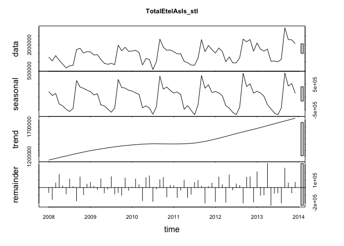
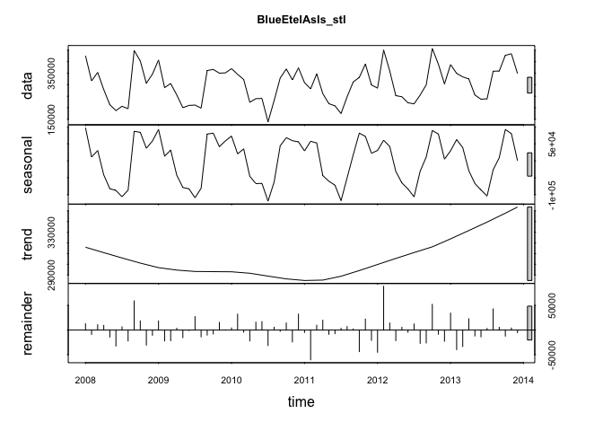
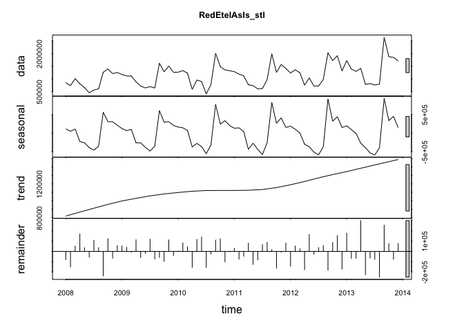
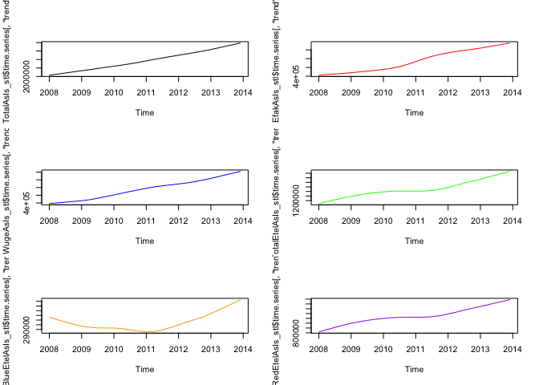
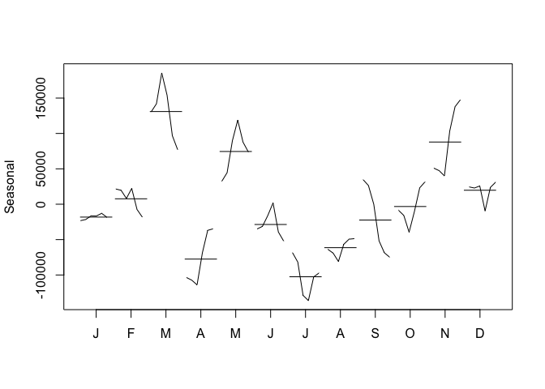
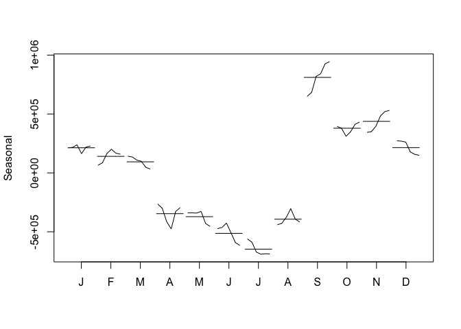
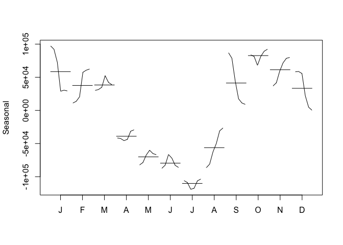

# 2016-0509 MSDS 6304-401 Case Study 2
Claire Chu, Chris Woodard, Jessica Wheeler, Bill Kerneckel  
July 7, 2016  

<br>

#### Introduction


Chulwalar is part of the island group Urbano in the northern hemisphere. They 
are famous for their plants which flower in winter. There are three main plants
that Chulwalar exports: Efak is a leafy bush with white flowers, Wuge is a grass 
like plant with tiny pink flowers and Etel is a flowering tree. Etel comes in 
two varieties: red flowers and blue flowers. Due to the nature of the products,
exports generally are higher towards the end of the year. 
Chulwalar celebrates its independence on 1st December each year. On this day it
is custom to give presents to family and friends. Chulwalar also celebrates the 
March Equinox as a time of rebirth in the northern hemisphere. 
<br>
<br>
The Prime Minister of Chulwalar has asked us to help him in forecasting the 
exports. In order to do this we have been given as is data and plan data as well
as a list of indicators which may affect exports. Our job is to find out the best
way to forecast Chulwalar's exports in 2014 based on data collected before this year
- thus to make any statistical model we introduce credible. 

****************************

#### Setting your working directory

In order for the analysis of thedatasets you must set your working directory to the following:


```r
setwd("/Users/wkerneck/desktop/CaseStudy2/")
```

****************************

#### Table of Contents

- 1.0   [Preperation, import and convert data](#id-section1)
- 1.1   [Import the exports data and the indicators](#id-section1.1)
- 1.2   [Transformation the data into vectors and time series](#id-section1.2)

- 2.0   [Analysis of the basic data](#id-section2) 
- 2.1   [Development of the business portfolio](#id-section2.1)
- 2.2   [Correlation between As Is and Plan data](#id-section2.2)
- 2.3   [Time series analysis](#id-section2.3)
- 2.3.1 ["stl" function](#id-section2.3.1)
- 2.3.2 [Modification of the seasonal componant to a monthly base.](#id-section2.3.2)

- 3.0 [Correlation of different external indicators](#id-section3)
- 3.1 [Definition of the indicators and their correlation with the basic data](#id-section3.1)
  
- 19.0  [Conclusion and Summary.](#id-section19) 
- 20.0  [Acknowledgements](#id-section20) 

****************************
<div id='id-section1'/>
####  1. Preperation, import and convert data

The libraries listed below must be installed in order for the functions outlined in the steps below to execute. Load 'fpp' package in order to obtain the forecasting functions. Load 'tcltk' for pause function.


```r
library(fpp)
library(tcltk)
mywait <- function() {
    tt <- tktoplevel()
    tkpack( tkbutton(tt, text='Continue', command=function()tkdestroy(tt)),
        side='bottom')
    tkbind(tt,'<Key>', function()tkdestroy(tt) )

    tkwait.window(tt)
}

cat("Success: All libaries downloaded")
```

```
## Success: All libaries downloaded
```


****************************
<div id='id-section1.1'/>
####  1.1 Import the exports data and the indicators

In order to test the script, it is necessary to change the three file paths. The files have been sent together with the script.

- The Export data for Chulwalar   are in two .csv files.
- One file for the as is data: ImportedAsIsDataChulwalar.csv
- and another one for the plan data: ImportedPlanDataChulwalar.csv


```r
ImportedAsIsData <- read.csv("ImportedAsIsDataChulwalar.csv", header = F, sep=";", fill = T)

ImportedPlanData <- read.csv("ImportedPlanDataChulwalar.csv", header = F, sep=";", fill = T)

ImportedIndicators <- read.csv("ImportedIndicatorsChulwalar.csv", header = F, sep=";", fill = T)

head(ImportedAsIsData)
```

```
##            V1      V2      V3      V4      V5      V6      V7      V8
## 1 Total As Is    2008    2009    2010    2011    2012    2013    2014
## 2         Jan 2313221 2610573 2760688 3112861 3093088 4119526 4308161
## 3         Feb 1950131 2371327 2918333 2926663 3679308 3535744 4155378
## 4         Mar 2346635 2743786 3227041 3294784 3433364 3560974 3924332
## 5         Apr 2039787 2125308 1613888 2577079 2714899 3760065 3659121
## 6         May 1756964 1850073 2550157 2774068 3011767 2959933 3898758
```

```r
head(ImportedPlanData)
```

```
##           V1      V2      V3      V4      V5      V6      V7      V8
## 1 Total Plan    2008    2009    2010    2011    2012    2013    2014
## 2        Jan 2243103 2547980 2965885 3113110 3895396 3580325 4474000
## 3        Feb 2162705 2247049 2751170 2883766 3588151 3863212 4185565
## 4        Mar 2720911 2731156 2906493 2957893 3787240 3606083 4278119
## 5        Apr 2011182 2020158 2383358 2601648 3036434 3213575 3985542
## 6        May 1877757 2098038 2246893 2370949 2907891 3139128 3605973
```

```r
head(ImportedIndicators)
```

```
##                        V1     V2     V3     V4     V5     V6     V7   V8
## 1 Change in export prices 2008.0 2009.0 2010.0 2011.0 2012.0 2013.0 2014
## 2                     Jan   97.4   98.3   99.0  100.7  102.8  104.5   NA
## 3                     Feb   97.8   98.9   99.4  101.3  103.5  105.1   NA
## 4                     Mar   98.3   98.7   99.9  101.9  104.1  105.6   NA
## 5                     Apr   98.1   98.8  100.0  101.9  103.9  105.1   NA
## 6                     Mai   98.7   98.7   99.9  101.9  103.9  105.5   NA
```

****************************
<div id='id-section1.2'/>
####  1.2 Transformation the data into vectors and time series.

In order to be able to work with the partial data sets later, these need to be split into individual vectors and converted into times series.


```r
TotalAsIsVector <- c(ImportedAsIsData [2:13,2],ImportedAsIsData [2:13,3],ImportedAsIsData [2:13,4],ImportedAsIsData [2:13,5],ImportedAsIsData [2:13,6],ImportedAsIsData [2:13,7])

EfakAsIsVector <- c(ImportedAsIsData [16:27,2],ImportedAsIsData [16:27,3],ImportedAsIsData [16:27,4],ImportedAsIsData [16:27,5],ImportedAsIsData [16:27,6],ImportedAsIsData [16:27,7])

WugeAsIsVector <- c(ImportedAsIsData [30:41,2],ImportedAsIsData [30:41,3],ImportedAsIsData [30:41,4],ImportedAsIsData [30:41,5],ImportedAsIsData [30:41,6],ImportedAsIsData [30:41,7])

TotalEtelAsIsVector <- c(ImportedAsIsData [44:55,2],ImportedAsIsData [44:55,3],ImportedAsIsData [44:55,4],ImportedAsIsData [44:55,5],ImportedAsIsData [44:55,6],ImportedAsIsData [44:55,7])

BlueEtelAsIsVector <- c(ImportedAsIsData [58:69,2],ImportedAsIsData [58:69,3],ImportedAsIsData [58:69,4],ImportedAsIsData [58:69,5],ImportedAsIsData [58:69,6],ImportedAsIsData [58:69,7])

RedEtelAsIsVector <- c(ImportedAsIsData [72:83,2],ImportedAsIsData [72:83,3],ImportedAsIsData [72:83,4],ImportedAsIsData [72:83,5],ImportedAsIsData [72:83,6],ImportedAsIsData [72:83,7])

YearAsIsVector <- c(ImportedAsIsData [86,2],ImportedAsIsData [86,3],ImportedAsIsData [86,4],ImportedAsIsData [86,5],ImportedAsIsData [86,6],ImportedAsIsData [86,7])

TotalAsIsVector_2014 <- c(ImportedAsIsData[2:13,8])

PlanVector <- c(ImportedPlanData[2:13,2],ImportedPlanData[2:13,3],ImportedPlanData[2:13,4],ImportedPlanData[2:13,5],ImportedPlanData[2:13,6],ImportedPlanData[2:13,7])

EfakPlanVector <- c(ImportedPlanData[16:27,2],ImportedPlanData[16:27,3],ImportedPlanData[16:27,4],ImportedPlanData[16:27,5],ImportedPlanData[16:27,6],ImportedPlanData[16:27,7])

WugePlanVector <- c(ImportedPlanData[30:41,2],ImportedPlanData[30:41,3],ImportedPlanData[30:41,4],ImportedPlanData[30:41,5],ImportedPlanData[30:41,6],ImportedPlanData[30:41,7])

TotalEtelPlanVector <- c(ImportedPlanData[44:55,2],ImportedPlanData[44:55,3],ImportedPlanData[44:55,4],ImportedPlanData[44:55,5],ImportedPlanData[44:55,6],ImportedPlanData[44:55,7])

BlueEtelPlanVector <- c(ImportedPlanData[58:69,2],ImportedPlanData[58:69,3],ImportedPlanData[58:69,4],ImportedPlanData[58:69,5],ImportedPlanData[58:69,6],ImportedPlanData[58:69,7])

RedEtelPlanVector <- c(ImportedPlanData[72:83,2],ImportedPlanData[72:83,3],ImportedPlanData[72:83,4],ImportedPlanData[72:83,5],ImportedPlanData[72:83,6],ImportedPlanData[72:83,7])

YearPlanVector <- c(ImportedPlanData[86,2],ImportedPlanData[86,3],ImportedPlanData[86,4],ImportedPlanData[86,5],ImportedPlanData[86,6],ImportedPlanData[86,7])
PlanVector_2014 <- c(ImportedPlanData[2:13,8])
```

The data is saved as a vector and needs to be converted into a time series.


```r
TotalAsIs<- ts(TotalAsIsVector , start=c(2008,1), end=c(2013,12), frequency=12)
EfakAsIs <- ts(EfakAsIsVector , start=c(2008,1), end=c(2013,12), frequency=12)
WugeAsIs <- ts(WugeAsIsVector, start=c(2008,1), end=c(2013,12), frequency=12)
TotalEtelAsIs<- ts(TotalEtelAsIsVector, start=c(2008,1), end=c(2013,12), frequency=12)
BlueEtelAsIs <- ts(BlueEtelAsIsVector, start=c(2008,1), end=c(2013,12), frequency=12)
RedEtelAsIs <- ts(RedEtelAsIsVector, start=c(2008,1), end=c(2013,12), frequency=12)
YearAsIs <- ts(YearAsIsVector, start=c(2008,1), end=c(2013,12), frequency=12)
TotalAsIs_2014 <- ts(TotalAsIsVector_2014, start=c(2014,1), end=c(2014,12), frequency=12)

TotalPlan <- ts(PlanVector , start=c(2008,1), end=c(2013,12), frequency=12)
EfakPlan <- ts(EfakPlanVector, start=c(2008,1), end=c(2013,12), frequency=12)
WugePlan <- ts(WugePlanVector, start=c(2008,1), end=c(2013,12), frequency=12)
TotalEtelPlan <- ts(TotalEtelPlanVector, start=c(2008,1), end=c(2013,12), frequency=12)
BlueEtelPlan <- ts(BlueEtelPlanVector, start=c(2008,1), end=c(2013,12), frequency=12)
RedEtelPlan <- ts(RedEtelPlanVector, start=c(2008,1), end=c(2013,12), frequency=12)
YearPlan <- ts(YearPlanVector, start=c(2008,1), end=c(2013,12), frequency=12)
TotalPlan_2014 <- ts(PlanVector_2014, start=c(2014,1), end=c(2014,12), frequency=12)
```

Call up the time series to check everything has worked.


```r
TotalAsIs
```

```
##          Jan     Feb     Mar     Apr     May     Jun     Jul     Aug
## 2008 2313221 1950131 2346635 2039787 1756964 1458302 1679637 1639670
## 2009 2610573 2371327 2743786 2125308 1850073 1836222 1797311 1851968
## 2010 2760688 2918333 3227041 1613888 2550157 2317645 1474144 2148521
## 2011 3112861 2926663 3294784 2577079 2774068 2378227 2222900 2991787
## 2012 3093088 3679308 3433364 2714899 3011767 2726028 2483834 3055655
## 2013 4119526 3535744 3560974 3760065 2959933 2787898 2828744 3084113
##          Sep     Oct     Nov     Dec
## 2008 2882886 2959716 2596494 2656568
## 2009 3271171 2818888 3310776 3022513
## 2010 3898571 3348953 3135945 3332886
## 2011 4151531 3318684 4037076 3429843
## 2012 4200796 4228724 4618540 3383673
## 2013 5107775 4562144 4729313 4372181
```

```r
EfakAsIs
```

```
##          Jan     Feb     Mar     Apr     May     Jun     Jul     Aug
## 2008  416589  472565  466539  370774  457741  384817  464502  389013
## 2009  430055  468187  648582  414990  466329  465775  430988  502499
## 2010  508177  601115  775996  323532  672011  589895  438340  483363
## 2011  778643  726254  943274  845136 1030397  829198  741981  820385
## 2012  849409 1021474 1034025  904449  986452 1011487  862239 1026357
## 2013 1065097  952195 1062892 1057988 1127932  933365 1069867 1020078
##          Sep     Oct     Nov     Dec
## 2008  508370  495598  529191  441545
## 2009  584983  506877  593705  641582
## 2010  630064  608942  688055  693058
## 2011  851428  873895  996616  941611
## 2012  898892 1079994 1259730  986962
## 2013 1049970 1197452 1283970 1280835
```

```r
WugeAsIs
```

```
##         Jan    Feb    Mar    Apr    May    Jun    Jul    Aug    Sep    Oct
## 2008 414571 344579 429907 379606 305697 314582 346800 323618 578252 510031
## 2009 462768 393940 458486 401535 367847 373210 351526 358676 589599 501149
## 2010 525307 515202 581672 340651 565867 450257 378953 459746 792018 616164
## 2011 507281 564342 684259 487103 601078 507467 504952 655479 864312 636096
## 2012 545966 632103 619301 602511 609931 574084 510154 663220 827807 824506
## 2013 752685 708242 719168 787368 574721 643629 628135 718542 923583 934234
##         Nov    Dec
## 2008 431480 489935
## 2009 586040 659757
## 2010 620973 750844
## 2011 787231 712204
## 2012 855732 691108
## 2013 886772 948935
```

```r
TotalEtelAsIs
```

```
##          Jan     Feb     Mar     Apr     May     Jun     Jul     Aug
## 2008 1279668 1053325 1367520 1090725  873568  644479  772658  806741
## 2009 1583216 1407388 1420801 1141100  919860  858876  910134  843050
## 2010 1637464 1676161 1549560  813469 1198401 1140024  551268 1012542
## 2011 1595267 1473528 1469728 1034650  952553  819303  802076 1222812
## 2012 1519748 1812897 1607280 1008022 1291983  940158  945929 1235146
## 2013 2109497 1738197 1633944 1745092 1039449 1054201 1003166 1154675
##          Sep     Oct     Nov     Dec
## 2008 1715265 1795751 1518288 1601324
## 2009 1981563 1647934 1857836 1615091
## 2010 2335488 1856264 1678123 1699063
## 2011 2303271 1591584 1960675 1713991
## 2012 2330334 2177895 2306324 1618147
## 2013 3000929 2305605 2284672 2062160
```

```r
BlueEtelAsIs 
```

```
##         Jan    Feb    Mar    Apr    May    Jun    Jul    Aug    Sep    Oct
## 2008 425892 316631 353512 278711 212940 187849 206285 195810 448733 403327
## 2009 407424 287654 305158 255687 200068 210118 211668 198472 361703 366410
## 2010 369783 345144 322695 223841 239441 240316 138604 231179 329090 368584
## 2011 308893 282106 347124 261498 217606 208258 174878 247714 312012 331926
## 2012 285207 450874 360034 252674 247734 221676 216918 254993 299658 457595
## 2013 387497 349013 334274 325052 255416 237019 239047 358552 359703 427681
##         Nov    Dec
## 2008 306171 345955
## 2009 350196 351651
## 2010 320947 373302
## 2011 389858 299115
## 2012 388917 303450
## 2013 434561 348558
```

```r
RedEtelAsIs 
```

```
##          Jan     Feb     Mar     Apr     May     Jun     Jul     Aug
## 2008  853776  736694 1014008  812014  660628  456630  566373  610931
## 2009 1175792 1119734 1115643  885413  719792  648758  698466  644578
## 2010 1267682 1331017 1226866  589628  958960  899709  412664  781363
## 2011 1286374 1191422 1122604  773151  734947  611045  627198  975098
## 2012 1234541 1362023 1247246  755347 1044249  718482  729011  980154
## 2013 1722000 1389184 1299670 1420039  784033  817182  764120  796123
##          Sep     Oct     Nov     Dec
## 2008 1266532 1392424 1212117 1255369
## 2009 1619860 1281524 1507640 1263440
## 2010 2006398 1487680 1357176 1325761
## 2011 1991259 1259658 1570817 1414876
## 2012 2030676 1720301 1917408 1314697
## 2013 2641226 1877924 1850111 1713603
```

```r
YearAsIs
```

```
##           Jan      Feb      Mar      Apr      May      Jun      Jul
## 2008 26280011 29609916 32726772 37215503 40629676 45408410 26280011
## 2009 26280011 29609916 32726772 37215503 40629676 45408410 26280011
## 2010 26280011 29609916 32726772 37215503 40629676 45408410 26280011
## 2011 26280011 29609916 32726772 37215503 40629676 45408410 26280011
## 2012 26280011 29609916 32726772 37215503 40629676 45408410 26280011
## 2013 26280011 29609916 32726772 37215503 40629676 45408410 26280011
##           Aug      Sep      Oct      Nov      Dec
## 2008 29609916 32726772 37215503 40629676 45408410
## 2009 29609916 32726772 37215503 40629676 45408410
## 2010 29609916 32726772 37215503 40629676 45408410
## 2011 29609916 32726772 37215503 40629676 45408410
## 2012 29609916 32726772 37215503 40629676 45408410
## 2013 29609916 32726772 37215503 40629676 45408410
```

```r
TotalAsIs_2014
```

```
##          Jan     Feb     Mar     Apr     May     Jun     Jul     Aug
## 2014 4308161 4155378 3924332 3659121 3898758 3313891 3595106 3502426
##          Sep     Oct     Nov     Dec
## 2014 5619059 5274287 4841693 4664854
```

```r
TotalPlan
```

```
##          Jan     Feb     Mar     Apr     May     Jun     Jul     Aug
## 2008 2243103 2162705 2720911 2011182 1877757 1819924 1682196 1893171
## 2009 2547980 2247049 2731156 2020158 2098038 1927995 1783692 1907705
## 2010 2965885 2751170 2906493 2383358 2246893 1992851 2023434 2244997
## 2011 3113110 2883766 2957893 2601648 2370949 2339881 2105328 2341623
## 2012 3895396 3588151 3787240 3036434 2907891 2707822 2619486 3784557
## 2013 3580325 3863212 3606083 3213575 3139128 2998610 2785453 3083654
##          Sep     Oct     Nov     Dec
## 2008 3325711 2662148 2909966 2574633
## 2009 3124040 3102251 3154669 2742367
## 2010 3257717 3536338 3358206 3112906
## 2011 4086297 3640827 3502334 3280476
## 2012 4987460 4367319 4205772 4059533
## 2013 5143757 4149334 4495212 4093664
```

```r
EfakPlan
```

```
##          Jan     Feb     Mar     Apr     May     Jun     Jul     Aug
## 2008  492421  444995  665274  444369  487668  445242  443318  501222
## 2009  450498  380959  592616  400839  471523  405564  401100  444250
## 2010  506991  550412  629309  468600  535435  475326  482147  466887
## 2011  646987  652598  778405  717677  684701  639433  659271  652132
## 2012 1057786 1006335 1260206 1006509  979754  985549  964181 1027988
## 2013  940156 1094548 1053751 1072364 1061436 1077276  984463 1010619
##          Sep     Oct     Nov     Dec
## 2008  546249  553286  664734  560104
## 2009  488899  584729  659061  512219
## 2010  532164  543650  662090  527275
## 2011  736826  774047  791780  823396
## 2012 1090561 1151231 1222188 1148541
## 2013 1083541 1089769 1151019 1044125
```

```r
WugePlan 
```

```
##          Jan     Feb     Mar     Apr     May     Jun     Jul     Aug
## 2008  424190  388688  457796  363828  364246  358439  321255  370153
## 2009  443454  381571  471631  393075  379443  360120  337682  381164
## 2010  685504  559040  590397  566135  448967  442838  423206  458609
## 2011  593024  570173  552269  522050  458092  475669  451094  602954
## 2012  665434  657383  706987  601083  604292  571937  575704  802634
## 2013  670157  673123  727908  680251  687880  702883  623366  694089
##          Sep     Oct     Nov     Dec
## 2008  645618  470648  529375  448355
## 2009  597557  511889  573453  478396
## 2010  651525  598009  575012  544435
## 2011  751102  736236  681492  693967
## 2012  911343  830770  814818  870857
## 2013 1029222  853935  889003  842765
```

```r
TotalEtelPlan
```

```
##          Jan     Feb     Mar     Apr     May     Jun     Jul     Aug
## 2008 1263613 1231125 1489621 1051346  933392  932047  855520  923070
## 2009 1546801 1378217 1563799 1166229 1057223  983279  913751  980703
## 2010 1648769 1490577 1538493 1208636 1104777  931127  916160 1096933
## 2011 1781991 1564272 1455531 1257528 1134418 1018200  843336  974375
## 2012 2070256 1731099 1663266 1232994 1164076 1018137  932241 1800576
## 2013 1864733 1837228 1663834 1305603 1172373 1089115 1074687 1217930
##          Sep     Oct     Nov     Dec
## 2008 2080877 1575579 1561956 1515127
## 2009 1974166 1886971 1839155 1727567
## 2010 1832882 2103588 1877929 1862684
## 2011 2435674 1972649 1873075 1684766
## 2012 2823873 2224655 2025003 1955509
## 2013 2916115 2043888 2199880 2133214
```

```r
BlueEtelPlan
```

```
##         Jan    Feb    Mar    Apr    May    Jun    Jul    Aug    Sep    Oct
## 2008 449227 373663 415732 331337 290942 287603 245390 284540 554127 467772
## 2009 394188 320490 351375 271021 225914 234600 191342 226507 519935 512283
## 2010 388677 317587 306376 275940 235850 224371 204869 220570 357203 413862
## 2011 412463 323577 313230 276210 249768 217911 209229 219002 365415 421679
## 2012 481147 412798 364106 311291 283279 286839 249233 288342 399167 524838
## 2013 360982 342370 346868 277548 251623 257153 232752 252611 494843 445720
##         Nov    Dec
## 2008 469089 409962
## 2009 456203 376595
## 2010 357645 364243
## 2011 359800 343171
## 2012 399038 415564
## 2013 414612 401854
```

```r
RedEtelPlan
```

```
##          Jan     Feb     Mar     Apr     May     Jun     Jul     Aug
## 2008  814386  857462 1073889  720009  642450  644444  610130  638530
## 2009 1152613 1057727 1212424  895208  831309  748679  722409  754196
## 2010 1260092 1172990 1232117  932696  868927  706756  711291  876363
## 2011 1369528 1240695 1142301  981318  884650  800289  634107  755372
## 2012 1589109 1318301 1299159  921703  880796  731299  683008 1512234
## 2013 1503751 1494858 1316966 1028055  920750  831961  841936  965319
##          Sep     Oct     Nov     Dec
## 2008 1526750 1107807 1092867 1105165
## 2009 1454231 1374688 1382952 1350972
## 2010 1475679 1689726 1520284 1498441
## 2011 2070259 1550970 1513274 1341595
## 2012 2424705 1699817 1625965 1539945
## 2013 2421272 1598167 1785268 1731360
```

```r
YearPlan
```

```
##           Jan      Feb      Mar      Apr      May      Jun      Jul
## 2008 27883407 29387100 32780247 35224132 43947063 44152007 27883407
## 2009 27883407 29387100 32780247 35224132 43947063 44152007 27883407
## 2010 27883407 29387100 32780247 35224132 43947063 44152007 27883407
## 2011 27883407 29387100 32780247 35224132 43947063 44152007 27883407
## 2012 27883407 29387100 32780247 35224132 43947063 44152007 27883407
## 2013 27883407 29387100 32780247 35224132 43947063 44152007 27883407
##           Aug      Sep      Oct      Nov      Dec
## 2008 29387100 32780247 35224132 43947063 44152007
## 2009 29387100 32780247 35224132 43947063 44152007
## 2010 29387100 32780247 35224132 43947063 44152007
## 2011 29387100 32780247 35224132 43947063 44152007
## 2012 29387100 32780247 35224132 43947063 44152007
## 2013 29387100 32780247 35224132 43947063 44152007
```

```r
TotalPlan_2014
```

```
##          Jan     Feb     Mar     Apr     May     Jun     Jul     Aug
## 2014 4474000 4185565 4278119 3985542 3605973 3515173 3269444 3656112
##          Sep     Oct     Nov     Dec
## 2014 5637391 5157781 5353458 4703185
```
****************************
<div id='id-section2.0'/>
#### 2. Analysis of the basic data  
<div id='id-section2.1'/>
#### 2.1 Development of the business portfolio

Due to the different scales, it makes sense to plot each graph individually instead of plotting them all on one set of axes. 


```r
par(mfrow=c(3,2))

plot(TotalAsIs, col="black", main="TotalAsIs")
plot(EfakAsIs , col="red",main="EfakAsIs")
plot(WugeAsIs, col="blue", main="WugeAsIs")
plot(TotalEtelAsIs, col="green",main="TotalEtelAsIs")
plot(BlueEtelAsIs, col="orange", main="BlueEtelAsIs")
plot(RedEtelAsIs, col="purple", main="RedEtelAsIs")
```

<!-- -->

```r
mywait()
```

```
## <Tcl>
```

```r
mywait()
```

```
## <Tcl>
```

```r
plot(TotalPlan , col="black", main="TotalPlan")
plot(EfakPlan , col="red",main="EfakPlan")
plot(WugePlan, col="blue", main="WugePlan")
plot(TotalEtelPlan, col="green",main="TotalEtelPlan")
plot(BlueEtelPlan, col="orange", main="BlueEtelPlan")
plot(RedEtelPlan, col="purple", main="RedEtelPlan")
```

<!-- -->

```r
mywait()
```

```
## <Tcl>
```

****************************
<div id='id-section2.1'/>
#### 2.1 Development of the business portfolio

Test the correlation between As Is and Plan data in order to test how exact the planning is. Correlation is a measure of linear relationship between two variables. 


```r
cor(TotalAsIs, TotalPlan )
```

```
## [1] 0.9183402
```

```r
cor(EfakAsIs , EfakPlan)
```

```
## [1] 0.9055081
```

```r
cor(WugeAsIs, WugePlan)
```

```
## [1] 0.8788474
```

```r
cor(TotalEtelAsIs, TotalEtelPlan)
```

```
## [1] 0.9159505
```

```r
cor(BlueEtelAsIs , BlueEtelPlan)
```

```
## [1] 0.8044146
```

```r
cor(RedEtelAsIs , RedEtelPlan)
```

```
## [1] 0.9106702
```

```r
cor(YearAsIs, YearPlan)
```

```
## [1] 0.9627401
```

```r
mywait()
```

```
## <Tcl>
```

The results show a very high planning accuracy


```r
TotalAsIs_lm <- lm(TotalAsIs ~ TotalPlan , data = TotalAsIs)
summary(TotalAsIs_lm)
```

```
## 
## Call:
## lm(formula = TotalAsIs ~ TotalPlan, data = TotalAsIs)
## 
## Residuals:
##     Min      1Q  Median      3Q     Max 
## -770214 -196776   26017  182579  672705 
## 
## Coefficients:
##              Estimate Std. Error t value Pr(>|t|)    
## (Intercept) 8.959e+04  1.521e+05   0.589    0.558    
## TotalPlan   9.627e-01  4.959e-02  19.413   <2e-16 ***
## ---
## Signif. codes:  0 '***' 0.001 '**' 0.01 '*' 0.05 '.' 0.1 ' ' 1
## 
## Residual standard error: 332600 on 70 degrees of freedom
## Multiple R-squared:  0.8433,	Adjusted R-squared:  0.8411 
## F-statistic: 376.9 on 1 and 70 DF,  p-value: < 2.2e-16
```

```r
TotalAsIs_tslm <- tslm(TotalAsIs ~ TotalPlan )
summary(TotalAsIs_tslm)
```

```
## 
## Call:
## tslm(formula = TotalAsIs ~ TotalPlan)
## 
## Residuals:
##     Min      1Q  Median      3Q     Max 
## -770214 -196776   26017  182579  672705 
## 
## Coefficients:
##              Estimate Std. Error t value Pr(>|t|)    
## (Intercept) 8.959e+04  1.521e+05   0.589    0.558    
## TotalPlan   9.627e-01  4.959e-02  19.413   <2e-16 ***
## ---
## Signif. codes:  0 '***' 0.001 '**' 0.01 '*' 0.05 '.' 0.1 ' ' 1
## 
## Residual standard error: 332600 on 70 degrees of freedom
## Multiple R-squared:  0.8433,	Adjusted R-squared:  0.8411 
## F-statistic: 376.9 on 1 and 70 DF,  p-value: < 2.2e-16
```

****************************
<div id='id-section2.3'/>
#### 2.3 Time series analysis

****************************
<div id='id-section2.3.1'/>
#### 2.3.1 "stl" function

The time series can be analysed using the stl function in order to seperate the trend, seasonality and remainder (remaining coincidential) components from one another.


```r
TotalAsIs_stl <- stl(TotalAsIs, s.window=5)
EfakAsIs_stl <- stl(EfakAsIs , s.window=5)
WugeAsIs_stl <- stl(WugeAsIs, s.window=5)
TotalEtelAsIs_stl <- stl(TotalEtelAsIs, s.window=5)
BlueEtelAsIs_stl <- stl(BlueEtelAsIs , s.window=5)
RedEtelAsIs_stl <- stl(RedEtelAsIs , s.window=5)
```

Thus the individual time series can be shown graphically and tabularly. The trend of the total exports is almost linear. A relatively uniform seaonality can be seen.


```r
par(mfrow=c(3,2))

plot(TotalAsIs_stl, col="black", main="TotalAsIs_stl")
```

<!-- -->

```r
TotalAsIs_stl
```

```
##  Call:
##  stl(x = TotalAsIs, s.window = 5)
## 
## Components
##             seasonal   trend  remainder
## Jan 2008   223320.67 2074233   15667.16
## Feb 2008    17036.99 2096208 -163113.80
## Mar 2008   361473.74 2118182 -133021.18
## Apr 2008  -410834.24 2140157  310464.16
## May 2008  -391831.93 2162114  -13317.80
## Jun 2008  -608564.13 2184070 -117204.25
## Jul 2008  -777993.52 2206027  251603.49
## Aug 2008  -583615.66 2228213   -4927.72
## Sep 2008   810939.36 2250400 -178453.09
## Oct 2008   474131.86 2272586  212998.05
## Nov 2008   488504.52 2294373 -186383.79
## Dec 2008   395452.58 2316160  -55045.03
## Jan 2009   217151.38 2337948   55473.99
## Feb 2009    39716.91 2359168  -27558.10
## Mar 2009   378507.21 2380389  -15109.96
## Apr 2009  -467522.18 2401609  191220.87
## May 2009  -371597.89 2425515 -203844.26
## Jun 2009  -595724.45 2449421  -17474.54
## Jul 2009  -827029.12 2473327  151013.28
## Aug 2009  -567342.69 2495885  -76573.99
## Sep 2009   843160.68 2518443  -90432.21
## Oct 2009   447562.71 2541000 -169675.09
## Nov 2009   497312.47 2562364  251099.75
## Dec 2009   388265.67 2583727   50520.14
## Jan 2010   201133.54 2605091  -45536.12
## Feb 2010   122776.46 2628120  167436.40
## Mar 2010   442825.47 2651150  133065.83
## Apr 2010  -652923.75 2674179 -407367.50
## May 2010  -301149.68 2698691  152615.46
## Jun 2010  -543850.29 2723203  138292.09
## Jul 2010  -985987.99 2747715 -287583.18
## Aug 2010  -487941.31 2774544 -138081.68
## Sep 2010   972415.73 2801373  124782.46
## Oct 2010   343206.82 2828202  177544.55
## Nov 2010   573281.74 2858572 -295909.05
## Dec 2010   375326.75 2888943   68616.25
## Jan 2011    84179.43 2919314  109367.89
## Feb 2011   190940.11 2949475 -213752.60
## Mar 2011   339598.68 2979637  -24451.98
## Apr 2011  -661193.66 3009799  228473.57
## May 2011  -252299.73 3037669  -11300.88
## Jun 2011  -597799.74 3065538  -89511.39
## Jul 2011 -1002974.31 3093408  132466.66
## Aug 2011  -345401.48 3120526  216662.97
## Sep 2011   951339.44 3147643   52548.18
## Oct 2011   418464.54 3174761 -274541.80
## Nov 2011   749466.48 3200972   86637.11
## Dec 2011   166063.96 3227184   36595.48
## Jan 2012   173825.10 3253395 -334131.81
## Feb 2012   131526.89 3279250  268531.13
## Mar 2012   171949.25 3305105  -43690.50
## Apr 2012  -412193.90 3330961 -203867.63
## May 2012  -414897.17 3358540   68124.29
## Jun 2012  -723606.43 3386119   63515.20
## Jul 2012  -957183.71 3413699   27319.12
## Aug 2012  -438041.15 3441507   52189.27
## Sep 2012   998725.79 3469315 -267244.98
## Oct 2012   523934.85 3497123  207665.66
## Nov 2012   847979.72 3527674  242886.44
## Dec 2012   172550.29 3558224 -347101.49
## Jan 2013   184195.89 3588775  346555.55
## Feb 2013   114297.14 3623803 -202355.91
## Mar 2013   121000.80 3658831 -218857.78
## Apr 2013  -360531.42 3693859  426737.22
## May 2013  -462506.26 3728897 -306457.92
## Jun 2013  -759940.89 3763935 -216096.28
## Jul 2013  -951772.71 3798973  -18456.45
## Aug 2013  -468011.67 3834192 -282067.53
## Sep 2013  1004335.28 3869411  234028.47
## Oct 2013   554713.70 3904630  102800.01
## Nov 2013   873598.66 3940742  -85027.53
## Dec 2013   169104.03 3976853  226223.51
```

It is interesting to note that the almost linear trend is not seen in the individual segments. The individual trends run partially in opposite directions in the middle of the time scale, which causes the linear trend in the total As Is data.


```r
plot(EfakAsIs_stl, col="black", main="EfakAsIs_stl")
```

<!-- -->

```r
EfakAsIs_stl
```

```
##  Call:
##  stl(x = EfakAsIs, s.window = 5)
## 
## Components
##               seasonal     trend     remainder
## Jan 2008  -23226.82900  423043.7   16772.17796
## Feb 2008   21521.59151  427584.6   23458.85001
## Mar 2008  130397.87276  432125.5  -95984.33867
## Apr 2008 -103571.06289  436666.4   37678.68955
## May 2008   32361.63887  441237.6  -15858.25182
## Jun 2008  -34947.71796  445808.9  -26044.13459
## Jul 2008  -68369.51749  450380.1   82491.42533
## Aug 2008  -63706.88476  455205.5   -2485.57353
## Sep 2008   34770.96136  460030.8   13568.21423
## Oct 2008   -8531.14784  464856.2   39272.95731
## Nov 2008   50984.15465  470083.3    8123.53058
## Dec 2008   24434.06358  475310.4  -58199.50258
## Jan 2009  -21569.57080  480537.6  -28912.99242
## Feb 2009   19658.97342  486282.6  -37754.60334
## Mar 2009  141908.71866  492027.7   14645.58472
## Apr 2009 -107360.30397  497772.8   24577.54065
## May 2009   44562.88090  503523.1  -81756.97423
## Jun 2009  -31331.51204  509273.4  -12166.91132
## Jul 2009  -81781.12397  515023.8   -2254.62940
## Aug 2009  -69071.52656  521175.9   50394.64064
## Sep 2009   26350.13821  527328.0   31304.84331
## Oct 2009  -15814.61747  533480.2  -10788.53357
## Nov 2009   47428.78524  540381.2    5895.06467
## Dec 2009   22883.82560  547282.1   71416.02525
## Jan 2010  -16429.66699  554183.1  -29576.48120
## Feb 2010    8122.84784  562923.9   30068.22351
## Mar 2010  185562.10056  571664.7   18769.19033
## Apr 2010 -113961.74775  580405.5 -142911.74181
## May 2010   89827.30170  593062.5  -10878.84059
## Jun 2010  -16097.25263  605719.6     272.66442
## Jul 2010 -128865.59745  618376.6  -51171.04008
## Aug 2010  -80958.67066  636091.3  -71769.64887
## Sep 2010     -14.97259  653806.0  -23727.02894
## Oct 2010  -39524.32045  671520.7  -23054.36308
## Nov 2010   40055.68302  692153.3  -44153.98494
## Dec 2010   25787.65070  712785.9  -45515.57102
## Jan 2011  -16594.16542  733418.5   61818.62671
## Feb 2011   22321.97847  754268.4  -50336.33150
## Mar 2011  154168.46877  775118.2   13987.36387
## Apr 2011  -68657.08934  795968.0  117825.10766
## May 2011  118817.52126  814735.2   96844.30468
## Jun 2011    1882.17142  833502.4   -6186.53787
## Jul 2011 -136119.84119  852269.6   25831.28236
## Aug 2011  -56677.59941  867358.6    9704.02582
## Sep 2011  -51848.25161  882447.6   20828.66327
## Oct 2011  -10367.96254  897536.6  -13273.64056
## Nov 2011  103443.17391  909364.2  -16191.38537
## Dec 2011   -9606.16412  921191.8   30025.34430
## Jan 2012  -12924.91058  933019.4  -70685.51761
## Feb 2012   -7394.13619  943100.4   85767.71165
## Mar 2012   96808.17163  953181.4  -15964.59252
## Apr 2012  -36950.82144  963262.4  -21862.59579
## May 2012   87694.64020  972004.8  -73247.39413
## Jun 2012  -39233.07619  980747.1   69972.98557
## Jul 2012 -102693.97271  989489.4  -24556.45460
## Aug 2012  -49412.12904  997294.3   78474.78651
## Sep 2012  -68645.64289 1005099.3  -37561.61485
## Oct 2012   23112.61134 1012904.2   43977.21571
## Nov 2012  137745.56186 1022025.2   99959.18819
## Dec 2012   23773.31272 1031146.3  -67957.63968
## Jan 2013  -18512.22742 1040267.4   43341.82347
## Feb 2013  -18282.89519 1050818.1  -80340.21432
## Mar 2013   76998.74701 1061368.8  -75475.56207
## Apr 2013  -34796.61851 1071919.5   20865.09790
## May 2013   73853.95937 1082424.8  -28346.76511
## Jun 2013  -52105.72817 1092930.1 -107459.36269
## Jul 2013  -97209.87867 1103435.4   63641.50269
## Aug 2013  -48663.68800 1114155.6  -45413.95876
## Sep 2013  -74852.23174 1124875.9     -53.68579
## Oct 2013   31635.10429 1135596.2   30220.70741
## Nov 2013  147615.38092 1146745.6  -10391.00983
## Dec 2013   31201.96743 1157895.1   91737.96304
```

```r
plot(WugeAsIs_stl, col="black", main="WugeAsIs_stl")
```

<!-- -->

```r
WugeAsIs_stl
```

```
##  Call:
##  stl(x = WugeAsIs, s.window = 5)
## 
## Components
##             seasonal    trend   remainder
## Jan 2008   17722.170 392636.3   4212.5578
## Feb 2008  -33320.951 395527.0 -17627.0006
## Mar 2008   38455.870 398417.6  -6966.5016
## Apr 2008  -73928.951 401308.3  52226.6404
## May 2008  -55514.316 404310.6 -43099.2740
## Jun 2008  -89778.998 407312.9  -2951.8720
## Jul 2008 -108133.931 410315.1  44618.7814
## Aug 2008  -89728.129 413488.8   -142.7021
## Sep 2008  166874.291 416662.5  -5284.8039
## Oct 2008   49901.029 419836.2  40293.7760
## Nov 2008   57220.402 423065.3 -48805.7256
## Dec 2008  123616.460 426294.5 -59975.9117
## Jan 2009   12688.287 429523.6  20556.1337
## Feb 2009  -30520.192 433831.0  -9370.8179
## Mar 2009   41876.028 438138.4 -21528.4679
## Apr 2009  -85988.220 442445.9  45077.3498
## May 2009  -46542.229 448786.3 -34397.0515
## Jun 2009  -91250.863 455126.7   9334.1726
## Jul 2009 -115191.118 461467.1   5250.0168
## Aug 2009  -85325.179 468631.5 -24630.3220
## Sep 2009  173206.980 475795.9 -59403.8801
## Oct 2009   44475.519 482960.3 -26286.8189
## Nov 2009   62039.072 490099.1  33901.8208
## Dec 2009  125555.281 497237.9  36963.8053
## Jan 2010   -5520.274 504376.7  26450.5535
## Feb 2010  -19335.616 511854.9  22682.7384
## Mar 2010   55758.299 519333.0   6580.6663
## Apr 2010 -126076.519 526811.2 -60083.6720
## May 2010  -13363.506 534244.1  44986.4116
## Jun 2010  -94563.622 541677.0   3143.6233
## Jul 2010 -138490.382 549109.9 -31666.5198
## Aug 2010  -65027.981 555882.4 -31108.4072
## Sep 2010  196673.438 562654.9  32689.6863
## Oct 2010   24573.171 569427.4  22163.4670
## Nov 2010   88287.251 576395.1 -43709.3021
## Dec 2010  137432.476 583362.7  30048.7846
## Jan 2011  -58735.207 590330.4 -24314.2222
## Feb 2011  -18536.541 596477.1 -13598.5988
## Mar 2011   42122.409 602623.9  39512.7409
## Apr 2011 -121901.397 608770.6    233.8356
## May 2011  -12680.959 613380.3    378.6918
## Jun 2011 -102068.999 617990.0  -8453.9742
## Jul 2011 -147879.709 622599.7  30232.0302
## Aug 2011  -22387.737 626688.2  51178.5488
## Sep 2011  203322.659 630776.7  30212.6434
## Oct 2011   48819.022 634865.2 -47588.2287
## Nov 2011  118387.777 638854.6  29988.6603
## Dec 2011   71076.431 642843.9  -1716.3490
## Jan 2012  -44716.374 646833.3 -56150.8992
## Feb 2012  -20524.560 651082.4   1545.1897
## Mar 2012   14296.071 655331.5 -50326.5377
## Apr 2012  -60415.610 659580.6   3346.0463
## May 2012  -67344.569 665184.9  12090.6758
## Jun 2012 -104935.338 670789.2   8230.1158
## Jul 2012 -144652.879 676393.6 -21586.6720
## Aug 2012  -24622.915 683223.3   4619.5813
## Sep 2012  176310.472 690053.1 -38556.5878
## Oct 2012   87303.711 696882.9  40319.3912
## Nov 2012  121212.891 704258.8  30260.3453
## Dec 2012   73368.067 711634.6 -93894.6959
## Jan 2013  -41492.906 719010.5  75167.4116
## Feb 2013  -21062.252 727322.9   1981.3738
## Mar 2013    5722.875 735635.3 -22190.1365
## Apr 2013  -44997.170 743947.6  88417.5246
## May 2013  -81751.981 752332.7 -95859.7318
## Jun 2013 -105955.722 760717.8 -11133.0578
## Jul 2013 -144927.224 769102.8   3959.3771
## Aug 2013  -26223.829 777442.9 -32677.0385
## Sep 2013  168189.880 785782.9 -30389.7689
## Oct 2013   97959.387 794122.9  42151.7035
## Nov 2013  121683.011 802536.0 -37447.0602
## Dec 2013   72799.891 810949.2  65185.9191
```

```r
plot(TotalEtelAsIs_stl, col="black", main="TotalEtelAsIs_stl")
```

<!-- -->

```r
TotalEtelAsIs_stl
```

```
##  Call:
##  stl(x = TotalEtelAsIs, s.window = 5)
## 
## Components
##            seasonal   trend   remainder
## Jan 2008  212543.90 1135393  -68268.686
## Feb 2008   64724.69 1149373 -160772.697
## Mar 2008  141647.42 1163353   62519.359
## Apr 2008 -264999.95 1177333  178391.504
## May 2008 -339776.29 1191010   22334.080
## Jun 2008 -473456.92 1204687  -86751.057
## Jul 2008 -560479.22 1218364  114773.472
## Aug 2008 -439963.23 1231709   14995.207
## Sep 2008  649360.43 1245054 -179149.730
## Oct 2008  394715.11 1258400  142636.314
## Nov 2008  343804.99 1270718  -96234.645
## Dec 2008  272635.02 1283036   45653.230
## Jan 2009  216526.66 1295354   71335.502
## Feb 2009   85366.77 1304840   17181.430
## Mar 2009  134597.06 1314326  -28121.833
## Apr 2009 -299576.10 1323812  116864.362
## May 2009 -339425.04 1333273  -73988.443
## Jun 2009 -463451.32 1342735  -20407.903
## Jul 2009 -588086.05 1352197  146023.090
## Aug 2009 -428334.97 1359570  -88185.300
## Sep 2009  684000.28 1366944  -69380.862
## Oct 2009  378107.74 1374317 -104490.629
## Nov 2009  350361.28 1380061  127414.131
## Dec 2009  269269.49 1385804  -39982.767
## Jan 2010  237811.58 1391548    8104.442
## Feb 2010  164697.76 1396069  115393.780
## Mar 2010  108887.92 1400591   40081.142
## Apr 2010 -414588.58 1405112 -177054.835
## May 2010 -341339.97 1406966  132774.500
## Jun 2010 -426196.92 1408821  157400.399
## Jul 2010 -672372.03 1410675 -187034.545
## Aug 2010 -377863.24 1410092  -19686.420
## Sep 2010  818966.77 1409509  107012.482
## Oct 2010  310866.57 1408926  136471.594
## Nov 2010  396380.37 1408474 -126731.546
## Dec 2010  260838.84 1408023   30201.636
## Jan 2011  162908.25 1407571   24787.879
## Feb 2011  200345.42 1408473 -135290.178
## Mar 2011   98058.73 1409375  -37705.374
## Apr 2011 -475991.41 1410277  100364.893
## May 2011 -326861.16 1414388 -134973.648
## Jun 2011 -508609.13 1418499  -90586.968
## Jul 2011 -690240.90 1422610   69706.513
## Aug 2011 -303950.41 1431899   94863.512
## Sep 2011  841755.54 1441187   20328.047
## Oct 2011  348453.95 1450476 -207345.878
## Nov 2011  482953.99 1463581   14139.587
## Dec 2011  177522.68 1476687   59781.396
## Jan 2012  219295.41 1489792 -189339.836
## Feb 2012  167343.82 1504763  140790.260
## Mar 2012   47565.92 1519733   39980.664
## Apr 2012 -327162.02 1534704 -199519.887
## May 2012 -429104.97 1550797  170291.408
## Jun 2012 -592640.70 1566889  -34090.529
## Jul 2012 -686742.76 1582982   49689.871
## Aug 2012 -391971.46 1597629   29488.941
## Sep 2012  926501.74 1612275 -208442.888
## Oct 2012  411978.67 1626922  138994.561
## Nov 2012  520321.23 1641216  144786.748
## Dec 2012  157545.15 1655510 -194908.427
## Jan 2013  228279.54 1669805  211412.939
## Feb 2013  159093.45 1685663 -106559.227
## Mar 2013   32529.79 1701521 -100106.827
## Apr 2013 -295207.15 1717379  322919.852
## May 2013 -454478.79 1733056 -239128.325
## Jun 2013 -615888.66 1748733  -78643.269
## Jul 2013 -688356.21 1764410  -72887.536
## Aug 2013 -417329.54 1779986 -207981.755
## Sep 2013  944212.59 1795563  261153.561
## Oct 2013  431257.90 1811139   63207.703
## Nov 2013  530407.87 1827035  -72771.039
## Dec 2013  148706.84 1842931   70522.228
```

```r
plot(BlueEtelAsIs_stl, col="black", main="BlueEtelAsIs_stl")
```

<!-- -->

```r
BlueEtelAsIs_stl
```

```
##  Call:
##  stl(x = BlueEtelAsIs, s.window = 5)
## 
## Components
##              seasonal    trend    remainder
## Jan 2008   97275.2686 315974.4  12642.32237
## Feb 2008   11139.0385 314282.3  -8790.29761
## Mar 2008   30181.1498 312590.1  10740.74095
## Apr 2008  -41604.1720 310898.0   9417.21264
## May 2008  -82250.9857 309242.2 -14051.23490
## Jun 2008  -87353.5760 307586.5 -32383.90582
## Jul 2008 -105927.8088 305930.7   6282.06573
## Aug 2008  -86477.3535 304328.8 -22041.43484
## Sep 2008   86898.6482 302726.8  59107.51812
## Oct 2008   83770.5178 301124.9  18431.60318
## Nov 2008   36900.0663 299701.7 -30430.81279
## Dec 2008   58228.6185 298278.6 -10552.23250
## Jan 2009   92163.8208 296855.5  18404.69768
## Feb 2009   13669.0992 296096.5 -22111.62110
## Mar 2009   31435.5679 295337.6 -21615.13008
## Apr 2009  -42500.6886 294578.6   3609.08610
## May 2009  -78661.8281 294146.4 -15416.55261
## Jun 2009  -82645.8853 293714.2   -950.27369
## Jul 2009 -108839.2262 293281.9  27225.28892
## Aug 2009  -81026.1051 293227.4 -13729.28107
## Sep 2009   78685.0819 293172.8 -10154.91706
## Oct 2009   81277.8262 293118.3  -7986.11032
## Nov 2009   41681.4715 293074.7  15439.81387
## Dec 2009   58704.1866 293031.1    -84.33172
## Jan 2010   72580.1351 292987.6   4215.28931
## Feb 2010   20498.2214 292532.9  32112.89956
## Mar 2010   34939.9947 292078.2  -4323.17717
## Apr 2010  -45620.9710 291623.5 -22161.51489
## May 2010  -67265.4495 290733.7  15972.70036
## Jun 2010  -66554.3702 289844.0  17026.35768
## Jul 2010 -119001.0705 288954.3 -31349.20536
## Aug 2010  -62538.0386 288086.0   5631.04452
## Sep 2010   44273.8739 287217.7  -2401.58625
## Oct 2010   67997.9357 286349.4  14236.63364
## Nov 2010   59212.5980 285847.9 -24113.45064
## Dec 2010   55648.6860 285346.3  32307.03936
## Jan 2011   28955.7656 284844.7  -4907.46230
## Feb 2011   57438.5509 284966.8 -60299.37514
## Mar 2011   52343.2302 285089.0   9691.81802
## Apr 2011  -43666.0551 285211.1  19952.97579
## May 2011  -60113.6551 286414.8  -8695.15338
## Jun 2011  -72019.3516 287618.5  -7341.18602
## Jul 2011 -117469.1424 288822.3   3524.87566
## Aug 2011  -49883.9911 290590.6   7007.39742
## Sep 2011   17466.7377 292358.9   2186.34154
## Oct 2011   81493.1516 294127.2 -43694.39935
## Nov 2011   71702.0181 296020.5  22135.51695
## Dec 2011   22128.0438 297913.7 -20926.72601
## Jan 2012   30433.2294 299806.9 -45033.12878
## Feb 2012   60664.1282 301695.0  88514.85648
## Mar 2012   42220.9376 303583.1  14229.93113
## Apr 2012  -31349.3314 305471.2 -21447.91583
## May 2012  -65160.8818 307305.4   5589.50602
## Jun 2012  -82895.6870 309139.5  -4567.81742
## Jul 2012 -106267.8793 310973.6  12212.24632
## Aug 2012  -30807.7609 312758.6 -26957.85302
## Sep 2012   11197.8369 314543.6 -26083.43168
## Oct 2012   89271.6698 316328.6  51994.75448
## Nov 2012   78575.5205 318810.9  -8469.37352
## Dec 2012    4838.5499 321293.1 -22681.68023
## Jan 2013   29411.7297 323775.4  34309.86273
## Feb 2013   62361.5103 326372.9 -39721.41087
## Mar 2013   38868.3697 328970.4 -33564.76325
## Apr 2013  -29333.0223 331567.9  22817.13583
## May 2013  -66822.9596 334198.4 -11959.48200
## Jun 2013  -86068.6022 336829.0 -13741.39449
## Jul 2013 -103603.1850 339459.6   3190.63314
## Aug 2013  -26521.6173 342232.5  42841.07133
## Sep 2013    9112.7410 345005.5   5584.71890
## Oct 2013   92262.6860 347778.5 -12360.22031
## Nov 2013   79848.3267 350650.9   4061.78244
## Dec 2013     279.0305 353523.2  -5244.27796
```

```r
plot(RedEtelAsIs_stl, col="black", main="RedEtelAsIs_stl")
```

<!-- -->

```r
RedEtelAsIs_stl
```

```
##  Call:
##  stl(x = RedEtelAsIs, s.window = 5)
## 
## Components
##             seasonal     trend   remainder
## Jan 2008  115268.835  819418.3  -80911.162
## Feb 2008   53585.615  835090.7 -151982.316
## Mar 2008  111466.463  850763.1   51778.461
## Apr 2008 -223395.889  866435.4  168974.440
## May 2008 -257525.355  881768.0   36385.394
## Jun 2008 -386103.162  897100.5  -54367.310
## Jul 2008 -454551.470  912433.0  108491.485
## Aug 2008 -353485.938  927380.2   37036.720
## Sep 2008  562461.720  942327.5 -238257.172
## Oct 2008  310944.528  957274.7  124204.786
## Nov 2008  306904.849  971015.9  -65803.760
## Dec 2008  214406.334  984757.1   56205.531
## Jan 2009  124363.076  998498.4   52930.565
## Feb 2009   71697.616 1008743.3   39293.091
## Mar 2009  103161.725 1018988.2   -6506.953
## Apr 2009 -257075.580 1029233.2  113255.418
## May 2009 -260763.268 1039127.1  -58571.874
## Jun 2009 -380805.212 1049021.1  -19457.912
## Jul 2009 -479246.894 1058915.1  118797.789
## Aug 2009 -347308.936 1066343.0  -74456.050
## Sep 2009  605315.129 1073770.9  -59225.996
## Oct 2009  296829.840 1081198.7  -96504.588
## Nov 2009  308679.739 1086986.0  111974.233
## Dec 2009  210565.226 1092773.3  -39898.534
## Jan 2010  165231.780 1098560.6    3889.633
## Feb 2010  144199.451 1103536.8   83280.783
## Mar 2010   73948.266 1108512.9   44404.788
## Apr 2010 -368967.981 1113489.1 -154893.145
## May 2010 -274074.598 1116232.9  116801.697
## Jun 2010 -359642.195 1118976.7  140374.518
## Jul 2010 -553371.024 1121720.5 -155685.429
## Aug 2010 -315325.262 1122005.8  -25317.534
## Sep 2010  774692.841 1122291.1  109414.018
## Oct 2010  242868.585 1122576.5  122234.930
## Nov 2010  337167.718 1122626.4 -102618.100
## Dec 2010  205190.103 1122676.3   -2105.381
## Jan 2011  133952.721 1122726.2   29695.105
## Feb 2011  142906.823 1123505.9  -74990.731
## Mar 2011   45715.744 1124285.6  -47397.386
## Apr 2011 -432326.121 1125065.4   80411.745
## May 2011 -266747.553 1127972.9 -126278.375
## Jun 2011 -436589.538 1130880.5  -83245.941
## Jul 2011 -572771.802 1133788.0   66181.771
## Aug 2011 -254066.178 1141308.2   87855.956
## Sep 2011  824288.759 1148828.4   18141.828
## Oct 2011  266961.044 1156348.6 -163651.649
## Nov 2011  411252.213 1167560.9   -7996.121
## Dec 2011  155394.594 1178773.2   80708.196
## Jan 2012  188862.232 1189985.5 -144306.744
## Feb 2012  106679.632 1203067.9   52275.454
## Mar 2012    5345.035 1216150.3   25750.648
## Apr 2012 -295813.639 1229232.7 -178072.081
## May 2012 -363944.157 1243491.3  164701.888
## Jun 2012 -509744.966 1257749.8  -29522.851
## Jul 2012 -580474.662 1272008.4   37477.296
## Aug 2012 -361163.446 1284870.0   56447.422
## Sep 2012  915303.837 1297731.7 -182359.519
## Oct 2012  322707.245 1310593.3   87000.416
## Nov 2012  441745.957 1322405.3  153256.733
## Dec 2012  152706.817 1334217.3 -172227.099
## Jan 2013  198867.808 1346029.3  177102.939
## Feb 2013   96731.864 1359290.0  -66837.878
## Mar 2013   -6338.588 1372550.8  -66542.188
## Apr 2013 -265875.136 1385811.5  300102.598
## May 2013 -387655.909 1398857.8 -227168.886
## Jun 2013 -529820.071 1411904.1  -64901.981
## Jul 2013 -584752.754 1424950.3  -76077.555
## Aug 2013 -390807.670 1437753.9 -250823.189
## Sep 2013  935099.766 1450557.4  255568.824
## Oct 2013  338995.467 1463361.0   75567.574
## Nov 2013  450559.803 1476384.4  -76833.165
## Dec 2013  148428.084 1489407.8   75767.153
```

```r
mywait()
```

```
## <Tcl>
```

```r
par(mfrow=c(3,2))

plot(TotalAsIs_stl$time.series[,"trend"], col="black")
plot(EfakAsIs_stl$time.series[,"trend"], col="red")
plot(WugeAsIs_stl$time.series[,"trend"], col="blue")
plot(TotalEtelAsIs_stl$time.series[,"trend"], col="green")
plot(BlueEtelAsIs_stl$time.series[,"trend"], col="orange")
plot(RedEtelAsIs_stl$time.series[,"trend"], col="purple")
```

<!-- -->

```r
mywait()
```

```
## <Tcl>
```

****************************
<div id='id-section2.3.2'/>
#### 2.3.2 Modification of the seasonal componant to a monthly base

The modification of the seasonlity component can also be changed into a monthly view. It only makes sense to do this if the seasonality componant as the trend looks almost identical and the remainder is then randomly spread. 


```r
monthplot(TotalAsIs_stl$time.series[,"seasonal"], main="", ylab="Seasonal")
```

<!-- -->

```r
monthplot(EfakAsIs_stl$time.series[,"seasonal"], main="", ylab="Seasonal")
```

<!-- -->

```r
monthplot(WugeAsIs_stl$time.series[,"seasonal"], main="", ylab="Seasonal")
```

<!-- -->

```r
monthplot(TotalEtelAsIs_stl$time.series[,"seasonal"], main="", ylab="Seasonal")
```

<!-- -->

```r
monthplot(BlueEtelAsIs_stl$time.series[,"seasonal"], main="", ylab="Seasonal")
```

<!-- -->

```r
monthplot(RedEtelAsIs_stl$time.series[,"seasonal"], main="", ylab="Seasonal")
```

<!-- -->

```r
mywait()
```

```
## <Tcl>
```

****************************
<div id='id-section3'/>
#### 3 Correlation of different external indicators

****************************
<div id='id-section3.1'/>
#### 3.1 Definition of the indicators and their correlation with the basic data

The following indicators are to be tested:

1   Monthly Change in Export Price Index (CEPI)
2 	Monthly Satisfaction Index (SI) government based data
3 	Average monthly temperatures in Chulwalar
4 	Monthly births in Chulwalar
5 	Monthly Satisfaction Index (SI) external index 
6 	Yearly Exports from Urbano
7 	Yearly number of Globalisation Party members in Chulwalar
8 	Monthly Average Export Price Index for Chulwalar
9 	Monthly Producer Price Index (PPI) for Etel in Chulwalar
10 	National Holidays
11 	Chulwalar Index (Total value of all companies in Chulwalar)
12	Monthly Inflation rate in Chulwalar
13	Proposed spending for National Holidays
14    Influence of National Holiday

The indicators will be converted into individual  vectors and subsequently converted into time series. The correlation of the indicators will then be tested against the As Is exports for Chulwalar. 

Monthly Change in Export Price Index (CEPI)


```r
CEPIVector <- c(ImportedIndicators[2:13,2],ImportedIndicators[2:13,3],ImportedIndicators[2:13,4],ImportedIndicators[2:13,5],ImportedIndicators[2:13,6],ImportedIndicators[2:13,7])
CEPI <- ts(CEPIVector , start=c(2008,1), end=c(2013,12), frequency=12)
plot(CEPI, main="CEPI")
```

<!-- -->

```r
cor(TotalAsIs, CEPI)
```

```
## [1] 0.663925
```

```r
cor(EfakAsIs , CEPI)
```

```
## [1] 0.9303543
```

```r
cor(WugeAsIs, CEPI)
```

```
## [1] 0.7618551
```

```r
cor(TotalEtelAsIs, CEPI)
```

```
## [1] 0.339713
```

```r
cor(BlueEtelAsIs , CEPI)
```

```
## [1] 0.1448837
```

```r
cor(RedEtelAsIs , CEPI)
```

```
## [1] 0.3587646
```

```r
mywait()
```

```
## <Tcl>
```
****************************
<div id='id-section19'/>
#### Conclusion and Summary


****************************
<div id='id-section20'/>
#### Acknowledgements

Planning and forecasting in a volatile setting: the Chulwalar case v0.8alpha        

Contributing authors:
<ul>
<li>Amy Wheeler</li>
<li>Nina Weitkamp</li>
<li>Patrick Berlekamp</li>
<li>Johannes Brauer</li>
<li>Andreas Faatz</li>
<li>Hans-Ulrich Holst</li>
</ul>
                                                                             
Designed and coded at Hochschule Osnabrück, Germany              
Contact: faatz@wi.hs-osnabrueck.de                     

Thanks to: Rob Hyndman for all the lovely forecasting libraries in R                                                                                                    
