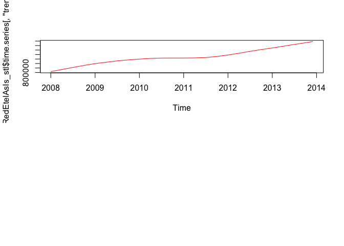

# Analysis of the basic data
Nathan Mowat Chris Woodard, Jessica Wheeler, Bill Kerneckel  
July 7, 2016  


****************************

#### Table of Contents

[Back to Home](https://github.com/wkerneck/CaseStudy2)

* 2.0   [Analysis of the basic data](#id-section2)
* 2.1   [Development of the business portfolio](#id-section2.1)
* 1.2   [Transformation the data into vectors and time series](#id-section1.2)


****************************
<div id='id-section2.0'/>
#### 2. Analysis of the basic data  
<div id='id-section2.1'/>
#### 2.1 Development of the business portfolio

Due to the different scales, it makes sense to plot each graph individually instead of plotting them all on one set of axes. 


```r
par(mfrow=c(2,1))
plot(RedEtelAsIs, col="red", main="RedEtelAsIs")
plot(RedEtelPlan, col="red", main="RedEtelPlan")
```

<!-- -->

```r
mywait()
```

```
## <Tcl>
```

****************************
<div id='id-section2.2'/>
####  2.2 Correlation between As Is and Plan data                                  

Test the correlation between As Is and Plan data in order to test how exact the planning is. Correlation is a measure of linear relationship between two variables. 


```r
cor(RedEtelAsIs , RedEtelPlan)
```

```
## [1] 0.9106702
```

```r
mywait()
```

```
## <Tcl>
```

****************************
<div id='id-section2.2'/>
#### 2.3 Time series analysis                                                     

****************************
<div id='id-section2.2'/>
#### 2.3.1 "stl" function                                                         

The time series can be analysed using the stl function in order to seperate the trend, seasonality and remainder (remaining coincidential) components from one another.


```r
RedEtelAsIs_stl <- stl(RedEtelAsIs , s.window=5)
```

Thus the individual time series can be shown graphically and tabularly.The trend of the total exports is almost linear. A relatively uniform seaonality can be seen. It is interesting to note that the almost linear trend is not seen in the individual segments. The individual trends run partially in opposite directions in the middle of the time scale, which causes the linear trend in the total As Is data.


```r
plot(RedEtelAsIs_stl, col="black", main="RedEtelAsIs_stl")
```

<!-- -->

```r
RedEtelAsIs_stl
```

```
##  Call:
##  stl(x = RedEtelAsIs, s.window = 5)
## 
## Components
##             seasonal     trend   remainder
## Jan 2008  115268.835  819418.3  -80911.162
## Feb 2008   53585.615  835090.7 -151982.316
## Mar 2008  111466.463  850763.1   51778.461
## Apr 2008 -223395.889  866435.4  168974.440
## May 2008 -257525.355  881768.0   36385.394
## Jun 2008 -386103.162  897100.5  -54367.310
## Jul 2008 -454551.470  912433.0  108491.485
## Aug 2008 -353485.938  927380.2   37036.720
## Sep 2008  562461.720  942327.5 -238257.172
## Oct 2008  310944.528  957274.7  124204.786
## Nov 2008  306904.849  971015.9  -65803.760
## Dec 2008  214406.334  984757.1   56205.531
## Jan 2009  124363.076  998498.4   52930.565
## Feb 2009   71697.616 1008743.3   39293.091
## Mar 2009  103161.725 1018988.2   -6506.953
## Apr 2009 -257075.580 1029233.2  113255.418
## May 2009 -260763.268 1039127.1  -58571.874
## Jun 2009 -380805.212 1049021.1  -19457.912
## Jul 2009 -479246.894 1058915.1  118797.789
## Aug 2009 -347308.936 1066343.0  -74456.050
## Sep 2009  605315.129 1073770.9  -59225.996
## Oct 2009  296829.840 1081198.7  -96504.588
## Nov 2009  308679.739 1086986.0  111974.233
## Dec 2009  210565.226 1092773.3  -39898.534
## Jan 2010  165231.780 1098560.6    3889.633
## Feb 2010  144199.451 1103536.8   83280.783
## Mar 2010   73948.266 1108512.9   44404.788
## Apr 2010 -368967.981 1113489.1 -154893.145
## May 2010 -274074.598 1116232.9  116801.697
## Jun 2010 -359642.195 1118976.7  140374.518
## Jul 2010 -553371.024 1121720.5 -155685.429
## Aug 2010 -315325.262 1122005.8  -25317.534
## Sep 2010  774692.841 1122291.1  109414.018
## Oct 2010  242868.585 1122576.5  122234.930
## Nov 2010  337167.718 1122626.4 -102618.100
## Dec 2010  205190.103 1122676.3   -2105.381
## Jan 2011  133952.721 1122726.2   29695.105
## Feb 2011  142906.823 1123505.9  -74990.731
## Mar 2011   45715.744 1124285.6  -47397.386
## Apr 2011 -432326.121 1125065.4   80411.745
## May 2011 -266747.553 1127972.9 -126278.375
## Jun 2011 -436589.538 1130880.5  -83245.941
## Jul 2011 -572771.802 1133788.0   66181.771
## Aug 2011 -254066.178 1141308.2   87855.956
## Sep 2011  824288.759 1148828.4   18141.828
## Oct 2011  266961.044 1156348.6 -163651.649
## Nov 2011  411252.213 1167560.9   -7996.121
## Dec 2011  155394.594 1178773.2   80708.196
## Jan 2012  188862.232 1189985.5 -144306.744
## Feb 2012  106679.632 1203067.9   52275.454
## Mar 2012    5345.035 1216150.3   25750.648
## Apr 2012 -295813.639 1229232.7 -178072.081
## May 2012 -363944.157 1243491.3  164701.888
## Jun 2012 -509744.966 1257749.8  -29522.851
## Jul 2012 -580474.662 1272008.4   37477.296
## Aug 2012 -361163.446 1284870.0   56447.422
## Sep 2012  915303.837 1297731.7 -182359.519
## Oct 2012  322707.245 1310593.3   87000.416
## Nov 2012  441745.957 1322405.3  153256.733
## Dec 2012  152706.817 1334217.3 -172227.099
## Jan 2013  198867.808 1346029.3  177102.939
## Feb 2013   96731.864 1359290.0  -66837.878
## Mar 2013   -6338.588 1372550.8  -66542.188
## Apr 2013 -265875.136 1385811.5  300102.598
## May 2013 -387655.909 1398857.8 -227168.886
## Jun 2013 -529820.071 1411904.1  -64901.981
## Jul 2013 -584752.754 1424950.3  -76077.555
## Aug 2013 -390807.670 1437753.9 -250823.189
## Sep 2013  935099.766 1450557.4  255568.824
## Oct 2013  338995.467 1463361.0   75567.574
## Nov 2013  450559.803 1476384.4  -76833.165
## Dec 2013  148428.084 1489407.8   75767.153
```

```r
mywait()
```

```
## <Tcl>
```

```r
par(mfrow=c(3,2))


plot(RedEtelAsIs_stl$time.series[,"trend"], col="red")
mywait()
```

```
## <Tcl>
```

<!-- -->

****************************
<div id='id-section2.3'/>

#### 2.3.2 Modification of the seasonal componant to a monthly base       

The modification of the seasonlity component can also be changed into a monthly view. It only makes sense to do this if the seasonality componant as the trend looks almost identical and the remainder is then randomly spread. 


```r
monthplot(RedEtelAsIs_stl$time.series[,"seasonal"], main="", ylab="Seasonal")
```

<!-- -->

```r
mywait()
```

```
## <Tcl>
```
