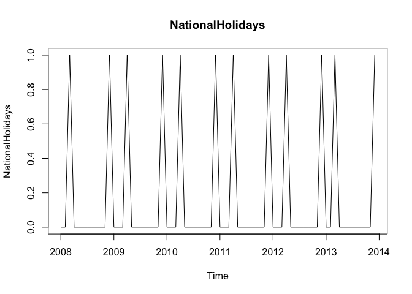
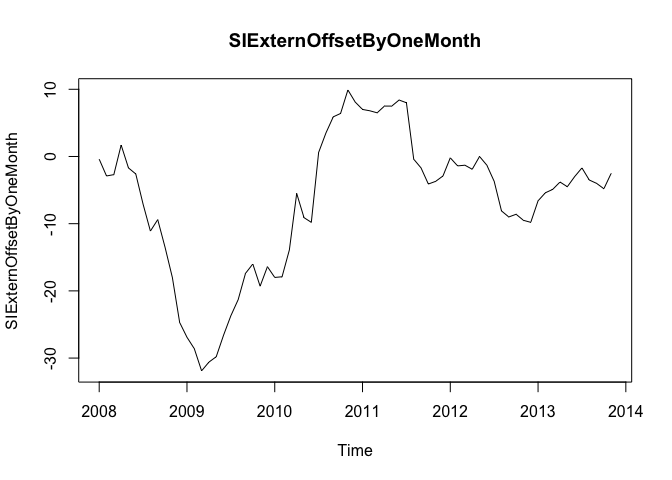

# Correlation of different external indicators
Nathan Mowat, Chris Woodard, Jessica Wheeler, Bill Kerneckel  
July 7, 2016  


****************************

#### Table of Contents

[Back to Home](https://github.com/wkerneck/CaseStudy2)

* 3.0   [Correlation of different external indicators](#id-section3)
* 3.1   [Definition of the indicators and their correlation with the basic data](#id-section3.1)
* 3.2   [Correlation of the indicators with a time offset ](#id-section3.2)
* 3.3   [Correlation of the indicators with each another](#id-section3.3)


****************************
<div id='id-section3.0'/>
#### 3.0 Correlation of different external indicators  

****************************
<div id='id-section3.1'/>
#### 3.1 Definition of the indicators and their correlation with the basic data

The following indicators are to be tested:

1.  [Monthly Change in Export Price Index (CEPI)](#id-section3.1.1)
2.  [Monthly Satisfaction Index (SI) government based data](#id-section3.1.2)
3.  [Average monthly temperatures in Chulwalar](#id-section3.1.3)
4.  [Monthly births in Chulwalar](#id-section3.1.4)
5.  [Monthly Satisfaction Index (SI) external index](#id-section3.1.5) 
6.  [Yearly Exports from Urbano](#id-section3.1.6)
7.  [Yearly number of Globalisation Party members in Chulwalar](#id-section3.1.7)
8.  [Monthly Average Export Price Index for Chulwalar](#id-section3.1.8)
9.  [Monthly Producer Price Index (PPI) for RedEtel in Chulwalar](#id-section3.1.9)
10. [National Holidays](#id-section3.1.10)
11. [Chulwalar Index (Total value of all companies in Chulwalar)](#id-section3.1.11)
12.	[Monthly Inflation rate in Chulwalar](#id-section3.1.12)
13.	[Proposed spending for National Holidays](#id-section3.1.13)
14. [Influence of National Holiday](#id-section3.1.14)

<div id='id-section3.1.1'/>
The indicators will be converted into individual vectors and subsequently converted into time series. The correlation of the indicators will then be tested against the As Is exports for Chulwalar. 


```r
CEPIVector <- c(ImportedIndicators[2:13,2],ImportedIndicators[2:13,3],ImportedIndicators[2:13,4],ImportedIndicators[2:13,5],ImportedIndicators[2:13,6],ImportedIndicators[2:13,7])
CEPI <- ts(CEPIVector , start=c(2008,1), end=c(2013,12), frequency=12)

plot(CEPI, main="CEPI")
```

<!-- -->

```r
cor(RedEtelAsIs , CEPI)
```

```
## [1] 0.3587646
```

The CEPI does not correlates very well with the RedEtel exports. 

<div id='id-section3.1.2'/>
<strong>Monthly Satisfaction Index (SI) government based data.</strong>


```r
SIGovVector <- c(ImportedIndicators[16:27,2],ImportedIndicators[16:27,3],ImportedIndicators[16:27,4],ImportedIndicators[16:27,5],ImportedIndicators[16:27,6],ImportedIndicators[16:27,7])
SIGov <- ts(SIGovVector , start=c(2008,1), end=c(2013,12), frequency=12)

plot(SIGov, main="SIGov")
```

<!-- -->

```r
cor(RedEtelAsIs , SIGov)
```

```
## [1] 0.009978415
```


The Satisfaction Index does not show any particular correlation with any of the exports data. 

<div id='id-section3.1.3'/>
<strong>Average monthly temperatures in Chulwalar.</strong>


```r
TemperatureVector <- c(ImportedIndicators[30:41,2],ImportedIndicators[30:41,3],ImportedIndicators[30:41,4],ImportedIndicators[30:41,5],ImportedIndicators[30:41,6],ImportedIndicators[30:41,7])
Temperature <- ts(TemperatureVector, start=c(2008,1), end=c(2013,12), frequency=12)

plot(Temperature, main="Temperature")
```

<!-- -->

```r
cor(RedEtelAsIs , Temperature)
```

```
## [1] -0.4028941
```

The temperatures have a negative correlation, exports increase in the colder months. 

<div id='id-section3.1.4'/>
<strong>Monthly births in Chulwalar</strong> 


```r
BirthsVector <- c(ImportedIndicators[44:55,2],ImportedIndicators[44:55,3],ImportedIndicators[44:55,4],ImportedIndicators[44:55,5],ImportedIndicators[44:55,6],ImportedIndicators[44:55,7])
Births <- ts(BirthsVector, start=c(2008,1), end=c(2013,12), frequency=12)

plot(Births, main="Births")
```

<!-- -->

```r
cor(RedEtelAsIs , Births)
```

```
## [1] -0.1217222
```

The consideration by Chulwalar's experts was that expecting new parents to try to export more products to pay for the 
cost of a new child. However, this could not be confirmed.  

<div id='id-section3.1.5'/>
<strong>Monthly Satisfaction Index (SI) external index</strong>


```r
SIExternVector <- c(ImportedIndicators[58:69,2],ImportedIndicators[58:69,3],ImportedIndicators[58:69,4],ImportedIndicators[58:69,5],ImportedIndicators[58:69,6],ImportedIndicators[58:69,7])
SIExtern <- ts(SIExternVector, start=c(2008,1), end=c(2013,12), frequency=12)

plot(SIExtern, main="SIExtern")
```

<!-- -->

```r
cor(RedEtelAsIs , SIExtern)
```

```
## [1] 0.2960946
```

<div id='id-section3.1.6'/>
<strong>Yearly exports from Urbano</strong>


```r
UrbanoExportsVector <- c(ImportedIndicators[72:83,2],ImportedIndicators[72:83,3],ImportedIndicators[72:83,4],ImportedIndicators[72:83,5],ImportedIndicators[72:83,6],ImportedIndicators[72:83,7])
UrbanoExports <- ts(UrbanoExportsVector, start=c(2008,1), end=c(2013,12), frequency=12)

plot(UrbanoExports, main="UrbanoExports")
```

<!-- -->

```r
cor(RedEtelAsIs , UrbanoExports)
```

```
## [1] 0.3309962
```

This indicator also has a moderately low correlation with RedEtel exports. Unfortunatly it was not possible to find other useful indicators based on exports from Urbano, due to possible informers being very restrictive with information. 

<div id='id-section3.1.7'/>
<strong>Yearly number of Globalisation Party members in Chulwalar</strong>


```r
GlobalisationPartyMembersVector <- c(ImportedIndicators[86:97,2],ImportedIndicators[86:97,3],ImportedIndicators[86:97,4],ImportedIndicators[86:97,5],ImportedIndicators[86:97,6],ImportedIndicators[86:97,7])
GlobalisationPartyMembers <- ts(GlobalisationPartyMembersVector, start=c(2008,1), end=c(2013,12), frequency=12)

plot(GlobalisationPartyMembers, main="GlobalisationPartyMembers")
```

<!-- -->

```r
cor(RedEtelAsIs , GlobalisationPartyMembers)
```

```
## [1] 0.3234832
```

There is a similar picture here to that of Urbano Exports.It should however be noted that there is a continuos growth here and that the yearly view could lead to the data appearing to correlate, although this could just be due to an increase in trend. Although this could also be true for the Urbano Exports, the trend seems logical due to the Chulwalar's exports growing in accordance with the Urbano's Exports.

<div id='id-section3.1.8'/>
<strong>Monthly Average Export Price Index for Chulwalar</strong>


```r
AEPIVector <- c(ImportedIndicators[100:111,2],ImportedIndicators[100:111,3],ImportedIndicators[100:111,4],ImportedIndicators[100:111,5],ImportedIndicators[100:111,6],ImportedIndicators[100:111,7])
AEPI <- ts(AEPIVector, start=c(2008,1), end=c(2013,12), frequency=12)

plot(AEPI, main="AEPI")
```

<!-- -->

```r
cor(RedEtelAsIs , AEPI)
```

```
## [1] 0.3157277
```

The continuous growth leads to a moderately low correlation here too. See Above

<div id='id-section3.1.9'/>
<strong>Monthly Producer Price Index (PPI) for RedEtel in Chulwalar</strong>


```r
PPIEtelVector <- c(ImportedIndicators[114:125,2],ImportedIndicators[114:125,3],ImportedIndicators[114:125,4],ImportedIndicators[114:125,5],ImportedIndicators[114:125,6],ImportedIndicators[114:125,7])
PPIEtel <- ts(PPIEtelVector, start=c(2008,1), end=c(2013,12), frequency=12)

plot(PPIEtel, main="PPIEtel")
```

<!-- -->

```r
cor(RedEtelAsIs , PPIEtel)
```

```
## [1] 0.3391872
```

This indicator does not give the expected results. It does not show any correlation worth mentioning, not even with the Etel segment. 

<div id='id-section3.1.10'/>
<strong>National Holidays</strong>


```r
NationalHolidaysVector <- c(ImportedIndicators[170:181,2],ImportedIndicators[170:181,3],ImportedIndicators[170:181,4],ImportedIndicators[170:181,5],ImportedIndicators[170:181,6],ImportedIndicators[170:181,7])
NationalHolidays <- ts(NationalHolidaysVector, start=c(2008,1), end=c(2013,12), frequency=12)

plot(NationalHolidays, main="NationalHolidays")
```

<!-- -->

```r
cor(RedEtelAsIs , NationalHolidays)
```

```
## [1] -0.01717636
```

The months April and December do not correlate well with the exports data. However later tests will show that these are worth considering. The missing correlation is just due to the sparse structure of the National Holidays time series.

<div id='id-section3.1.11'/>
<strong>Chulwalar Index (Total value of all companies in Chulwalar)</strong>


```r
ChulwalarIndexVector <- c(ImportedIndicators[128:139,2],ImportedIndicators[128:139,3],ImportedIndicators[128:139,4],ImportedIndicators[128:139,5],ImportedIndicators[128:139,6],ImportedIndicators[128:139,7])
ChulwalarIndex <- ts(ChulwalarIndexVector, start=c(2008,1), end=c(2013,12), frequency=12)

plot(ChulwalarIndex, main="ChulwalarIndex")
```

<!-- -->

```r
cor(RedEtelAsIs , ChulwalarIndex)
```

```
## [1] 0.2242922
```

No particular findings

<div id='id-section3.1.12'/>
<strong>Monthly Inflation rate in Chulwalar</strong>


```r
InflationVector <- c(ImportedIndicators[142:153,2],ImportedIndicators[142:153,3],ImportedIndicators[142:153,4],ImportedIndicators[142:153,5],ImportedIndicators[142:153,6],ImportedIndicators[142:153,7])
Inflation <- ts(InflationVector, start=c(2008,1), end=c(2013,12), frequency=12)

plot(Inflation, main="Inflation")
```

<!-- -->

```r
cor(RedEtelAsIs , Inflation)
```

```
## [1] -0.0982151
```

No particular findings

<div id='id-section3.1.13'/>
<strong>Proposed spending for Independence day presents</strong>


```r
IndependenceDayPresentsVector <- c(ImportedIndicators[156:167,2],ImportedIndicators[156:167,3],ImportedIndicators[156:167,4],ImportedIndicators[156:167,5],ImportedIndicators[156:167,6],ImportedIndicators[156:167,7])
IndependenceDayPresents <- ts(IndependenceDayPresentsVector, start=c(2008,1), end=c(2013,12), frequency=12)
plot(IndependenceDayPresents, main="IndependenceDayPresents")
```

<!-- -->

```r
cor(RedEtelAsIs , IndependenceDayPresents)
```

```
## [1] 0.2881631
```

No particular findings

<div id='id-section3.1.14'/>
<strong>Influence of National Holidays:</strong>

This indicator is an experiment where the influence of National Holidays is extended into the months leading up to the holiday. However later tests show that this indicator is no better for forecasting than the orignial National Holidays indicator.


```r
InfluenceNationalHolidaysVector <- c(ImportedIndicators[184:195,2],ImportedIndicators[184:195,3],ImportedIndicators[184:195,4],ImportedIndicators[184:195,5],ImportedIndicators[184:195,6],ImportedIndicators[184:195,7])
InfluenceNationalHolidays <- ts(InfluenceNationalHolidaysVector, start=c(2008,1), end=c(2013,12), frequency=12)

plot(InfluenceNationalHolidays, main="InfluenceNationalHolidays")
```

<!-- -->

```r
cor(RedEtelAsIs , InfluenceNationalHolidays)
```

```
## [1] 0.4643512
```

Check that the data import has worked


```r
head(CEPIVector) 
```

```
## [1] 97.4 97.8 98.3 98.1 98.7 98.9
```

```r
head(SIGovVector)  
```

```
## [1] -0.4 -2.9 -2.7  1.7 -1.7 -2.6
```

```r
head(TemperatureVector)
```

```
## [1]  3.6  3.7  4.2  7.6 14.5 16.9
```

```r
head(BirthsVector) 
```

```
## [1] 58519 53370 52852 55048 57398 58313
```

```r
head(SIExternVector) 
```

```
## [1] 4.5 4.5 4.6 4.6 5.0 4.3
```

```r
head(UrbanoExportsVector) 
```

```
## [1] 5850000 5850000 5850000 5850000 5850000 5850000
```

```r
head(GlobalisationPartyMembersVector) 
```

```
## [1] 45089 45089 45089 45089 45089 45089
```

```r
head(AEPIVector) 
```

```
## [1]  99.0  99.3  99.5  99.2  99.5 100.2
```

```r
head(PPIEtelVector) 
```

```
## [1] 100.6  99.7  99.9  99.6 100.0  99.7
```

```r
head(NationalHolidaysVector) 
```

```
## [1] 0 0 1 0 0 0
```

```r
head(ChulwalarIndexVector) 
```

```
## [1] 6851.75 6748.13 6534.97 6948.82 7096.79 6418.32
```

```r
head(InflationVector) 
```

```
## [1] 2.85 2.84 3.15 2.40 3.03 3.24
```

```r
head(IndependenceDayPresentsVector) 
```

```
## [1] 221 221 221 221 221 221
```

****************************
<div id='id-section3.2'/>
####  3.2 Correlation of the indicators with a time offset                                  

Test the correlation between As Is and Plan data in order to test how exact the planning is. Correlation is a measure of linear relationship between two variables. 


```r
SIExternOffsetByOneMonthVector <- c(ImportedIndicators[57:68,2],ImportedIndicators[57:68,3],ImportedIndicators[57:68,4],ImportedIndicators[57:68,5],ImportedIndicators[57:68,6],ImportedIndicators[57:68,7])
SIExternOffsetByOneMonth <- ts(SIGovVector, start=c(2008,1), end=c(2013,11), frequency=12)

plot(SIExternOffsetByOneMonth, main="SIExternOffsetByOneMonth")
```

<!-- -->

Delete December 2013 from the ts 


```r
RedEtelAsIsWithoutDec12013 <- ts(RedEtelAsIsVector, start=c(2008,1), end=c(2013,11), frequency=12)

cor(RedEtelAsIsWithoutDec12013, SIExternOffsetByOneMonth)
```

```
## [1] 0.002745801
```

The result is not very convincing.

Offset SIGov Indicator by two months


```r
SIGovVectorShifted2Months <- c(ImportedIndicators[15:26,2],ImportedIndicators[15:26,3],ImportedIndicators[15:26,4],ImportedIndicators[15:26,5],ImportedIndicators[15:26,6],ImportedIndicators[15:26,7])
SIGovShifted2Months <- ts(SIGovVectorShifted2Months , start=c(2008,1), end=c(2013,10), frequency=12)
plot(SIGovShifted2Months)
```

<!-- -->

Delete November and December 2013 from the ts


```r
RedEtelAsIsWithoutNovDec2013 <- ts(RedEtelAsIsVector, start=c(2008,1), end=c(2013,10), frequency=12)

cor(RedEtelAsIsWithoutNovDec2013, SIGovShifted2Months)
```

```
## [1] 0.08798115
```

The correlation of the indicators has not really been improved by the offsets, so we will not continue with this approach. 

****************************
<div id='id-section3.3'/>
#### 3.3 Correlation of the indicators with each another                                                   

In order to test which indicators could be used in a model with eachother, we need to look at the correlation of the indicators with eachother. All thirteen indicators will be compared with eachother in a correlation coefficient matrix. First of all it is necessary to summarise all indicators in a matrix.


```r
IndicatorsMatrix <-cbind(CEPIVector, SIGovVector, TemperatureVector, BirthsVector, SIGovVector, UrbanoExportsVector, GlobalisationPartyMembersVector, AEPIVector, PPIEtel, NationalHolidaysVector, ChulwalarIndexVector, InflationVector, IndependenceDayPresentsVector)
```

Establish the standardised data matrix


```r
IndicatorsmatrixStandardised=scale(IndicatorsMatrix)
```

The dimensions of the matrix are determined by the number of indicators.


```r
NumberOfIndicators=dim(IndicatorsmatrixStandardised)[1]
```

Produce the IndicatorsCorrelationCoefficientMatrix.


```r
IndicatorsCorrelationCoefficientMatrix=(1/(NumberOfIndicators-1))*t(IndicatorsmatrixStandardised)%*%IndicatorsmatrixStandardised
```

The Correlation Coefficient Matrix shows that CEPI has a moderately low correlation, UrbanoExports, GlobalisationPartyMembers and AEPI.  These will become the set of indicators used later, although we are aware of the dangers of multicollinearity. Red Etel is also moderately negatively correlated with temperature.

However it is interesting to note that NationalHolidays, UrbanoExports, GlobalisationPartyMembers have a very low correlation with one another. Therefore these will also  become a set of indicators used later.

****************************
