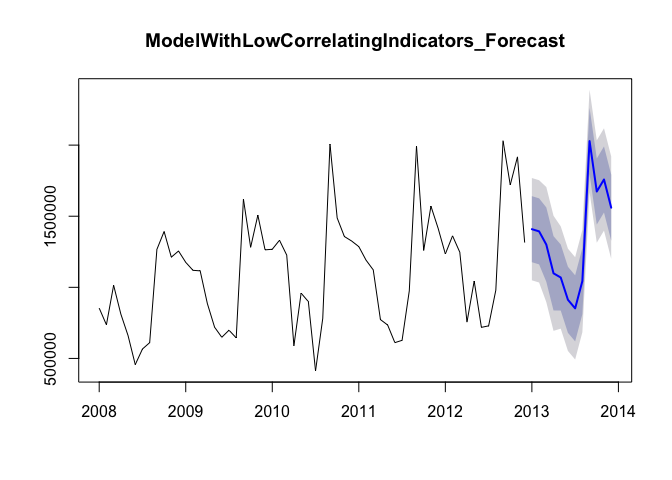

# Forecasts with the models
Nathan Mowat, Chris Woodard, Jessica Wheeler, Bill Kerneckel  
July 7, 2016  


****************************

#### Table of Contents

[Back to Home](https://github.com/wkerneck/CaseStudy2)

* 5.0     [Forecasts with the models](#id-section5)
* 5.1     [Shorten the time series in order to test the forecasts](#id-section5.1)
* 5.2     [Forecasting und testing the models](#id-section5.2)
* 5.2.1.1 [Forecast ModelWithHighCorrelatingIndicators](#id-section5.1.1)
* 5.2.1.2 [Forecast ModelWithLowCorrelatingIndicators](#id-section5.2.1.2)
* 5.2.2   [Forecast ModelWithTrendAndSeasonalityOnly](#id-section5.2.2)
* 5.2.3   [Forecast ModelWithRedEtelExportsIndicators](#id-section5.2.3)
* 5.2.4   [Forecast ModelWithRedEtelExportsIndicators](#id-section5.2.4)
* 5.2.5   [Forecast ModelTotalEtel](#id-section5.2.5)
* 5.2.6   [Forecast ModelWithTotalUrbanoExport](#id-section5.2.6)
* 5.2.7   [Forecast ModelWithNationalHolidays](#id-section5.2.7)
* 5.2.8   [Forecast ModelWithInfluenceNationalHoliday](#id-section5.2.8)

****************************
<div id='id-section5.0'/>
#### 5.0 Forecasts with the models

****************************
<div id='id-section5.1'/>

####  5.1 Shorten the time series in order to test the forecasts

Shortening the exports data in the Time Series in order to be able to compare the produced forecasts with the 

<strong>As Is data</strong>


```r
TotalAsIs_2012 <- ts(TotalAsIsVector , start=c(2008,1), end=c(2012,12), frequency=12)

RedEtelAsIs_2012 <- ts(RedEtelAsIsVector, start=c(2008,1), end=c(2012,12), frequency=12)

YearAsIs_2012 <- ts(YearAsIsVector, start=c(2008,1), end=c(2012,12), frequency=12)
```

Shortening the indicators by the same amount


```r
CEPI_2012 <- ts(CEPIVector , start=c(2008,1), end=c(2012,12), frequency=12)
SIGov_2012 <- ts(SIGovVector , start=c(2008,1), end=c(2012,12), frequency=12)
Temperature_2012 <- ts(TemperatureVector, start=c(2008,1), end=c(2012,12), frequency=12)
Births_2012 <- ts(BirthsVector, start=c(2008,1), end=c(2012,12), frequency=12)
SIExtern_2012 <- ts(SIExternVector, start=c(2008,1), end=c(2012,12), frequency=12)
UrbanoExports_2012 <- ts(UrbanoExportsVector, start=c(2008,1), end=c(2012,12), frequency=12)
GlobalisationPartyMembers_2012 <- ts(GlobalisationPartyMembersVector, start=c(2008,1), end=c(2012,12), frequency=12)
AEPI_2012 <- ts(AEPIVector, start=c(2008,1), end=c(2012,12), frequency=12)
PPIEtel_2012 <- ts(PPIEtel, start=c(2008,1), end=c(2012,12), frequency=12)
NationalHolidays_2012 <- ts(NationalHolidaysVector, start=c(2008,1), end=c(2012,12), frequency=12)
ChulwalarIndex_2012 <- ts(ChulwalarIndexVector, start=c(2008,1), end=c(2012,12), frequency=12)
Inflation_2012 <- ts(InflationVector, start=c(2008,1), end=c(2012,12), frequency=12)
InfluenceNationalHolidays_2012 <- ts(InfluenceNationalHolidaysVector, start=c(2008,1), end=c(2012,12), frequency=12)
```

Seperate the As Is and Plan data for 2013 in order to be able to compare the forecast to this data.


```r
TotalAsIsVector_2013 <- c(ImportedAsIsData [2:13,7])
RedEtelAsIsVector_2013 <- c(ImportedAsIsData [72:83,7])
YearAsIsVector_2013 <- c(ImportedAsIsData [86,7])

TotalAsIs_2013 <- ts(TotalAsIsVector_2013, start=c(2013,1), end=c(2013,12), frequency=12)
RedEtelAsIs_2013 <- ts(RedEtelAsIsVector_2013, start=c(2013,1), end=c(2013,12), frequency=12)
YearAsIs_2013 <- ts(YearAsIsVector_2013, start=c(2013,1), end=c(2013,12), frequency=12)

PlanVector_2013 <- c(ImportedPlanData[2:13,7])
RedEtelPlanVector_2013 <- c(ImportedPlanData[72:83,7])
YearPlanVector_2013 <- c(ImportedPlanData[86,7])

TotalPlan_2013 <- ts(PlanVector_2013, start=c(2013,1), end=c(2013,12), frequency=12)
RedEtelPlan_2013 <- ts(RedEtelPlanVector_2013, start=c(2013,1), end=c(2013,12), frequency=12)
YearPlan_2013 <- ts(YearPlanVector_2013, start=c(2013,1), end=c(2013,12), frequency=12)
```

Seperate the indicator data for 2013 and 2014 in order to use these in the forecasts. First as a vector and then as a time series.


```r
CEPIVector_2013 <- c(ImportedIndicators[2:13,7])
CEPIVector_2014 <- c(ImportedIndicators[2:13,8])
SIGovVector_2013 <- c(ImportedIndicators[16:27,7])
SIGovVector_2014 <- c(ImportedIndicators[16:27,8])
TemperatureVector_2013 <- c(ImportedIndicators[30:41,7])
TemperatureVector_2014 <- c(ImportedIndicators[30:41,8])
BirthsVector_2013 <- c(ImportedIndicators[44:55,7])
BirthsVector_2014 <- c(ImportedIndicators[44:55,8])
SIExternVector_2013 <- c(ImportedIndicators[58:69,7])
SIExternVector_2014 <- c(ImportedIndicators[58:69,8])
UrbanoExportsVector_2013 <- c(ImportedIndicators[72:83,7])
UrbanoExportsVector_2014 <- c(ImportedIndicators[72:83,8])
GlobalisationPartyMembersVector_2013 <- c(ImportedIndicators[86:97,7])
GlobalisationPartyMembersVector_2014 <- c(ImportedIndicators[86:97,8])
AEPIVector_2013 <- c(ImportedIndicators[100:111,7])
AEPIVector_2014 <- c(ImportedIndicators[100:111,8])
PPIEtelVector_2013 <- c(ImportedIndicators[114:125,7])
PPIEtelVector_2014 <- c(ImportedIndicators[114:125,8])
NationalHolidaysVector_2013 <-c(ImportedIndicators[170:181,7])
NationalHolidaysVector_2014 <-c(ImportedIndicators[170:181,8])
ChulwalarIndexVector_2013 <- c(ImportedIndicators[128:139,7])
ChulwalarIndexVector_2014 <- c(ImportedIndicators[128:139,8])
InflationVector_2013 <- c(ImportedIndicators[142:153,7])
InflationVector_2014 <- c(ImportedIndicators[142:153,8])
InfluenceNationalHolidaysVector_2013 <-c(ImportedIndicators[184:195,7])
InfluenceNationalHolidaysVector_2014 <-c(ImportedIndicators[184:195,8])

CEPI_2013 <- ts(CEPIVector_2013 , start=c(2013,1), end=c(2013,12), frequency=12)
CEPI_2014 <- ts(CEPIVector_2014 , start=c(2013,1), end=c(2013,12), frequency=12)
SIGov_2013 <- ts(SIGovVector_2013 , start=c(2013,1), end=c(2013,12), frequency=12)
SIGov_2014 <- ts(SIGovVector_2014 , start=c(2013,1), end=c(2013,12), frequency=12)
Temperature_2013 <- ts(TemperatureVector_2013, start=c(2013,1), end=c(2013,12), frequency=12)
Temperature_2014 <- ts(TemperatureVector_2014, start=c(2013,1), end=c(2013,12), frequency=12)
Births_2013 <- ts(BirthsVector_2013, start=c(2013,1), end=c(2013,12), frequency=12)
Births_2014 <- ts(BirthsVector_2014, start=c(2013,1), end=c(2013,12), frequency=12)
SIExtern_2013 <- ts(SIExternVector_2013, start=c(2013,1), end=c(2013,12), frequency=12)
SIExtern_2014 <- ts(SIExternVector_2014, start=c(2013,1), end=c(2013,12), frequency=12)
UrbanoExports_2013 <- ts(UrbanoExportsVector_2013, start=c(2013,1), end=c(2013,12), frequency=12)
UrbanoExports_2014 <- ts(UrbanoExportsVector_2014, start=c(2013,1), end=c(2013,12), frequency=12)
GlobalisationPartyMembers_2013 <- ts(GlobalisationPartyMembersVector_2013, start=c(2013,1), end=c(2013,12), frequency=12)
GlobalisationPartyMembers_2014 <- ts(GlobalisationPartyMembersVector_2014, start=c(2013,1), end=c(2013,12), frequency=12)
AEPI_2013 <- ts(AEPIVector_2013, start=c(2013,1), end=c(2013,12), frequency=12)
AEPI_2014 <- ts(AEPIVector_2013, start=c(2013,1), end=c(2013,12), frequency=12)
PPIEtel_2013 <- ts(PPIEtelVector_2013, start=c(2013,1), end=c(2013,12), frequency=12)
PPIEtel_2014 <- ts(PPIEtelVector_2014, start=c(2013,1), end=c(2013,12), frequency=12)
NationalHolidays_2013 <- ts(NationalHolidaysVector_2013, start=c(2013,1), end=c(2013,12), frequency=12)
NationalHolidays_2014 <- ts(NationalHolidaysVector_2014, start=c(2014,1), end=c(2014,12), frequency=12)
ChulwalarIndex_2013 <- ts(ChulwalarIndexVector_2013, start=c(2013,1), end=c(2013,12), frequency=12)
ChulwalarIndex_2014 <- ts(ChulwalarIndexVector_2014, start=c(2013,1), end=c(2013,12), frequency=12)
Inflation_2013 <- ts(InflationVector_2013, start=c(2013,1), end=c(2013,12), frequency=12)
Inflation_2014 <- ts(InflationVector_2014, start=c(2013,1), end=c(2013,12), frequency=12)
InfluenceNationalHolidaysVector_2013 <- ts(InfluenceNationalHolidaysVector_2013, start=c(2013,1), end=c(2013,12), frequency=12)
InfluenceNationalHolidaysVector_2014 <- ts(InfluenceNationalHolidaysVector_2014, start=c(2013,1), end=c(2013,12), frequency=12)
```

****************************
<div id='id-section5.2'/>
####  5.2 Forecasting und testing the models        


****************************
<div id='id-section5.2.1.1'/>
####  5.2.1.1 Forecast ModelWithHighCorrelatingIndicators

Shorten ModelWithHighCorrelatingIndicators by one year in order to be able to produce a forecast for 2013. 


```r
ModelWithHighCorrelatingIndicators_2012 <- tslm(TotalAsIs_2012 ~ trend + season + CEPI_2012 + SIExtern_2012 + UrbanoExports_2012 + GlobalisationPartyMembers_2012 + AEPI_2012)
summary(ModelWithHighCorrelatingIndicators_2012) 
```

```
## 
## Call:
## tslm(formula = TotalAsIs_2012 ~ trend + season + CEPI_2012 + 
##     SIExtern_2012 + UrbanoExports_2012 + GlobalisationPartyMembers_2012 + 
##     AEPI_2012)
## 
## Residuals:
##     Min      1Q  Median      3Q     Max 
## -590682 -148874   23944  148648  423243 
## 
## Coefficients:
##                                  Estimate Std. Error t value Pr(>|t|)    
## (Intercept)                    -1.542e+07  1.461e+07  -1.056 0.297224    
## trend                           2.827e+02  2.096e+04   0.013 0.989301    
## season2                        -1.071e+05  1.777e+05  -0.603 0.549946    
## season3                         6.219e+04  2.031e+05   0.306 0.760993    
## season4                        -7.186e+05  1.935e+05  -3.715 0.000595 ***
## season5                        -5.757e+05  1.978e+05  -2.910 0.005752 ** 
## season6                        -8.241e+05  1.994e+05  -4.134 0.000167 ***
## season7                        -1.083e+06  2.186e+05  -4.955 1.23e-05 ***
## season8                        -6.963e+05  2.236e+05  -3.113 0.003325 ** 
## season9                         6.649e+05  2.219e+05   2.996 0.004572 ** 
## season10                        3.046e+05  2.223e+05   1.370 0.177909    
## season11                        5.136e+05  2.230e+05   2.303 0.026314 *  
## season12                        4.974e+04  2.530e+05   0.197 0.845057    
## CEPI_2012                       2.248e+05  1.922e+05   1.169 0.248882    
## SIExtern_2012                   2.369e+04  4.590e+04   0.516 0.608451    
## UrbanoExports_2012             -1.522e-01  5.208e-01  -0.292 0.771535    
## GlobalisationPartyMembers_2012  3.142e+01  3.844e+01   0.817 0.418370    
## AEPI_2012                      -4.974e+04  6.236e+04  -0.798 0.429556    
## ---
## Signif. codes:  0 '***' 0.001 '**' 0.01 '*' 0.05 '.' 0.1 ' ' 1
## 
## Residual standard error: 256600 on 42 degrees of freedom
## Multiple R-squared:  0.9145,	Adjusted R-squared:  0.8798 
## F-statistic: 26.41 on 17 and 42 DF,  p-value: < 2.2e-16
```

Add "newdata" to the 2013 indicator values for the forecast 


```r
ModelWithHighCorrelatingIndicators_Forecast <- forecast(ModelWithHighCorrelatingIndicators_2012,newdata=data.frame(CEPI_2012=CEPI_2013, SIExtern_2012=SIExtern_2013, UrbanoExports_2012= UrbanoExports_2013, GlobalisationPartyMembers_2012=GlobalisationPartyMembers_2013, AEPI_2012=AEPI_2013),h=12)
plot(ModelWithHighCorrelatingIndicators_Forecast, main="ModelWithHighCorrelatingIndicators_Forecast")
```

<!-- -->

```r
ModelWithHighCorrelatingIndicators_Forecast
```

```
##          Point Forecast   Lo 80   Hi 80   Lo 95   Hi 95
## Jan 2013        3588409 3145307 4031511 2901625 4275193
## Feb 2013        3615751 3174780 4056722 2932271 4299231
## Mar 2013        3857685 3418316 4297055 3176687 4538684
## Apr 2013        2959830 2478742 3440918 2214171 3705489
## May 2013        3163014 2698603 3627424 2443204 3882824
## Jun 2013        2934791 2472811 3396771 2218748 3650835
## Jul 2013        2755659 2296827 3214490 2044495 3466822
## Aug 2013        3167751 2707972 3627531 2455119 3880384
## Sep 2013        4512206 4061044 4963367 3812930 5211481
## Oct 2013        4129962 3677062 4582861 3427993 4831931
## Nov 2013        4398869 3963060 4834678 3723389 5074349
## Dec 2013        4019999 3580235 4459762 3338390 4701608
```

In order to be able to correlate the Forecast with the As Is Data, it is necessary to convert the Point 

<strong>Estimator into a time series.</strong> 


```r
ModelWithHighCorrelatingIndicators_Forecast_df <-as.data.frame(ModelWithHighCorrelatingIndicators_Forecast) 
ModelWithHighCorrelatingIndicators_PointForecast <- ts(ModelWithHighCorrelatingIndicators_Forecast_df$"Point Forecast", start=c(2013,1), end=c(2013,12), frequency=12)
```

Correlation of the forecasts and As Is Data. As a comparison, the correlation of the As Is Data for 2013 with the Plan Data. 


```r
cor(ModelWithHighCorrelatingIndicators_PointForecast, TotalAsIs_2013) 
```

```
## [1] 0.9028604
```

```r
cor(TotalAsIs_2013, TotalPlan_2013)
```

```
## [1] 0.929769
```

A Comparison with linear regression also supports the result.


```r
ModelWithHighCorrelatingIndicators_forecast_lm <- lm(TotalAsIs_2013 ~ ModelWithHighCorrelatingIndicators_PointForecast, data = TotalAsIs_2013)
TotalAsIs_2013_lm <- lm(TotalAsIs_2013 ~ TotalPlan_2013, data = TotalAsIs_2013)
summary(ModelWithHighCorrelatingIndicators_forecast_lm)
```

```
## 
## Call:
## lm(formula = TotalAsIs_2013 ~ ModelWithHighCorrelatingIndicators_PointForecast, 
##     data = TotalAsIs_2013)
## 
## Residuals:
##     Min      1Q  Median      3Q     Max 
## -540546 -227283   12596  157487  731430 
## 
## Coefficients:
##                                                    Estimate Std. Error
## (Intercept)                                      -5.082e+05  6.545e+05
## ModelWithHighCorrelatingIndicators_PointForecast  1.195e+00  1.799e-01
##                                                  t value Pr(>|t|)    
## (Intercept)                                       -0.776    0.455    
## ModelWithHighCorrelatingIndicators_PointForecast   6.641 5.78e-05 ***
## ---
## Signif. codes:  0 '***' 0.001 '**' 0.01 '*' 0.05 '.' 0.1 ' ' 1
## 
## Residual standard error: 357000 on 10 degrees of freedom
## Multiple R-squared:  0.8152,	Adjusted R-squared:  0.7967 
## F-statistic:  44.1 on 1 and 10 DF,  p-value: 5.776e-05
```

```r
summary(TotalAsIs_2013_lm)
```

```
## 
## Call:
## lm(formula = TotalAsIs_2013 ~ TotalPlan_2013, data = TotalAsIs_2013)
## 
## Residuals:
##     Min      1Q  Median      3Q     Max 
## -441885 -227385  -43470  184761  466401 
## 
## Coefficients:
##                  Estimate Std. Error t value Pr(>|t|)    
## (Intercept)    -8.972e+04  4.930e+05  -0.182    0.859    
## TotalPlan_2013  1.053e+00  1.318e-01   7.987  1.2e-05 ***
## ---
## Signif. codes:  0 '***' 0.001 '**' 0.01 '*' 0.05 '.' 0.1 ' ' 1
## 
## Residual standard error: 305700 on 10 degrees of freedom
## Multiple R-squared:  0.8645,	Adjusted R-squared:  0.8509 
## F-statistic: 63.78 on 1 and 10 DF,  p-value: 1.195e-05
```

****************************
<div id='id-section5.2.1.2'/>
####  5.2.1.2 Forecast ModelWithLowCorrelatingIndicators

Shorten ModelWithLowCorrelatingIndicators by one year in order to be able to produce a forecast for 2013.


```r
ModelWithLowCorrelatingIndicators_2012 <- tslm(TotalAsIs_2012 ~ trend + season + NationalHolidays_2012 + UrbanoExports_2012 + GlobalisationPartyMembers_2012)
summary(ModelWithLowCorrelatingIndicators_2012) 
```

```
## 
## Call:
## tslm(formula = TotalAsIs_2012 ~ trend + season + NationalHolidays_2012 + 
##     UrbanoExports_2012 + GlobalisationPartyMembers_2012)
## 
## Residuals:
##     Min      1Q  Median      3Q     Max 
## -508808 -130098   11746  177748  466017 
## 
## Coefficients:
##                                  Estimate Std. Error t value Pr(>|t|)    
## (Intercept)                     1.211e+06  1.549e+06   0.782 0.438428    
## trend                           2.004e+04  1.028e+04   1.950 0.057515 .  
## season2                        -2.898e+04  1.573e+05  -0.184 0.854714    
## season3                         2.520e+05  1.631e+05   1.545 0.129609    
## season4                        -3.800e+05  2.242e+05  -1.695 0.097100 .  
## season5                        -4.697e+05  1.623e+05  -2.894 0.005897 ** 
## season6                        -7.350e+05  1.652e+05  -4.450 5.79e-05 ***
## season7                        -9.668e+05  1.687e+05  -5.732 8.35e-07 ***
## season8                        -5.809e+05  1.727e+05  -3.364 0.001602 ** 
## season9                         7.426e+05  1.772e+05   4.190 0.000132 ***
## season10                        3.765e+05  1.822e+05   2.066 0.044712 *  
## season11                        5.612e+05  1.876e+05   2.991 0.004541 ** 
## season12                        4.716e+05  2.756e+05   1.711 0.094062 .  
## NationalHolidays_2012          -3.051e+05  1.962e+05  -1.554 0.127234    
## UrbanoExports_2012              1.218e-01  1.838e-01   0.663 0.510937    
## GlobalisationPartyMembers_2012  5.692e+00  2.753e+01   0.207 0.837165    
## ---
## Signif. codes:  0 '***' 0.001 '**' 0.01 '*' 0.05 '.' 0.1 ' ' 1
## 
## Residual standard error: 248200 on 44 degrees of freedom
## Multiple R-squared:  0.9162,	Adjusted R-squared:  0.8876 
## F-statistic: 32.05 on 15 and 44 DF,  p-value: < 2.2e-16
```

Add "newdata" to the 2013 indicator values for the forecast 


```r
ModelWithLowCorrelatingIndicators_Forecast <- forecast(ModelWithLowCorrelatingIndicators_2012,newdata=data.frame(NationalHolidays_2012=NationalHolidays_2013, UrbanoExports_2012= UrbanoExports_2013, GlobalisationPartyMembers_2012=GlobalisationPartyMembers_2013),h=12)
plot(ModelWithLowCorrelatingIndicators_Forecast, main="ModelWithLowCorrelatingIndicators_Forecast")
```

<!-- -->

```r
ModelWithLowCorrelatingIndicators_Forecast
```

```
##          Point Forecast   Lo 80   Hi 80   Lo 95   Hi 95
## Jan 2013        3703214 3306827 4099602 3089217 4317212
## Feb 2013        3694280 3297893 4090668 3080283 4308278
## Mar 2013        3690209 3244288 4136130 2999485 4380933
## Apr 2013        3383361 2937440 3829282 2692637 4074085
## May 2013        3313734 2917347 3710121 2699736 3927731
## Jun 2013        3068413 2672026 3464800 2454415 3682410
## Jul 2013        2856693 2460306 3253081 2242696 3470691
## Aug 2013        3262648 2866261 3659036 2648651 3876646
## Sep 2013        4606119 4209732 5002506 3992121 5220117
## Oct 2013        4260121 3863734 4656508 3646123 4874119
## Nov 2013        4464894 4068507 4861282 3850897 5078892
## Dec 2013        4090225 3693837 4486612 3476227 4704222
```

In order to be able to correlate the Forecast with the As Is Data, it is necessary to convert the Point 

<strong>Estimator into a time series.</strong> 


```r
ModelWithLowCorrelatingIndicators_Forecast_df <-as.data.frame(ModelWithLowCorrelatingIndicators_Forecast) 
ModelWithLowCorrelatingIndicators_PointForecast <- ts(ModelWithLowCorrelatingIndicators_Forecast_df$"Point Forecast", start=c(2013,1), end=c(2013,12), frequency=12)
```

Correlation of the forecasts and As Is Data. As a comparison, the correlation of the As Is Data for 2013 with the Plan Data. 


```r
cor(ModelWithLowCorrelatingIndicators_PointForecast, TotalAsIs_2013) 
```

```
## [1] 0.9590162
```

```r
cor(TotalAsIs_2013, TotalPlan_2013)
```

```
## [1] 0.929769
```

A Comparison with linear regression also supports the result.


```r
ModelWithLowCorrelatingIndicators_forecast_lm <- lm(TotalAsIs_2013 ~ ModelWithLowCorrelatingIndicators_PointForecast, data = TotalAsIs_2013)
TotalAsIs_2013_lm <- lm(TotalAsIs_2013 ~ TotalPlan_2013, data = TotalAsIs_2013)
summary(ModelWithLowCorrelatingIndicators_forecast_lm)
```

```
## 
## Call:
## lm(formula = TotalAsIs_2013 ~ ModelWithLowCorrelatingIndicators_PointForecast, 
##     data = TotalAsIs_2013)
## 
## Residuals:
##     Min      1Q  Median      3Q     Max 
## -299026 -155463  -40768  115237  406333 
## 
## Coefficients:
##                                                   Estimate Std. Error
## (Intercept)                                     -1.252e+06  4.754e+05
## ModelWithLowCorrelatingIndicators_PointForecast  1.361e+00  1.272e-01
##                                                 t value Pr(>|t|)    
## (Intercept)                                      -2.633    0.025 *  
## ModelWithLowCorrelatingIndicators_PointForecast  10.703  8.5e-07 ***
## ---
## Signif. codes:  0 '***' 0.001 '**' 0.01 '*' 0.05 '.' 0.1 ' ' 1
## 
## Residual standard error: 235300 on 10 degrees of freedom
## Multiple R-squared:  0.9197,	Adjusted R-squared:  0.9117 
## F-statistic: 114.6 on 1 and 10 DF,  p-value: 8.5e-07
```

```r
summary(TotalAsIs_2013_lm)
```

```
## 
## Call:
## lm(formula = TotalAsIs_2013 ~ TotalPlan_2013, data = TotalAsIs_2013)
## 
## Residuals:
##     Min      1Q  Median      3Q     Max 
## -441885 -227385  -43470  184761  466401 
## 
## Coefficients:
##                  Estimate Std. Error t value Pr(>|t|)    
## (Intercept)    -8.972e+04  4.930e+05  -0.182    0.859    
## TotalPlan_2013  1.053e+00  1.318e-01   7.987  1.2e-05 ***
## ---
## Signif. codes:  0 '***' 0.001 '**' 0.01 '*' 0.05 '.' 0.1 ' ' 1
## 
## Residual standard error: 305700 on 10 degrees of freedom
## Multiple R-squared:  0.8645,	Adjusted R-squared:  0.8509 
## F-statistic: 63.78 on 1 and 10 DF,  p-value: 1.195e-05
```

****************************
<div id='id-section5.2.2'/>
####  5.2.2 Forecast ModelWithTrendAndSeasonalityOnly

Shorten ModelWithTrendAndSeasonalityOnly by one year in order to be able to produce a forecast for 2013.


```r
ModelWithTrendAndSeasonalityOnly_2012 <- tslm(TotalAsIs_2012 ~ trend + season)
summary(ModelWithTrendAndSeasonalityOnly_2012) 
```

```
## 
## Call:
## tslm(formula = TotalAsIs_2012 ~ trend + season)
## 
## Residuals:
##     Min      1Q  Median      3Q     Max 
## -600304 -116717   -7864  163111  473692 
## 
## Coefficients:
##             Estimate Std. Error t value Pr(>|t|)    
## (Intercept)  2147792     120530  17.820  < 2e-16 ***
## trend          25212       1887  13.363  < 2e-16 ***
## season2       -34146     156872  -0.218 0.828632    
## season3       180612     156906   1.151 0.255518    
## season4      -639529     156962  -4.074 0.000176 ***
## season5      -490327     157042  -3.122 0.003068 ** 
## season6      -760860     157144  -4.842 1.43e-05 ***
## season7      -997792     157268  -6.345 8.09e-08 ***
## season8      -617048     157415  -3.920 0.000286 ***
## season9       701211     157585   4.450 5.26e-05 ***
## season10      330001     157777   2.092 0.041907 *  
## season11      509562     157991   3.225 0.002292 ** 
## season12      109681     158227   0.693 0.491603    
## ---
## Signif. codes:  0 '***' 0.001 '**' 0.01 '*' 0.05 '.' 0.1 ' ' 1
## 
## Residual standard error: 248000 on 47 degrees of freedom
## Multiple R-squared:  0.9106,	Adjusted R-squared:  0.8878 
## F-statistic: 39.89 on 12 and 47 DF,  p-value: < 2.2e-16
```

Add "newdata" to the 2013 indicator values for the forecast.


```r
ModelWithTrendAndSeasonalityOnly_Forecast <- forecast(ModelWithTrendAndSeasonalityOnly_2012,h=12)
plot(ModelWithTrendAndSeasonalityOnly_Forecast, main="ModelWithTrendAndSeasonalityOnly_Forecast")
```

<!-- -->

```r
ModelWithTrendAndSeasonalityOnly_Forecast
```

```
##          Point Forecast   Lo 80   Hi 80   Lo 95   Hi 95
## Jan 2013        3685709 3321691 4049727 3122318 4249100
## Feb 2013        3676775 3312757 4040793 3113384 4240166
## Mar 2013        3916745 3552727 4280763 3353354 4480136
## Apr 2013        3121815 2757797 3485833 2558424 3685206
## May 2013        3296229 2932211 3660247 2732838 3859620
## Jun 2013        3050908 2686890 3414926 2487517 3614299
## Jul 2013        2839188 2475170 3203206 2275797 3402579
## Aug 2013        3245143 2881125 3609161 2681752 3808534
## Sep 2013        4588614 4224596 4952632 4025223 5152005
## Oct 2013        4242616 3878598 4606634 3679225 4806007
## Nov 2013        4447389 4083371 4811407 3883998 5010780
## Dec 2013        4072720 3708702 4436737 3509329 4636110
```

In order to be able to correlate the Forecast with the As Is Data, it is necessary to convert the Point 

<strong>Estimator into a time series.</strong>


```r
ModelWithTrendAndSeasonalityOnly_Forecast_df <-as.data.frame(ModelWithTrendAndSeasonalityOnly_Forecast) 
ModelWithTrendAndSeasonalityOnly_PointForecast <- ts(ModelWithTrendAndSeasonalityOnly_Forecast_df$"Point Forecast", start=c(2013,1), end=c(2013,12), frequency=12)
```

Correlation of the forecasts and As Is Data. As a comparison, the correlation of the As Is Data for 2013 with the Plan Data.


```r
cor(ModelWithTrendAndSeasonalityOnly_PointForecast, TotalAsIs_2013) 
```

```
## [1] 0.9138049
```

```r
cor(TotalAsIs_2013, TotalPlan_2013)
```

```
## [1] 0.929769
```

A Comparison with linear regression also supports the result.


```r
ModelWithTrendAndSeasonalityOnly_Forecast_lm <- lm(TotalAsIs_2013 ~ ModelWithTrendAndSeasonalityOnly_PointForecast, data = TotalAsIs_2013)
TotalAsIs_2013_lm <- lm(TotalAsIs_2013 ~ TotalPlan_2013, data = TotalAsIs_2013)
summary(ModelWithTrendAndSeasonalityOnly_Forecast_lm)
```

```
## 
## Call:
## lm(formula = TotalAsIs_2013 ~ ModelWithTrendAndSeasonalityOnly_PointForecast, 
##     data = TotalAsIs_2013)
## 
## Residuals:
##     Min      1Q  Median      3Q     Max 
## -516239 -216450   33683  123007  675607 
## 
## Coefficients:
##                                                  Estimate Std. Error
## (Intercept)                                    -8.142e+05  6.536e+05
## ModelWithTrendAndSeasonalityOnly_PointForecast  1.249e+00  1.755e-01
##                                                t value Pr(>|t|)    
## (Intercept)                                     -1.246    0.241    
## ModelWithTrendAndSeasonalityOnly_PointForecast   7.115 3.24e-05 ***
## ---
## Signif. codes:  0 '***' 0.001 '**' 0.01 '*' 0.05 '.' 0.1 ' ' 1
## 
## Residual standard error: 337300 on 10 degrees of freedom
## Multiple R-squared:  0.835,	Adjusted R-squared:  0.8185 
## F-statistic: 50.62 on 1 and 10 DF,  p-value: 3.238e-05
```

```r
summary(TotalAsIs_2013_lm)
```

```
## 
## Call:
## lm(formula = TotalAsIs_2013 ~ TotalPlan_2013, data = TotalAsIs_2013)
## 
## Residuals:
##     Min      1Q  Median      3Q     Max 
## -441885 -227385  -43470  184761  466401 
## 
## Coefficients:
##                  Estimate Std. Error t value Pr(>|t|)    
## (Intercept)    -8.972e+04  4.930e+05  -0.182    0.859    
## TotalPlan_2013  1.053e+00  1.318e-01   7.987  1.2e-05 ***
## ---
## Signif. codes:  0 '***' 0.001 '**' 0.01 '*' 0.05 '.' 0.1 ' ' 1
## 
## Residual standard error: 305700 on 10 degrees of freedom
## Multiple R-squared:  0.8645,	Adjusted R-squared:  0.8509 
## F-statistic: 63.78 on 1 and 10 DF,  p-value: 1.195e-05
```

****************************
<div id='id-section5.2.3'/>
####  5.2.3 Forecast ModelWithRedEtelExportsIndicators

Shorten the variables in ModelWithRedEtelExportsIndicators by one year in order to be able to produce a forecast for 2013.


```r
ModelWithRedEtelExportsIndicators_2012 <- tslm(RedEtelAsIs_2012 ~ trend + season + CEPI_2012 + UrbanoExports_2012 + AEPI_2012)
ModelRedEtelSalesWithCEPI_2012 <- tslm(RedEtelAsIs_2012 ~ trend + season + CEPI_2012)
ModelRedEtelSalesWithTrendAnsSeasonalityOnly_2012 <- tslm(RedEtelAsIs_2012 ~ trend + season)
ModelWithCEPIOnly_2012 <- tslm(RedEtelAsIs_2012 ~ CEPI_2012)
summary(ModelWithRedEtelExportsIndicators_2012) 
```

```
## 
## Call:
## tslm(formula = RedEtelAsIs_2012 ~ trend + season + CEPI_2012 + 
##     UrbanoExports_2012 + AEPI_2012)
## 
## Residuals:
##     Min      1Q  Median      3Q     Max 
## -310407  -74592   10360   67675  268756 
## 
## Coefficients:
##                      Estimate Std. Error t value Pr(>|t|)    
## (Intercept)        -7.339e+06  5.749e+06  -1.277 0.208469    
## trend               2.522e+03  4.975e+03   0.507 0.614760    
## season2            -6.910e+04  9.596e+04  -0.720 0.475248    
## season3            -1.095e+05  1.076e+05  -1.018 0.314079    
## season4            -4.832e+05  1.051e+05  -4.597 3.60e-05 ***
## season5            -4.482e+05  1.068e+05  -4.196 0.000130 ***
## season6            -6.076e+05  1.090e+05  -5.576 1.41e-06 ***
## season7            -6.963e+05  1.194e+05  -5.830 5.99e-07 ***
## season8            -5.227e+05  1.227e+05  -4.260 0.000106 ***
## season9             4.767e+05  1.208e+05   3.946 0.000283 ***
## season10            1.109e+05  1.188e+05   0.933 0.355694    
## season11            1.936e+05  1.166e+05   1.660 0.104015    
## season12           -5.710e+04  1.356e+05  -0.421 0.675656    
## CEPI_2012           1.452e+05  7.789e+04   1.864 0.068987 .  
## UrbanoExports_2012 -1.169e-01  2.794e-01  -0.418 0.677660    
## AEPI_2012          -5.245e+04  2.807e+04  -1.869 0.068354 .  
## ---
## Signif. codes:  0 '***' 0.001 '**' 0.01 '*' 0.05 '.' 0.1 ' ' 1
## 
## Residual standard error: 141500 on 44 degrees of freedom
## Multiple R-squared:  0.9054,	Adjusted R-squared:  0.8731 
## F-statistic: 28.06 on 15 and 44 DF,  p-value: < 2.2e-16
```

```r
summary(ModelRedEtelSalesWithCEPI_2012) 
```

```
## 
## Call:
## tslm(formula = RedEtelAsIs_2012 ~ trend + season + CEPI_2012)
## 
## Residuals:
##     Min      1Q  Median      3Q     Max 
## -334534  -92127   16612   92404  275097 
## 
## Coefficients:
##             Estimate Std. Error t value Pr(>|t|)    
## (Intercept)  3858853    3094908   1.247 0.218768    
## trend           9967       3956   2.520 0.015279 *  
## season2        -9465      94668  -0.100 0.920796    
## season3       -10516      96386  -0.109 0.913594    
## season4      -403828      95363  -4.235 0.000108 ***
## season5      -350826      95192  -3.685 0.000600 ***
## season6      -515220      95050  -5.420 2.12e-06 ***
## season7      -577095      96073  -6.007 2.83e-07 ***
## season8      -392424      96037  -4.086 0.000174 ***
## season9       580947      95234   6.100 2.05e-07 ***
## season10      215762      94776   2.277 0.027514 *  
## season11      289327      94502   3.062 0.003670 ** 
## season12       94750      95840   0.989 0.328019    
## CEPI_2012     -29550      32004  -0.923 0.360650    
## ---
## Signif. codes:  0 '***' 0.001 '**' 0.01 '*' 0.05 '.' 0.1 ' ' 1
## 
## Residual standard error: 148100 on 46 degrees of freedom
## Multiple R-squared:  0.8915,	Adjusted R-squared:  0.8608 
## F-statistic: 29.07 on 13 and 46 DF,  p-value: < 2.2e-16
```

```r
summary(ModelRedEtelSalesWithTrendAnsSeasonalityOnly_2012) 
```

```
## 
## Call:
## tslm(formula = RedEtelAsIs_2012 ~ trend + season)
## 
## Residuals:
##     Min      1Q  Median      3Q     Max 
## -361228  -84581   16694   93341  249192 
## 
## Coefficients:
##             Estimate Std. Error t value Pr(>|t|)    
## (Intercept)  1001982      71882  13.939  < 2e-16 ***
## trend           6466       1125   5.746 6.50e-07 ***
## season2       -21921      93555  -0.234 0.815761    
## season3       -31292      93576  -0.334 0.739565    
## season4      -419920      93609  -4.486 4.67e-05 ***
## season5      -365782      93657  -3.906 0.000299 ***
## season6      -529038      93718  -5.645 9.24e-07 ***
## season7      -595687      93792  -6.351 7.90e-08 ***
## season8      -410470      93880  -4.372 6.77e-05 ***
## season9       567584      93981   6.039 2.35e-07 ***
## season10      206490      94095   2.194 0.033178 *  
## season11      284738      94223   3.022 0.004056 ** 
## season12       80069      94364   0.849 0.400451    
## ---
## Signif. codes:  0 '***' 0.001 '**' 0.01 '*' 0.05 '.' 0.1 ' ' 1
## 
## Residual standard error: 147900 on 47 degrees of freedom
## Multiple R-squared:  0.8895,	Adjusted R-squared:  0.8613 
## F-statistic: 31.53 on 12 and 47 DF,  p-value: < 2.2e-16
```

```r
summary(ModelWithCEPIOnly_2012)
```

```
## 
## Call:
## tslm(formula = RedEtelAsIs_2012 ~ CEPI_2012)
## 
## Residuals:
##     Min      1Q  Median      3Q     Max 
## -650839 -315811   14571  255840  942895 
## 
## Coefficients:
##             Estimate Std. Error t value Pr(>|t|)  
## (Intercept) -4113897    2328826  -1.767   0.0826 .
## CEPI_2012      51722      23114   2.238   0.0291 *
## ---
## Signif. codes:  0 '***' 0.001 '**' 0.01 '*' 0.05 '.' 0.1 ' ' 1
## 
## Residual standard error: 384300 on 58 degrees of freedom
## Multiple R-squared:  0.07948,	Adjusted R-squared:  0.0636 
## F-statistic: 5.008 on 1 and 58 DF,  p-value: 0.02909
```

Add "newdata" to the 2013 indicator values for the forecast.


```r
ModelWithRedEtelExportsIndicators_Forecast <- forecast(ModelWithRedEtelExportsIndicators_2012, newdata=data.frame(CEPI_2012=CEPI_2013, UrbanoExports_2012 = UrbanoExports_2013, AEPI_2012 = AEPI_2013),h=12)
ModelRedEtelSalesWithCEPI_Forecast <- forecast(ModelRedEtelSalesWithCEPI_2012, , newdata=data.frame(CEPI_2012=CEPI_2013), h=12)
ModelRedEtelSalesWithTrendAnsSeasonalityOnly_Forecast <- forecast(ModelRedEtelSalesWithTrendAnsSeasonalityOnly_2012,h=12)
ModelWithCEPIOnly_Forecast <- forecast(ModelWithCEPIOnly_2012, , newdata=data.frame(CEPI_2012=CEPI_2013), h=12)

par(mfrow=c(2,2))

plot(ModelWithRedEtelExportsIndicators_Forecast, main="ModelWithRedEtelExportsIndicators_Forecast")
plot(ModelRedEtelSalesWithCEPI_Forecast, main="ModelRedEtelSalesWithCEPI_Forecast")
plot(ModelRedEtelSalesWithTrendAnsSeasonalityOnly_Forecast, main="ModelRedEtelSalesWithTrendAnsSeasonalityOnly_Forecast")
plot(ModelWithCEPIOnly_Forecast, main="ModelWithCEPIOnly_Forecast")
```

<!-- -->

```r
ModelWithRedEtelExportsIndicators_Forecast
```

```
##          Point Forecast     Lo 80     Hi 80     Lo 95   Hi 95
## Jan 2013      1344588.7 1128958.4 1560219.1 1010580.8 1678597
## Feb 2013      1349384.7 1133178.8 1565590.7 1014485.2 1684284
## Mar 2013      1336870.5 1123022.8 1550718.2 1005623.9 1668117
## Apr 2013       887921.1  667609.6 1108232.7  546662.1 1229180
## May 2013       951974.4  736889.4 1167059.3  618811.3 1285137
## Jun 2013       804382.1  589908.2 1018856.1  472165.4 1136599
## Jul 2013       748865.5  535521.8  962209.2  418399.6 1079331
## Aug 2013       951206.6  738112.4 1164300.7  621127.2 1281286
## Sep 2013      1942583.4 1729843.7 2155323.1 1613053.0 2272114
## Oct 2013      1581754.1 1367362.3 1796145.9 1249664.7 1913843
## Nov 2013      1706558.8 1493611.4 1919506.2 1376706.7 2036411
## Dec 2013      1505938.9 1292575.8 1719301.9 1175442.9 1836435
```

```r
ModelRedEtelSalesWithCEPI_Forecast
```

```
##          Point Forecast     Lo 80   Hi 80     Lo 95   Hi 95
## Jan 2013      1378827.7 1159920.8 1597735 1039935.8 1717720
## Feb 2013      1361599.7 1142396.4 1580803 1022248.9 1700951
## Mar 2013      1355740.1 1135980.5 1575500 1015528.2 1695952
## Apr 2013       987170.4  769322.1 1205019  649917.3 1324424
## May 2013      1038318.9  819316.3 1257322  699278.9 1377359
## Jun 2013       880937.5  661836.1 1100039  541744.5 1220131
## Jul 2013       814254.1  593861.1 1034647  473061.6 1155446
## Aug 2013      1008891.5  789131.9 1228651  668679.6 1349103
## Sep 2013      1992229.7 1772226.0 2212233 1651639.9 2332819
## Oct 2013      1642921.1 1423918.5 1861924 1303881.1 1981961
## Nov 2013      1720543.3 1500150.3 1940936 1379350.8 2061736
## Dec 2013      1524113.3 1304109.6 1744117 1183523.5 1864703
```

```r
ModelRedEtelSalesWithTrendAnsSeasonalityOnly_Forecast
```

```
##          Point Forecast     Lo 80   Hi 80     Lo 95   Hi 95
## Jan 2013      1396410.2 1179316.7 1613504 1060414.4 1732406
## Feb 2013      1380955.2 1163861.7 1598049 1044959.4 1716951
## Mar 2013      1378050.6 1160957.1 1595144 1042054.8 1714046
## Apr 2013       995887.8  778794.3 1212981  659892.0 1331884
## May 2013      1056492.4  839398.9 1273586  720496.6 1392488
## Jun 2013       899702.0  682608.5 1116795  563706.2 1235698
## Jul 2013       839519.6  622426.1 1056613  503523.8 1175515
## Aug 2013      1031202.0  814108.5 1248295  695206.2 1367198
## Sep 2013      2015722.2 1798628.7 2232816 1679726.4 2351718
## Oct 2013      1661094.6 1444001.1 1878188 1325098.8 1997090
## Nov 2013      1745808.8 1528715.3 1962902 1409813.0 2081805
## Dec 2013      1547605.8 1330512.3 1764699 1211610.0 1883602
```

```r
ModelWithCEPIOnly_Forecast
```

```
##          Point Forecast    Lo 80   Hi 80    Lo 95   Hi 95
## Jan 2013        1291081 776260.2 1805902 496117.8 2086044
## Feb 2013        1322114 803056.1 1841173 520607.9 2123621
## Mar 2013        1347975 824940.1 1871011 540327.6 2155623
## Apr 2013        1322114 803056.1 1841173 520607.9 2123621
## May 2013        1342803 820595.2 1865011 536433.0 2149173
## Jun 2013        1347975 824940.1 1871011 540327.6 2155623
## Jul 2013        1373837 846428.3 1901245 559436.4 2188237
## Aug 2013        1373837 846428.3 1901245 559436.4 2188237
## Sep 2013        1373837 846428.3 1901245 559436.4 2188237
## Oct 2013        1363492 837879.9 1889104 551865.3 2175119
## Nov 2013        1373837 846428.3 1901245 559436.4 2188237
## Dec 2013        1394526 863340.5 1925711 574293.5 2214758
```

In order to be able to correlate the Forecast with the As Is Data, it is necessary to convert the Point 

<strong>Estimator into a time series.</strong>


```r
ModelWithRedEtelExportsIndicators_Forecast_df <-as.data.frame(ModelWithRedEtelExportsIndicators_Forecast) 
ModelRedEtelSalesWithCEPI_Forecast_df <-as.data.frame(ModelRedEtelSalesWithCEPI_Forecast) 
ModelRedEtelSalesWithTrendAnsSeasonalityOnly_Forecast_df <-as.data.frame(ModelRedEtelSalesWithTrendAnsSeasonalityOnly_Forecast) 
ModelWithCEPIOnly_Forecast_df <-as.data.frame(ModelWithCEPIOnly_Forecast) 
ModelWithRedEtelExportsIndicators_PointForecast <- ts(ModelWithRedEtelExportsIndicators_Forecast_df$"Point Forecast", start=c(2013,1), end=c(2013,12), frequency=12)
ModelRedEtelSalesWithCEPI_PointForecast <- ts(ModelRedEtelSalesWithCEPI_Forecast_df$"Point Forecast", start=c(2013,1), end=c(2013,12), frequency=12)
ModelRedEtelSalesWithTrendAnsSeasonalityOnly_PointForecast <- ts(ModelRedEtelSalesWithTrendAnsSeasonalityOnly_Forecast_df$"Point Forecast", start=c(2013,1), end=c(2013,12), frequency=12)
ModelWithCEPIOnly_PointForecast <- ts(ModelWithCEPIOnly_Forecast_df$"Point Forecast", start=c(2013,1), end=c(2013,12), frequency=12)
```

Correlation of the forecasts and As Is Data. As a comparison, the correlation of the As Is Data for 2013 with the Plan Data.


```r
cor(ModelWithRedEtelExportsIndicators_PointForecast, RedEtelAsIs_2013) 
```

```
## [1] 0.9183368
```

```r
cor(ModelRedEtelSalesWithCEPI_PointForecast, RedEtelAsIs_2013) 
```

```
## [1] 0.9314049
```

```r
cor(ModelRedEtelSalesWithTrendAnsSeasonalityOnly_PointForecast, RedEtelAsIs_2013) 
```

```
## [1] 0.9288154
```

```r
cor(ModelWithCEPIOnly_PointForecast, RedEtelAsIs_2013)
```

```
## [1] 0.09199683
```

```r
cor(RedEtelAsIs_2013, RedEtelPlan_2013)
```

```
## [1] 0.9570811
```

****************************
<div id='id-section5.2.4'/>
####  5.2.4 Forecast ModelWithRedEtelExportsIndicators

Shorten the variable in ModelWithRedEtelExportsIndicators by one year in order to be able to produce a forecast for 2013.


```r
ModelWithRedEtelExportsIndicators_2012 <- tslm(RedEtelAsIs_2012 ~ trend + season + CEPI_2012 + UrbanoExports_2012 + AEPI_2012 + GlobalisationPartyMembers_2012)
ModelRedEtelWithCEPI_2012 <- tslm(RedEtelAsIs_2012 ~ trend + season + CEPI_2012)
ModelRedEtelWithTrendAndSeasonalityOnly_2012 <- tslm(RedEtelAsIs_2012 ~ trend + season)
summary(ModelWithRedEtelExportsIndicators_2012) 
```

```
## 
## Call:
## tslm(formula = RedEtelAsIs_2012 ~ trend + season + CEPI_2012 + 
##     UrbanoExports_2012 + AEPI_2012 + GlobalisationPartyMembers_2012)
## 
## Residuals:
##     Min      1Q  Median      3Q     Max 
## -310063  -71933    4597   67551  274590 
## 
## Coefficients:
##                                  Estimate Std. Error t value Pr(>|t|)    
## (Intercept)                    -9.586e+06  8.006e+06  -1.197 0.237735    
## trend                          -1.735e+03  1.159e+04  -0.150 0.881706    
## season2                        -7.592e+04  9.831e+04  -0.772 0.444211    
## season3                        -1.199e+05  1.115e+05  -1.075 0.288386    
## season4                        -4.874e+05  1.066e+05  -4.571 4.07e-05 ***
## season5                        -4.521e+05  1.083e+05  -4.176 0.000142 ***
## season6                        -6.078e+05  1.100e+05  -5.524 1.79e-06 ***
## season7                        -6.979e+05  1.206e+05  -5.785 7.51e-07 ***
## season8                        -5.229e+05  1.239e+05  -4.221 0.000123 ***
## season9                         4.834e+05  1.231e+05   3.927 0.000306 ***
## season10                        1.208e+05  1.224e+05   0.987 0.329051    
## season11                        2.082e+05  1.231e+05   1.692 0.097935 .  
## season12                       -4.863e+04  1.384e+05  -0.351 0.727096    
## CEPI_2012                       1.729e+05  1.039e+05   1.663 0.103492    
## UrbanoExports_2012             -1.351e-01  2.856e-01  -0.473 0.638617    
## AEPI_2012                      -5.991e+04  3.374e+04  -1.776 0.082849 .  
## GlobalisationPartyMembers_2012  8.701e+00  2.135e+01   0.407 0.685674    
## ---
## Signif. codes:  0 '***' 0.001 '**' 0.01 '*' 0.05 '.' 0.1 ' ' 1
## 
## Residual standard error: 142800 on 43 degrees of freedom
## Multiple R-squared:  0.9057,	Adjusted R-squared:  0.8707 
## F-statistic: 25.82 on 16 and 43 DF,  p-value: < 2.2e-16
```

```r
summary(ModelRedEtelWithCEPI_2012) 
```

```
## 
## Call:
## tslm(formula = RedEtelAsIs_2012 ~ trend + season + CEPI_2012)
## 
## Residuals:
##     Min      1Q  Median      3Q     Max 
## -334534  -92127   16612   92404  275097 
## 
## Coefficients:
##             Estimate Std. Error t value Pr(>|t|)    
## (Intercept)  3858853    3094908   1.247 0.218768    
## trend           9967       3956   2.520 0.015279 *  
## season2        -9465      94668  -0.100 0.920796    
## season3       -10516      96386  -0.109 0.913594    
## season4      -403828      95363  -4.235 0.000108 ***
## season5      -350826      95192  -3.685 0.000600 ***
## season6      -515220      95050  -5.420 2.12e-06 ***
## season7      -577095      96073  -6.007 2.83e-07 ***
## season8      -392424      96037  -4.086 0.000174 ***
## season9       580947      95234   6.100 2.05e-07 ***
## season10      215762      94776   2.277 0.027514 *  
## season11      289327      94502   3.062 0.003670 ** 
## season12       94750      95840   0.989 0.328019    
## CEPI_2012     -29550      32004  -0.923 0.360650    
## ---
## Signif. codes:  0 '***' 0.001 '**' 0.01 '*' 0.05 '.' 0.1 ' ' 1
## 
## Residual standard error: 148100 on 46 degrees of freedom
## Multiple R-squared:  0.8915,	Adjusted R-squared:  0.8608 
## F-statistic: 29.07 on 13 and 46 DF,  p-value: < 2.2e-16
```

```r
summary(ModelRedEtelWithTrendAndSeasonalityOnly_2012) 
```

```
## 
## Call:
## tslm(formula = RedEtelAsIs_2012 ~ trend + season)
## 
## Residuals:
##     Min      1Q  Median      3Q     Max 
## -361228  -84581   16694   93341  249192 
## 
## Coefficients:
##             Estimate Std. Error t value Pr(>|t|)    
## (Intercept)  1001982      71882  13.939  < 2e-16 ***
## trend           6466       1125   5.746 6.50e-07 ***
## season2       -21921      93555  -0.234 0.815761    
## season3       -31292      93576  -0.334 0.739565    
## season4      -419920      93609  -4.486 4.67e-05 ***
## season5      -365782      93657  -3.906 0.000299 ***
## season6      -529038      93718  -5.645 9.24e-07 ***
## season7      -595687      93792  -6.351 7.90e-08 ***
## season8      -410470      93880  -4.372 6.77e-05 ***
## season9       567584      93981   6.039 2.35e-07 ***
## season10      206490      94095   2.194 0.033178 *  
## season11      284738      94223   3.022 0.004056 ** 
## season12       80069      94364   0.849 0.400451    
## ---
## Signif. codes:  0 '***' 0.001 '**' 0.01 '*' 0.05 '.' 0.1 ' ' 1
## 
## Residual standard error: 147900 on 47 degrees of freedom
## Multiple R-squared:  0.8895,	Adjusted R-squared:  0.8613 
## F-statistic: 31.53 on 12 and 47 DF,  p-value: < 2.2e-16
```

Add "newdata" to the 2013 indicator values for the forecast.


```r
ModelWithRedEtelExportsIndicators_Forecast <- forecast(ModelWithRedEtelExportsIndicators_2012, newdata=data.frame(CEPI_2012=CEPI_2013, UrbanoExports_2012 = UrbanoExports_2013, AEPI_2012 = AEPI_2013, GlobalisationPartyMembers_2012 = GlobalisationPartyMembers_2013),h=12)
ModelRedEtelWithCEPI_Forecast <- forecast(ModelRedEtelWithCEPI_2012, , newdata=data.frame(CEPI_2012=CEPI_2013), h=12)
ModelRedEtelWithTrendAndSeasonalityOnly_Forecast <- forecast(ModelRedEtelWithTrendAndSeasonalityOnly_2012,h=12)

plot(ModelWithRedEtelExportsIndicators_Forecast, main="ModelWithRedEtelExportsIndicators_Forecast")
```

<!-- -->

```r
plot(ModelRedEtelWithCEPI_Forecast, main="ModelRedEtelWithEPI_Forecast")
```

<!-- -->

```r
plot(ModelRedEtelWithTrendAndSeasonalityOnly_Forecast, main="ModelRedEtelWithTrendAndSeasonalityOnly_Forecast")
```

<!-- -->

```r
ModelWithRedEtelExportsIndicators_Forecast
```

```
##          Point Forecast     Lo 80   Hi 80     Lo 95   Hi 95
## Jan 2013      1309201.5 1063835.7 1554567  929018.9 1689384
## Feb 2013      1317299.7 1076084.5 1558515  943548.2 1691051
## Mar 2013      1304123.3 1064147.8 1544099  932292.6 1675954
## Apr 2013       842437.3  576699.8 1108175  430689.7 1254185
## May 2013       909234.6  652670.4 1165799  511700.5 1306769
## Jun 2013       763091.2  509486.3 1016696  370142.5 1156040
## Jul 2013       709787.4  460773.9  958801  323952.8 1095622
## Aug 2013       912939.9  665434.4 1160445  529442.0 1296438
## Sep 2013      1905573.4 1660339.1 2150808 1525594.5 2285552
## Oct 2013      1542594.5 1292534.3 1792655 1155138.2 1930051
## Nov 2013      1674790.3 1436983.4 1912597 1306319.9 2043261
## Dec 2013      1473404.1 1234164.6 1712644 1102713.9 1844094
```

```r
ModelRedEtelWithCEPI_Forecast
```

```
##          Point Forecast     Lo 80   Hi 80     Lo 95   Hi 95
## Jan 2013      1378827.7 1159920.8 1597735 1039935.8 1717720
## Feb 2013      1361599.7 1142396.4 1580803 1022248.9 1700951
## Mar 2013      1355740.1 1135980.5 1575500 1015528.2 1695952
## Apr 2013       987170.4  769322.1 1205019  649917.3 1324424
## May 2013      1038318.9  819316.3 1257322  699278.9 1377359
## Jun 2013       880937.5  661836.1 1100039  541744.5 1220131
## Jul 2013       814254.1  593861.1 1034647  473061.6 1155446
## Aug 2013      1008891.5  789131.9 1228651  668679.6 1349103
## Sep 2013      1992229.7 1772226.0 2212233 1651639.9 2332819
## Oct 2013      1642921.1 1423918.5 1861924 1303881.1 1981961
## Nov 2013      1720543.3 1500150.3 1940936 1379350.8 2061736
## Dec 2013      1524113.3 1304109.6 1744117 1183523.5 1864703
```

```r
ModelRedEtelWithTrendAndSeasonalityOnly_Forecast
```

```
##          Point Forecast     Lo 80   Hi 80     Lo 95   Hi 95
## Jan 2013      1396410.2 1179316.7 1613504 1060414.4 1732406
## Feb 2013      1380955.2 1163861.7 1598049 1044959.4 1716951
## Mar 2013      1378050.6 1160957.1 1595144 1042054.8 1714046
## Apr 2013       995887.8  778794.3 1212981  659892.0 1331884
## May 2013      1056492.4  839398.9 1273586  720496.6 1392488
## Jun 2013       899702.0  682608.5 1116795  563706.2 1235698
## Jul 2013       839519.6  622426.1 1056613  503523.8 1175515
## Aug 2013      1031202.0  814108.5 1248295  695206.2 1367198
## Sep 2013      2015722.2 1798628.7 2232816 1679726.4 2351718
## Oct 2013      1661094.6 1444001.1 1878188 1325098.8 1997090
## Nov 2013      1745808.8 1528715.3 1962902 1409813.0 2081805
## Dec 2013      1547605.8 1330512.3 1764699 1211610.0 1883602
```

In order to be able to correlate the Forecast with the As Is data, it is necessary to convert the Point 

<strong>Estimator into a time series.</strong>


```r
ModelWithRedEtelExportsIndicators_Forecast_df <-as.data.frame(ModelWithRedEtelExportsIndicators_Forecast) 
ModelRedEtelWithCEPI_Forecast_df <-as.data.frame(ModelRedEtelWithCEPI_Forecast) 
ModelRedEtelWithTrendAndSeasonalityOnly_Forecast_df <-as.data.frame(ModelRedEtelWithTrendAndSeasonalityOnly_Forecast)
ModelWithRedEtelExportsIndicators_PointForecast <- ts(ModelWithRedEtelExportsIndicators_Forecast_df$"Point Forecast", start=c(2013,1), end=c(2013,12), frequency=12)
ModelRedEtelWithCEPI_PointForecast <- ts(ModelRedEtelWithCEPI_Forecast_df$"Point Forecast", start=c(2013,1), end=c(2013,12), frequency=12)
ModelRedEtelWithTrendAndSeasonalityOnly_PointForecast <- ts(ModelRedEtelWithTrendAndSeasonalityOnly_Forecast_df$"Point Forecast", start=c(2013,1), end=c(2013,12), frequency=12)
```

Correlation of the forecasts and As Is data. As a comparison, the correlation of the As Is data for 2013 with the Plan Data.


```r
cor(ModelWithRedEtelExportsIndicators_PointForecast, RedEtelAsIs_2013) 
```

```
## [1] 0.9160346
```

```r
cor(ModelRedEtelWithCEPI_PointForecast, RedEtelAsIs_2013) 
```

```
## [1] 0.9314049
```

```r
cor(ModelRedEtelWithTrendAndSeasonalityOnly_PointForecast, RedEtelAsIs_2013) 
```

```
## [1] 0.9288154
```

```r
cor(RedEtelAsIs_2013, RedEtelPlan_2013)
```

```
## [1] 0.9570811
```

****************************
<div id='id-section5.2.5'/>
####  5.2.5 Forecast ModelTotalEtel

Shorten the variables in ModelTotalEtel by one year in order to be able to produce a forecast for 2013.


```r
ModelRedEtel_2012 <- tslm(RedEtelAsIs_2012 ~ trend + season)
summary(ModelRedEtel_2012) 
```

```
## 
## Call:
## tslm(formula = RedEtelAsIs_2012 ~ trend + season)
## 
## Residuals:
##     Min      1Q  Median      3Q     Max 
## -361228  -84581   16694   93341  249192 
## 
## Coefficients:
##             Estimate Std. Error t value Pr(>|t|)    
## (Intercept)  1001982      71882  13.939  < 2e-16 ***
## trend           6466       1125   5.746 6.50e-07 ***
## season2       -21921      93555  -0.234 0.815761    
## season3       -31292      93576  -0.334 0.739565    
## season4      -419920      93609  -4.486 4.67e-05 ***
## season5      -365782      93657  -3.906 0.000299 ***
## season6      -529038      93718  -5.645 9.24e-07 ***
## season7      -595687      93792  -6.351 7.90e-08 ***
## season8      -410470      93880  -4.372 6.77e-05 ***
## season9       567584      93981   6.039 2.35e-07 ***
## season10      206490      94095   2.194 0.033178 *  
## season11      284738      94223   3.022 0.004056 ** 
## season12       80069      94364   0.849 0.400451    
## ---
## Signif. codes:  0 '***' 0.001 '**' 0.01 '*' 0.05 '.' 0.1 ' ' 1
## 
## Residual standard error: 147900 on 47 degrees of freedom
## Multiple R-squared:  0.8895,	Adjusted R-squared:  0.8613 
## F-statistic: 31.53 on 12 and 47 DF,  p-value: < 2.2e-16
```

<strong>Forecast</strong>


```r
ModelRedEtel_Forecast <- forecast(ModelRedEtel_2012,h=12)

plot(ModelRedEtel_Forecast,main="ModelRedEtel_Forecast")
```

<!-- -->

```r
ModelRedEtel_Forecast
```

```
##          Point Forecast     Lo 80   Hi 80     Lo 95   Hi 95
## Jan 2013      1396410.2 1179316.7 1613504 1060414.4 1732406
## Feb 2013      1380955.2 1163861.7 1598049 1044959.4 1716951
## Mar 2013      1378050.6 1160957.1 1595144 1042054.8 1714046
## Apr 2013       995887.8  778794.3 1212981  659892.0 1331884
## May 2013      1056492.4  839398.9 1273586  720496.6 1392488
## Jun 2013       899702.0  682608.5 1116795  563706.2 1235698
## Jul 2013       839519.6  622426.1 1056613  503523.8 1175515
## Aug 2013      1031202.0  814108.5 1248295  695206.2 1367198
## Sep 2013      2015722.2 1798628.7 2232816 1679726.4 2351718
## Oct 2013      1661094.6 1444001.1 1878188 1325098.8 1997090
## Nov 2013      1745808.8 1528715.3 1962902 1409813.0 2081805
## Dec 2013      1547605.8 1330512.3 1764699 1211610.0 1883602
```

In order to be able to correlate the Forecast with the As Is Data, it is necessary to convert the Point 

<strong>Estimator into a time series.</strong>


```r
ModelRedEtel_Forecast_df <-as.data.frame(ModelRedEtel_Forecast) 
ModelRedEtel_PointForecast <- ts(ModelRedEtel_Forecast_df$"Point Forecast", start=c(2013,1), end=c(2013,12), frequency=12)
```

Correlation of the forecasts and As Is Data. As a comparison, the correlation of the As Is Data for 2013 with the Plan Data.


```r
cor(RedEtelPlan_2013, RedEtelAsIs_2013)
```

```
## [1] 0.9570811
```

****************************
<div id='id-section5.2.6'/>
####  5.2.6 Forecast ModelWithTotalUrbanoExports

Shorten the variables in ModelWithTotalUrbanoExports by one year in order to be able to produce a forecast for 2013.


```r
ModelWithTotalUrbanoExports_2012 <- tslm(TotalAsIs_2012 ~ trend + season + UrbanoExports_2012)
summary(ModelWithTotalUrbanoExports_2012) 
```

```
## 
## Call:
## tslm(formula = TotalAsIs_2012 ~ trend + season + UrbanoExports_2012)
## 
## Residuals:
##     Min      1Q  Median      3Q     Max 
## -569149 -128266    8067  181935  457990 
## 
## Coefficients:
##                      Estimate Std. Error t value Pr(>|t|)    
## (Intercept)         1.450e+06  1.039e+06   1.396 0.169437    
## trend               2.187e+04  5.296e+03   4.129 0.000152 ***
## season2            -3.080e+04  1.579e+05  -0.195 0.846161    
## season3             1.873e+05  1.581e+05   1.184 0.242307    
## season4            -6.295e+05  1.586e+05  -3.970 0.000250 ***
## season5            -4.770e+05  1.592e+05  -2.996 0.004395 ** 
## season6            -7.441e+05  1.600e+05  -4.651 2.80e-05 ***
## season7            -9.777e+05  1.609e+05  -6.075 2.23e-07 ***
## season8            -5.936e+05  1.621e+05  -3.663 0.000643 ***
## season9             7.280e+05  1.634e+05   4.456 5.31e-05 ***
## season10            3.601e+05  1.648e+05   2.185 0.034032 *  
## season11            5.430e+05  1.664e+05   3.263 0.002084 ** 
## season12            1.465e+05  1.682e+05   0.871 0.388352    
## UrbanoExports_2012  1.246e-01  1.843e-01   0.676 0.502194    
## ---
## Signif. codes:  0 '***' 0.001 '**' 0.01 '*' 0.05 '.' 0.1 ' ' 1
## 
## Residual standard error: 249500 on 46 degrees of freedom
## Multiple R-squared:  0.9115,	Adjusted R-squared:  0.8864 
## F-statistic: 36.43 on 13 and 46 DF,  p-value: < 2.2e-16
```

Add "newdata" to the 2013 indicator values for the forecast.


```r
ModelWithTotalUrbanoExports_Forecast <- forecast(ModelWithTotalUrbanoExports_2012, newdata=data.frame(UrbanoExports_2012=UrbanoExports_2013), h=12)
plot(ModelWithTotalUrbanoExports_Forecast,main="ModelWithTotalUrbanoExports_Forecast")
```

<!-- -->

```r
ModelWithTotalUrbanoExports_Forecast
```

```
##          Point Forecast   Lo 80   Hi 80   Lo 95   Hi 95
## Jan 2013        3724840 3350944 4098736 3146008 4303672
## Feb 2013        3715906 3342010 4089802 3137074 4294739
## Mar 2013        3955876 3581980 4329772 3377044 4534708
## Apr 2013        3160946 2787050 3534842 2582114 3739778
## May 2013        3335360 2961464 3709256 2756527 3914192
## Jun 2013        3090039 2716143 3463935 2511206 3668871
## Jul 2013        2878319 2504423 3252215 2299487 3457151
## Aug 2013        3284274 2910378 3658170 2705442 3863106
## Sep 2013        4627745 4253849 5001641 4048913 5206577
## Oct 2013        4281747 3907851 4655643 3702915 4860579
## Nov 2013        4486520 4112624 4860416 3907688 5065352
## Dec 2013        4111851 3737954 4485747 3533018 4690683
```

In order to be able to correlate the Forecast with the As Is data, it is necessary to convert the Point 

<strong>Estimator into a time series.</strong>


```r
ModelWithTotalUrbanoExports_Forecast_df <-as.data.frame(ModelWithTotalUrbanoExports_Forecast) 
ModelWithTotalUrbanoExports_PointForecast <- ts(ModelWithTotalUrbanoExports_Forecast_df$"Point Forecast", start=c(2013,1), end=c(2013,12), frequency=12)
```

Correlation of the forecasts and As Is Data. As a comparison, the correlation of the As Is Data for 2013 with the Plan Data.


```r
cor(ModelWithTotalUrbanoExports_PointForecast, TotalAsIs_2013) 
```

```
## [1] 0.9138049
```

```r
cor(TotalAsIs_2013, TotalPlan_2013)
```

```
## [1] 0.929769
```

****************************
<div id='id-section5.2.7'/>
####  5.2.7 Forecast ModelWithNationalHolidays 

Shorten the variables in ModelWithNationalHolidays by one year in order to be able to produce a forecast for 2013.


```r
ModelWithNationalHolidays_2012 <- tslm(TotalAsIs_2012 ~ trend + season + NationalHolidays_2012)
summary(ModelWithNationalHolidays_2012) 
```

```
## 
## Call:
## tslm(formula = TotalAsIs_2012 ~ trend + season + NationalHolidays_2012)
## 
## Residuals:
##     Min      1Q  Median      3Q     Max 
## -539294 -116717   -7864  163111  473692 
## 
## Coefficients:
##                       Estimate Std. Error t value Pr(>|t|)    
## (Intercept)            2147792     118654  18.101  < 2e-16 ***
## trend                    25212       1857  13.574  < 2e-16 ***
## season2                 -34146     154430  -0.221 0.825988    
## season3                 241622     159215   1.518 0.135962    
## season4                -395488     218453  -1.810 0.076768 .  
## season5                -490327     154598  -3.172 0.002699 ** 
## season6                -760860     154698  -4.918 1.16e-05 ***
## season7                -997792     154821  -6.445 6.22e-08 ***
## season8                -617048     154966  -3.982 0.000241 ***
## season9                 701211     155133   4.520 4.31e-05 ***
## season10                330001     155322   2.125 0.039022 *  
## season11                509562     155532   3.276 0.002005 ** 
## season12                414732     248034   1.672 0.101299    
## NationalHolidays_2012  -305051     193024  -1.580 0.120873    
## ---
## Signif. codes:  0 '***' 0.001 '**' 0.01 '*' 0.05 '.' 0.1 ' ' 1
## 
## Residual standard error: 244200 on 46 degrees of freedom
## Multiple R-squared:  0.9152,	Adjusted R-squared:  0.8912 
## F-statistic: 38.19 on 13 and 46 DF,  p-value: < 2.2e-16
```

Add "newdata" to the 2013 indicator values for the forecast.


```r
ModelWithNationalHolidays_Forecast <- forecast(ModelWithNationalHolidays_2012, newdata=data.frame(NationalHolidays_2012=NationalHolidays_2013), h=12)
plot(ModelWithNationalHolidays_Forecast,main="ModelWithNationalHolidays_Forecast")
```

<!-- -->

```r
ModelWithNationalHolidays_Forecast
```

```
##          Point Forecast   Lo 80   Hi 80   Lo 95   Hi 95
## Jan 2013        3685709 3327245 4044174 3130767 4240652
## Feb 2013        3676775 3318311 4035240 3121833 4231718
## Mar 2013        3672704 3261840 4083568 3036641 4308767
## Apr 2013        3365856 2954992 3776720 2729793 4001919
## May 2013        3296229 2937764 3654693 2741286 3851171
## Jun 2013        3050908 2692443 3409372 2495965 3605850
## Jul 2013        2839188 2480724 3197653 2284246 3394131
## Aug 2013        3245143 2886679 3603608 2690201 3800086
## Sep 2013        4588614 4230149 4947079 4033671 5143556
## Oct 2013        4242616 3884151 4601081 3687673 4797558
## Nov 2013        4447389 4088925 4805854 3892447 5002332
## Dec 2013        4072720 3714255 4431184 3517777 4627662
```

In order to be able to correlate the Forecast with the As Is data, it is necessary to convert the Point 

<strong>Estimator into a time series.</strong>


```r
ModelWithNationalHolidays_Forecast_df <-as.data.frame(ModelWithNationalHolidays_Forecast) 
ModelWithNationalHolidays_PointForecast <- ts(ModelWithNationalHolidays_Forecast_df$"Point Forecast", start=c(2013,1), end=c(2013,12), frequency=12)
```

Correlation of the forecasts and As Is Data. As a comparison, the correlation of the As Is data for 2013 with the Plan Data.


```r
cor(ModelWithNationalHolidays_PointForecast, TotalAsIs_2013) 
```

```
## [1] 0.9590162
```

****************************
<div id='id-section5.2.8'/>
####  5.2.8 Forecast ModelWithInfluenceNationalHolidays

Shorten the variables in ModelWithInfluenceNationalHolidays by one year in order to be able to produce a forecast for 2013.


```r
ModelWithInfluenceNationalHolidays_2012 <- tslm(TotalAsIs_2012 ~ trend + season + InfluenceNationalHolidays_2012)
summary(ModelWithInfluenceNationalHolidays_2012) 
```

```
## 
## Call:
## tslm(formula = TotalAsIs_2012 ~ trend + season + InfluenceNationalHolidays_2012)
## 
## Residuals:
##     Min      1Q  Median      3Q     Max 
## -539294 -116717   -7864  163111  473692 
## 
## Coefficients:
##                                Estimate Std. Error t value Pr(>|t|)    
## (Intercept)                     2147792     118654  18.101  < 2e-16 ***
## trend                             25212       1857  13.574  < 2e-16 ***
## season2                          -34146     154430  -0.221 0.825988    
## season3                          241622     159215   1.518 0.135962    
## season4                         -395488     218453  -1.810 0.076768 .  
## season5                         -490327     154598  -3.172 0.002699 ** 
## season6                         -760860     154698  -4.918 1.16e-05 ***
## season7                         -997792     154821  -6.445 6.22e-08 ***
## season8                         -617048     154966  -3.982 0.000241 ***
## season9                         1006262     247638   4.063 0.000187 ***
## season10                         330001     155322   2.125 0.039022 *  
## season11                         814614     247888   3.286 0.001948 ** 
## season12                         414732     248034   1.672 0.101299    
## InfluenceNationalHolidays_2012  -305051     193024  -1.580 0.120873    
## ---
## Signif. codes:  0 '***' 0.001 '**' 0.01 '*' 0.05 '.' 0.1 ' ' 1
## 
## Residual standard error: 244200 on 46 degrees of freedom
## Multiple R-squared:  0.9152,	Adjusted R-squared:  0.8912 
## F-statistic: 38.19 on 13 and 46 DF,  p-value: < 2.2e-16
```

Add "newdata" to the 2013 indicator values for the forecast.


```r
ModelWithInfluenceNationalHolidays_Forecast <- forecast(ModelWithInfluenceNationalHolidays_2012, newdata=data.frame(InfluenceNationalHolidays_2012=InfluenceNationalHolidaysVector_2013), h=12)
plot(ModelWithInfluenceNationalHolidays_Forecast,main="ModelWithInfluenceNationalHolidays_Forecast")
```

<!-- -->

```r
ModelWithInfluenceNationalHolidays_Forecast
```

```
##          Point Forecast   Lo 80   Hi 80   Lo 95   Hi 95
## Jan 2013        3685709 3327245 4044174 3130767 4240652
## Feb 2013        3676775 3318311 4035240 3121833 4231718
## Mar 2013        3672704 3261840 4083568 3036641 4308767
## Apr 2013        3365856 2954992 3776720 2729793 4001919
## May 2013        3296229 2937764 3654693 2741286 3851171
## Jun 2013        3050908 2692443 3409372 2495965 3605850
## Jul 2013        2839188 2480724 3197653 2284246 3394131
## Aug 2013        3245143 2886679 3603608 2690201 3800086
## Sep 2013        4588614 4230149 4947079 4033671 5143556
## Oct 2013        4242616 3884151 4601081 3687673 4797558
## Nov 2013        4447389 4088925 4805854 3892447 5002332
## Dec 2013        4072720 3714255 4431184 3517777 4627662
```

In order to be able to correlate the Forecast with the As Is Data, it is necessary to convert the Point 

<strong>Estimator into a time series.</strong>


```r
ModelWithInfluenceNationalHolidays_Forecast_df <-as.data.frame(ModelWithInfluenceNationalHolidays_Forecast) 
ModelWithInfluenceNationalHolidays_PointForecast <- ts(ModelWithInfluenceNationalHolidays_Forecast_df$"Point Forecast", start=c(2013,1), end=c(2013,12), frequency=12)
```

Correlation of the forecasts and As Is Data. As a comparison, the correlation of the As Is Data for 2013 with the Plan Data.


```r
cor(ModelWithInfluenceNationalHolidays_PointForecast, TotalAsIs_2013) 
```

```
## [1] 0.9590162
```

```r
cor(TotalAsIs_2013, TotalPlan_2013)
```

```
## [1] 0.929769
```

```r
cor(TotalAsIs_2013, TotalPlan_2013)
```

```
## [1] 0.929769
```
