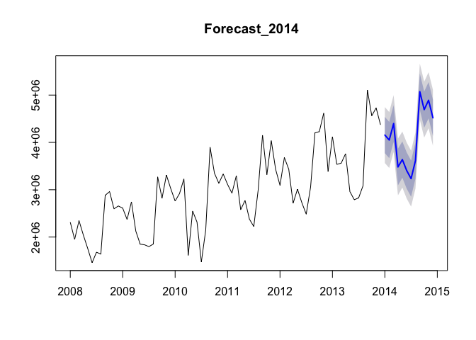
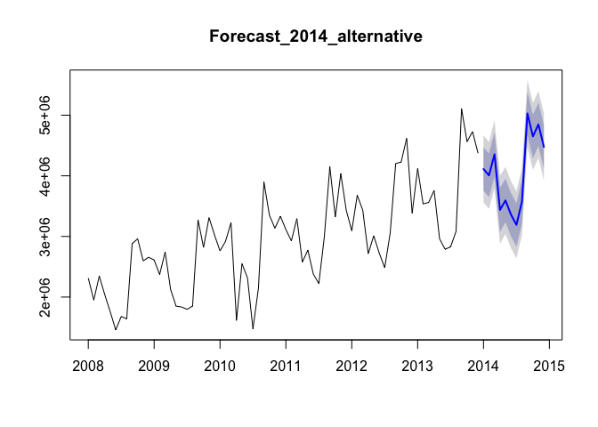

# Forecasts for 2014
Nathan Mowat, Chris Woodard, Jessica Wheeler, Bill Kerneckel  
July 7, 2016  


****************************

#### Table of Contents

[Back to Home](https://github.com/wkerneck/CaseStudy2)

* 6.0  [Forecasts for 2014](#id-section6)


****************************
<div id='id-section6.0'/>
#### 6.0 Forecasts for 2014
 
As ModelWithLowCorrelatingIndicators was the one of best fitting model for a forecast, the exports data for 2014 will be forecast based on trend and seasonality and NationalHolidays, UrbanoExports and GlobalisationPartyMembers.


```r
summary(ModelWithLowCorrelatingIndicators) 
```

```
## 
## Call:
## tslm(formula = TotalAsIs ~ trend + season + NationalHolidays + 
##     UrbanoExports + GlobalisationPartyMembers)
## 
## Residuals:
##     Min      1Q  Median      3Q     Max 
## -508755 -122676    7119  173089  403964 
## 
## Coefficients:
##                             Estimate Std. Error t value Pr(>|t|)    
## (Intercept)                1.467e+06  1.517e+06   0.967 0.337647    
## trend                      2.264e+04  9.148e+03   2.474 0.016399 *  
## season2                   -1.274e+05  1.450e+05  -0.878 0.383528    
## season3                    1.980e+05  1.546e+05   1.281 0.205562    
## season4                   -3.100e+05  1.794e+05  -1.728 0.089424 .  
## season5                   -6.084e+05  1.493e+05  -4.075 0.000146 ***
## season6                   -8.641e+05  1.518e+05  -5.693 4.78e-07 ***
## season7                   -1.056e+06  1.548e+05  -6.824 6.75e-09 ***
## season8                   -6.982e+05  1.583e+05  -4.411 4.72e-05 ***
## season9                    7.360e+05  1.622e+05   4.538 3.05e-05 ***
## season10                   3.341e+05  1.665e+05   2.007 0.049635 *  
## season11                   5.100e+05  1.712e+05   2.979 0.004276 ** 
## season12                   5.471e+05  2.338e+05   2.341 0.022838 *  
## NationalHolidays          -4.315e+05  1.535e+05  -2.811 0.006794 ** 
## UrbanoExports              1.622e-01  1.692e-01   0.959 0.341873    
## GlobalisationPartyMembers -4.032e+00  2.086e+01  -0.193 0.847464    
## ---
## Signif. codes:  0 '***' 0.001 '**' 0.01 '*' 0.05 '.' 0.1 ' ' 1
## 
## Residual standard error: 250700 on 56 degrees of freedom
## Multiple R-squared:  0.9288,	Adjusted R-squared:  0.9097 
## F-statistic: 48.69 on 15 and 56 DF,  p-value: < 2.2e-16
```

```r
Forecast_ModelWithLowCorrelatingIndicators_2014 <- forecast(ModelWithLowCorrelatingIndicators,newdata=data.frame(NationalHolidays=NationalHolidays_2014, UrbanoExports= UrbanoExports_2014, GlobalisationPartyMembers=GlobalisationPartyMembers_2014),h=12)
plot(Forecast_ModelWithLowCorrelatingIndicators_2014, main="Forecast_2014")
```

<!-- -->

```r
Forecast_ModelWithLowCorrelatingIndicators_2014_df <-as.data.frame(Forecast_ModelWithLowCorrelatingIndicators_2014) 
PointForecast_ModelWithLowCorrelatingIndicators_2014 <- ts(Forecast_ModelWithLowCorrelatingIndicators_2014_df$"Point Forecast", start=c(2014,1), end=c(2014,12), frequency=12)
PointForecast_ModelWithLowCorrelatingIndicators_2014
```

```
##          Jan     Feb     Mar     Apr     May     Jun     Jul     Aug
## 2014 4154873 4050131 4398156 3481206 3637040 3403934 3234308 3615166
##          Sep     Oct     Nov     Dec
## 2014 5072002 4692732 4891237 4519491
```

```r
cor(TotalAsIs_2014,TotalPlan_2014)
```

```
## [1] 0.9448221
```

```r
cor(TotalAsIs_2014,PointForecast_ModelWithLowCorrelatingIndicators_2014)
```

```
## [1] 0.9178468
```

As ModelWithTrendAndSeasonalityOnly also gave a well fitting model for a forecast, the exports data for 2014 will be forecast based on trend and seasonality. 


```r
summary(ModelWithTrendAndSeasonalityOnly) 
```

```
## 
## Call:
## tslm(formula = TotalAsIs ~ trend + season)
## 
## Residuals:
##     Min      1Q  Median      3Q     Max 
## -699390 -154210   17753  150363  495430 
## 
## Coefficients:
##             Estimate Std. Error t value Pr(>|t|)    
## (Intercept)  2182435     117276  18.609  < 2e-16 ***
## trend          26427       1514  17.456  < 2e-16 ***
## season2      -131168     152001  -0.863 0.391663    
## season3        46585     152024   0.306 0.760356    
## season4      -609102     152062  -4.006 0.000176 ***
## season5      -623539     152114  -4.099 0.000129 ***
## season6      -883072     152182  -5.803 2.74e-07 ***
## season7     -1079124     152265  -7.087 1.93e-09 ***
## season8      -724693     152363  -4.756 1.31e-05 ***
## season9       705716     152476   4.628 2.07e-05 ***
## season10      300019     152603   1.966 0.054009 .  
## season11      472099     152746   3.091 0.003045 ** 
## season12       73925     152903   0.483 0.630546    
## ---
## Signif. codes:  0 '***' 0.001 '**' 0.01 '*' 0.05 '.' 0.1 ' ' 1
## 
## Residual standard error: 263300 on 59 degrees of freedom
## Multiple R-squared:  0.9173,	Adjusted R-squared:  0.9004 
## F-statistic: 54.51 on 12 and 59 DF,  p-value: < 2.2e-16
```

```r
Forecast_2014 <- forecast(ModelWithTrendAndSeasonalityOnly,h=12)
plot(Forecast_2014, main="Forecast_2014")
```

<!-- -->

```r
Forecast_2014_df <-as.data.frame(Forecast_2014) 
PointForecast_TrendAndSeasonality_2014 <- ts(Forecast_2014_df$"Point Forecast", start=c(2014,1), end=c(2014,12), frequency=12)
PointForecast_TrendAndSeasonality_2014
```

```
##          Jan     Feb     Mar     Apr     May     Jun     Jul     Aug
## 2014 4111576 4006834 4211014 3581754 3593744 3360637 3191012 3571869
##          Sep     Oct     Nov     Dec
## 2014 5028705 4649435 4847941 4476194
```

```r
cor(TotalAsIs_2014,TotalPlan_2014)
```

```
## [1] 0.9448221
```

```r
cor(TotalAsIs_2014,PointForecast_TrendAndSeasonality_2014)
```

```
## [1] 0.9349765
```

Output instruction for the data export of the results for further use in Excel. 


```r
write.csv(PointForecast_TrendAndSeasonality_2014,file='PointForecast_TrendAndSeasonality_2014.csv')
```

<strong>ALTERNATIVE</strong>

As the indiators NationalHolidays delievered a good result, but could not convince in the 2013 forecast, it could be possible that the data for 2013 was to blame. Therefore there is another Forecast using the ModelWithNationalHolidays


```r
summary(ModelWithNationalHolidays)
```

```
## 
## Call:
## tslm(formula = TotalAsIs ~ trend + season + NationalHolidays)
## 
## Residuals:
##     Min      1Q  Median      3Q     Max 
## -555545 -153976       4  150487  404837 
## 
## Coefficients:
##                  Estimate Std. Error t value Pr(>|t|)    
## (Intercept)       2182435     110867  19.685  < 2e-16 ***
## trend               26427       1431  18.465  < 2e-16 ***
## season2           -131168     143696  -0.913  0.36512    
## season3            190430     152432   1.249  0.21658    
## season4           -321411     176034  -1.826  0.07302 .  
## season5           -623539     143803  -4.336 5.86e-05 ***
## season6           -883072     143867  -6.138 8.06e-08 ***
## season7          -1079124     143945  -7.497 4.29e-10 ***
## season8           -724693     144037  -5.031 5.02e-06 ***
## season9            705716     144144   4.896 8.18e-06 ***
## season10           300019     144265   2.080  0.04199 *  
## season11           472099     144400   3.269  0.00182 ** 
## season12           505461     210051   2.406  0.01932 *  
## NationalHolidays  -431536     152405  -2.832  0.00636 ** 
## ---
## Signif. codes:  0 '***' 0.001 '**' 0.01 '*' 0.05 '.' 0.1 ' ' 1
## 
## Residual standard error: 248900 on 58 degrees of freedom
## Multiple R-squared:  0.9273,	Adjusted R-squared:  0.911 
## F-statistic: 56.92 on 13 and 58 DF,  p-value: < 2.2e-16
```

```r
Forecast_2014_alternative <- forecast(ModelWithNationalHolidays, newdata=data.frame(NationalHolidays=NationalHolidays_2014),h=12)
plot(Forecast_2014_alternative,main="Forecast_2014_alternative")
```

<!-- -->

```r
Forecast_2014_alternative_df <-as.data.frame(Forecast_2014_alternative) 
PointForecast_2014_alternative <- ts(Forecast_2014_alternative_df$"Point Forecast", start=c(2014,1), end=c(2014,12), frequency=12)
PointForecast_2014_alternative
```

```
##          Jan     Feb     Mar     Apr     May     Jun     Jul     Aug
## 2014 4111576 4006834 4354859 3437909 3593744 3360637 3191012 3571869
##          Sep     Oct     Nov     Dec
## 2014 5028705 4649435 4847941 4476194
```

Output instruction for the data export of the results for further use in Excel.


```r
#write.csv(PointForecast_2014_alternative,file='PointForecast_2014_alternative.csv')
```
