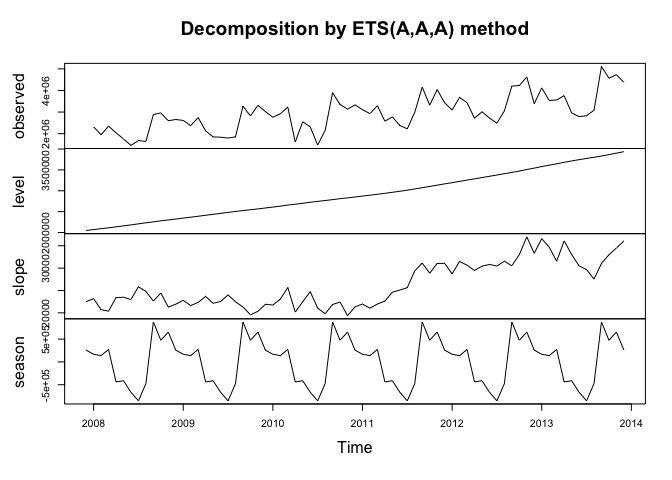
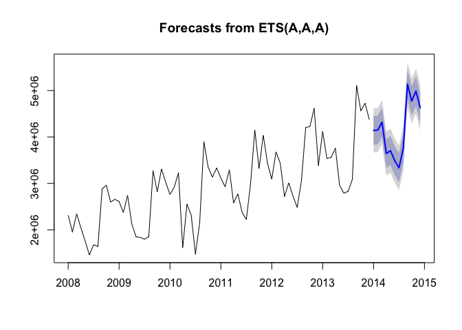

# Developing forecasting models with alternative model approaches
Nathan Mowat, Chris Woodard, Jessica Wheeler, Bill Kerneckel  
July 7, 2016  


****************************

#### Table of Contents

[Back to Home](https://github.com/wkerneck/CaseStudy2)

* 7.0   [Developing forecasting models with alternative model approaches](#id-section7)
* 7.1   [Exponential smoothing](#id-section7.1)
* 7.1.1 [Simple expontential smoothing](#id-section7.1.1)
* 7.1.2 [Holt's linear trend method](#id-section7.1.2)
* 7.1.3 [Holt-Winter's seasonal method](#id-section7.1.3)
* 7.1.4 [Innovations state space models for exponential smoothing](#id-section7.1.4) 

****************************
<div id='id-section7.0'/>
#### 7.0 Developing forecasting models with alternative model approaches
 
****************************
<div id='id-section7.1'/>
#### 7.1 Exponential Smoothing

Exponential Smoothing uses past values to calculate a forecast. The strength with which each value influences the forecast is weakened with help of a smoothing parameter. Thus we are dealing with a weighted average, whose values fade out the longer ago they were in the past.

****************************
<div id='id-section7.1'/>
#### 7.1 Exponential Smoothing

****************************
<div id='id-section7.1.1'/>
####  7.1.1 Simple expontential smoothing

Formula: ses(). It must be decided if alpha (the smoothing parameter should be automatically calculated. If initial=simple, the alpha value can be set to any chosen value, if initial=optimal (or nothing, as this is the 
default), alpha will be set to the optimal value based on ets(). h=12 gives the number of cycles for the forecast.


```r
Model_ses <- ses(TotalAsIs, h=12)
summary(Model_ses)
```

```
## 
## Forecast method: Simple exponential smoothing
## 
## Model Information:
## Simple exponential smoothing 
## 
## Call:
##  ses(x = TotalAsIs, h = 12) 
## 
##   Smoothing parameters:
##     alpha = 0.671 
## 
##   Initial states:
##     l = 2173226.7433 
## 
##   sigma:  609507
## 
##      AIC     AICc      BIC 
## 2230.058 2230.232 2234.612 
## 
## Error measures:
##                    ME   RMSE      MAE       MPE     MAPE     MASE
## Training set 47469.84 609507 429997.1 -1.511008 15.02336 1.172074
##                    ACF1
## Training set 0.02384493
## 
## Forecasts:
##          Point Forecast   Lo 80   Hi 80   Lo 95   Hi 95
## Jan 2014        4466448 3685333 5247562 3271836 5661059
## Feb 2014        4466448 3525801 5407094 3027853 5905042
## Mar 2014        4466448 3389650 5543245 2819628 6113267
## Apr 2014        4466448 3268880 5664015 2634926 6297969
## May 2014        4466448 3159220 5773675 2467215 6465680
## Jun 2014        4466448 3058072 5874823 2312524 6620371
## Jul 2014        4466448 2963718 5969177 2168221 6764674
## Aug 2014        4466448 2874947 6057948 2032458 6900437
## Sep 2014        4466448 2790873 6142022 1903878 7029017
## Oct 2014        4466448 2710821 6222074 1781448 7151447
## Nov 2014        4466448 2634263 6298632 1664363 7268532
## Dec 2014        4466448 2560778 6372117 1551977 7380918
```

```r
plot(Model_ses)
```

<!-- -->

The Akaike's Information Criterion(AIC/AICc) or the Bayesian Information 

Criterion (BIC) should be at minimum.


```r
plot(Model_ses, plot.conf=FALSE, ylab="Exports Chulwalar  )", xlab="Year", main="", fcol="white", type="o")
lines(fitted(Model_ses), col="green", type="o")
lines(Model_ses$mean, col="blue", type="o")
legend("topleft",lty=1, col=c(1,"green"), c("data", expression(alpha == 0.671)),pch=1)
```

<!-- -->

****************************
<div id='id-section7.1.2'/>
####  7.1.2 Holt's linear trend method

Holt added to the model in order to forecast using trends as well. For this it is necessary to add a beta, which determines the trend. If neither alpha nor beta is stated, both parameters will be optimised using ets(). 


```r
Model_holt_1 <- holt(TotalAsIs,h=12)
summary(Model_holt_1)
```

```
## 
## Forecast method: Holt's method
## 
## Model Information:
## Holt's method 
## 
## Call:
##  holt(x = TotalAsIs, h = 12) 
## 
##   Smoothing parameters:
##     alpha = 0.6571 
##     beta  = 1e-04 
## 
##   Initial states:
##     l = 2040390.7764 
##     b = 45050.7514 
## 
##   sigma:  608119.1
## 
##      AIC     AICc      BIC 
## 2233.730 2234.327 2242.837 
## 
## Error measures:
##                    ME     RMSE      MAE      MPE     MAPE     MASE
## Training set -16586.9 608119.1 441110.7 -3.88925 15.75307 1.202367
##                    ACF1
## Training set 0.03462672
## 
## Forecasts:
##          Point Forecast   Lo 80   Hi 80   Lo 95   Hi 95
## Jan 2014        4536367 3757031 5315703 3344475 5728259
## Feb 2014        4581298 3648703 5513894 3155016 6007580
## Mar 2014        4626230 3562188 5690271 2998918 6253541
## Apr 2014        4671161 3490181 5852141 2865008 6477314
## May 2014        4716092 3428721 6003463 2747228 6684956
## Jun 2014        4761024 3375378 6146669 2641862 6880185
## Jul 2014        4805955 3328531 6283379 2546429 7065480
## Aug 2014        4850886 3287035 6414738 2459182 7242591
## Sep 2014        4895818 3250047 6541588 2378829 7412807
## Oct 2014        4940749 3216925 6664573 2304387 7577111
## Nov 2014        4985680 3187164 6784196 2235088 7736273
## Dec 2014        5030612 3160363 6900860 2170314 7890909
```

```r
plot(Model_holt_1)
```

<!-- -->

The trend is exponential if the intercepts(level) and the gradient (slope) are multiplied with eachother. The values are worse. As the Beta was very low in the optimisation, the forecast is very similar to the ses() model. 


```r
Model_holt_2<- holt(TotalAsIs, exponential=TRUE,h=12)
summary(Model_holt_2)
```

```
## 
## Forecast method: Holt's method with exponential trend
## 
## Model Information:
## Holt's method with exponential trend 
## 
## Call:
##  holt(x = TotalAsIs, h = 12, exponential = TRUE) 
## 
##   Smoothing parameters:
##     alpha = 0.6637 
##     beta  = 1e-04 
## 
##   Initial states:
##     l = 2041538.9468 
##     b = 1.0029 
## 
##   sigma:  0.2438
## 
##      AIC     AICc      BIC 
## 2251.010 2251.607 2260.116 
## 
## Error measures:
##                    ME     RMSE      MAE       MPE     MAPE     MASE
## Training set 37825.61 609787.5 433018.9 -1.838214 15.18487 1.180311
##                    ACF1
## Training set 0.02918287
## 
## Forecasts:
##          Point Forecast   Lo 80   Hi 80   Lo 95    Hi 95
## Jan 2014        4488281 3117319 5873077 2432282  6655755
## Feb 2014        4502175 2875165 6235839 2165025  7284215
## Mar 2014        4516113 2712569 6523813 1925893  7839234
## Apr 2014        4530094 2497139 6782951 1812380  8344233
## May 2014        4544118 2368470 6961562 1715288  8942610
## Jun 2014        4558186 2288870 7243915 1609298  9429320
## Jul 2014        4572297 2174634 7432119 1494318  9905909
## Aug 2014        4586452 2064475 7707583 1384615 10236716
## Sep 2014        4600650 2004107 7950493 1268815 11177897
## Oct 2014        4614893 1938072 8170908 1262271 11355846
## Nov 2014        4629180 1857271 8276007 1182154 12094814
## Dec 2014        4643510 1786379 8331811 1136683 12360725
```

```r
plot(Model_holt_2)
```

<!-- -->

As such simple trends tend to forecast the future to positively, we have added a dampener.

Similar values to that of Model_holt_1 


```r
Model_holt_3 <- holt(TotalAsIs, damped=TRUE,h=12)
summary(Model_holt_3)
```

```
## 
## Forecast method: Damped Holt's method
## 
## Model Information:
## Damped Holt's method 
## 
## Call:
##  holt(x = TotalAsIs, h = 12, damped = TRUE) 
## 
##   Smoothing parameters:
##     alpha = 0.6613 
##     beta  = 2e-04 
##     phi   = 0.98 
## 
##   Initial states:
##     l = 2040392.5761 
##     b = 45053.25 
## 
##   sigma:  608787.2
## 
##      AIC     AICc      BIC 
## 2235.888 2236.797 2247.272 
## 
## Error measures:
##                    ME     RMSE      MAE       MPE     MAPE     MASE
## Training set 15578.94 608787.2 436909.7 -2.797612 15.46526 1.190916
##                    ACF1
## Training set 0.03351419
## 
## Forecasts:
##          Point Forecast   Lo 80   Hi 80   Lo 95   Hi 95
## Jan 2014        4483618 3703426 5263811 3290417 5676819
## Feb 2014        4493914 3558436 5429391 3063224 5924603
## Mar 2014        4504003 3435520 5572486 2869899 6138107
## Apr 2014        4513891 3327168 5700614 2698955 6328827
## May 2014        4523581 3229332 5817829 2544198 6502963
## Jun 2014        4533077 3139534 5926619 2401837 6664316
## Jul 2014        4542383 3056128 6028638 2269352 6815413
## Aug 2014        4551503 2977955 6125051 2144969 6958036
## Sep 2014        4560440 2904162 6216719 2027381 7093499
## Oct 2014        4569199 2834101 6304298 1915595 7222803
## Nov 2014        4577783 2767264 6388301 1808834 7346732
## Dec 2014        4586195 2703249 6469141 1706477 7465913
```

```r
plot(Model_holt_3)
```

<!-- -->

This also works for exponential trends. 

The values remain worse. 


```r
Model_holt_4 <- holt(TotalAsIs, exponential=TRUE, damped=TRUE,h=12)
summary(Model_holt_4)
```

```
## 
## Forecast method: Damped Holt's method with exponential trend
## 
## Model Information:
## Damped Holt's method with exponential trend 
## 
## Call:
##  holt(x = TotalAsIs, h = 12, damped = TRUE, exponential = TRUE) 
## 
##   Smoothing parameters:
##     alpha = 0.6679 
##     beta  = 1e-04 
##     phi   = 0.9799 
## 
##   Initial states:
##     l = 2041541.9705 
##     b = 1.0019 
## 
##   sigma:  0.2449
## 
##      AIC     AICc      BIC 
## 2253.216 2254.125 2264.600 
## 
## Error measures:
##                    ME     RMSE      MAE       MPE     MAPE     MASE
## Training set 46119.56 609906.7 432069.1 -1.549114 15.11987 1.177722
##                   ACF1
## Training set 0.0254941
## 
## Forecasts:
##          Point Forecast   Lo 80   Hi 80   Lo 95    Hi 95
## Jan 2014        4470648 3088364 5809545 2341887  6582696
## Feb 2014        4473164 2782929 6182335 2108655  7308179
## Mar 2014        4475630 2612633 6537984 1925875  7978374
## Apr 2014        4478047 2519259 6757907 1856429  8555124
## May 2014        4480418 2369817 7068833 1736577  9120776
## Jun 2014        4482742 2251630 7264042 1550822  9502543
## Jul 2014        4485020 2133590 7422248 1477883  9820668
## Aug 2014        4487253 2003729 7570209 1369519 10434070
## Sep 2014        4489443 1905952 7660784 1213820 10856921
## Oct 2014        4491589 1787808 7825284 1161972 11063753
## Nov 2014        4493694 1715241 7993837 1099933 11362955
## Dec 2014        4495757 1672388 8147548 1049443 11743270
```

```r
plot(Model_holt_4)
```

<!-- -->

level and slope can be plotted individually for each model. 


```r
plot(Model_holt_1$model$state)
```

<!-- -->

```r
plot(Model_holt_2$model$state)
```

<!-- -->

```r
plot(Model_holt_3$model$state)
```

<!-- -->

```r
plot(Model_holt_4$model$state)
```

<!-- -->

```r
plot(Model_holt_1, plot.conf=FALSE, ylab="Exports Chulwalar  )", xlab="Year", main="", fcol="white", type="o")
lines(fitted(Model_ses), col="purple", type="o")
lines(fitted(Model_holt_1), col="blue", type="o")
lines(fitted(Model_holt_2), col="red", type="o")
lines(fitted(Model_holt_3), col="green", type="o")
lines(fitted(Model_holt_4), col="orange", type="o")
lines(Model_ses$mean, col="purple", type="o")
lines(Model_holt_1$mean, col="blue", type="o")
lines(Model_holt_2$mean, col="red", type="o")
lines(Model_holt_3$mean, col="green", type="o")
lines(Model_holt_4$mean, col="orange", type="o")
legend("topleft",lty=1, col=c(1,"purple","blue","red","green","orange"), c("data", "SES","Holts auto", "Exponential", "Additive Damped", "Multiplicative Damped"),pch=1)
```

<!-- -->

As these forecasts are not very convincing at the moment, there is no need to export the data.

****************************
<div id='id-section7.1.3'/>
####  7.1.3 Holt-Winter's seasonal method

Holt and Winters have expanded Holt's model further to include the seasonality aspect. The parameter gamma, which is for smoothing the seasonality, was added to achieve this. The values are better than the models without seasonality. This logical matches our results from the regression approaches, the data is strongly influenced by seasonality. In the following model, none of the parameters are given so that they will be optimised automatically. There are two models: one using an additive error model method and one using a multiplicative error model.


```r
Model_hw_1 <- hw(TotalAsIs ,seasonal="additive",h=12)
summary(Model_hw_1)
```

```
## 
## Forecast method: Holt-Winters' additive method
## 
## Model Information:
## Holt-Winters' additive method 
## 
## Call:
##  hw(x = TotalAsIs, h = 12, seasonal = "additive") 
## 
##   Smoothing parameters:
##     alpha = 0.0087 
##     beta  = 0.0087 
##     gamma = 1e-04 
## 
##   Initial states:
##     l = 2047375.0884 
##     b = 22509.7631 
##     s=259168.3 654942.6 474529.8 876025.2 -475155 -852844
##            -664662.5 -412596.7 -438677.3 273215 138077.9 167976.7
## 
##   sigma:  241685
## 
##      AIC     AICc      BIC 
## 2124.856 2134.747 2161.283 
## 
## Error measures:
##                    ME   RMSE      MAE         MPE     MAPE      MASE
## Training set 21615.43 241685 202218.5 -0.08252109 7.329458 0.5512016
##                    ACF1
## Training set -0.2819072
## 
## Forecasts:
##          Point Forecast   Lo 80   Hi 80   Lo 95   Hi 95
## Jan 2014        4141204 3831472 4450936 3667510 4614898
## Feb 2014        4147309 3837472 4457147 3673453 4621165
## Mar 2014        4318537 4008512 4628563 3844394 4792680
## Apr 2014        3642744 3332425 3953063 3168153 4117335
## May 2014        3704865 3394124 4015605 3229628 4180102
## Jun 2014        3488859 3177546 3800173 3012746 3964973
## Jul 2014        3336738 3024677 3648799 2859482 3813994
## Aug 2014        3750478 3437474 4063482 3271780 4229176
## Sep 2014        5137771 4823607 5451935 4657298 5618244
## Oct 2014        4772337 4456775 5087900 4289726 5254949
## Nov 2014        4988809 4671591 5306028 4503665 5473953
## Dec 2014        4629097 4309943 4948252 4140992 5117202
```

```r
plot(Model_hw_1)
```

<!-- -->

```r
#     AIC     AICc      BIC 
#2127.984 2137.875 2164.411 
```


```r
Model_hw_2 <- hw(TotalAsIs ,seasonal="multiplicative",h=12)
summary(Model_hw_2)
```

```
## 
## Forecast method: Holt-Winters' multiplicative method
## 
## Model Information:
## Holt-Winters' multiplicative method 
## 
## Call:
##  hw(x = TotalAsIs, h = 12, seasonal = "multiplicative") 
## 
##   Smoothing parameters:
##     alpha = 0.025 
##     beta  = 0.0062 
##     gamma = 1e-04 
## 
##   Initial states:
##     l = 2026247.531 
##     b = 25395.1259 
##     s=1.0933 1.232 1.1763 1.3086 0.8384 0.699
##            0.7653 0.8502 0.8596 1.0793 1.0316 1.0665
## 
##   sigma:  0.0877
## 
##      AIC     AICc      BIC 
## 2128.303 2138.194 2164.729 
## 
## Error measures:
##                    ME     RMSE      MAE        MPE     MAPE      MASE
## Training set 17434.11 235296.6 191805.3 -0.3292809 7.213472 0.5228175
##                    ACF1
## Training set -0.3514421
## 
## Forecasts:
##          Point Forecast   Lo 80   Hi 80   Lo 95   Hi 95
## Jan 2014        4226941 3751624 4702258 3500006 4953876
## Feb 2014        4123665 3659738 4587591 3414151 4833179
## Mar 2014        4350808 3860995 4840620 3601704 5099911
## Apr 2014        3494208 3100476 3887940 2892046 4096370
## May 2014        3484738 3091618 3877858 2883513 4085963
## Jun 2014        3162774 2805463 3520085 2616314 3709234
## Jul 2014        2912399 2582802 3241996 2408324 3416474
## Aug 2014        3521645 3122278 3921013 2910865 4132425
## Sep 2014        5540988 4911109 6170867 4577671 6504304
## Oct 2014        5020487 4448200 5592775 4145249 5895725
## Nov 2014        5299729 4693715 5905743 4372911 6226547
## Dec 2014        4740169 4196230 5284108 3908286 5572052
```

```r
plot(Model_hw_2)
```

<!-- -->

```r
#     AIC     AICc      BIC 
#2137.673 2147.564 2174.100 
```

The additive model gives slightly better results than the multiplicative model.


```r
plot(Model_hw_1, ylab="Exports Chulwalar  ", plot.conf=FALSE, type="o", fcol="white", xlab="Year")
lines(fitted(Model_hw_1), col="red", lty=2)
lines(fitted(Model_hw_2), col="green", lty=2)
lines(Model_hw_1$mean, type="o", col="red")
lines(Model_hw_2$mean, type="o", col="green")
legend("topleft",lty=1, pch=1, col=1:3, c("data","Holt Winters' Additive","Holt Winters' Multiplicative"))
```

<!-- -->

In order to use the results later, they need to be converted into point forcasts.


```r
Model_hw_1_df <-as.data.frame(Model_hw_1) 
Model_hw_1_PointForecast <- ts(Model_hw_1_df$"Point Forecast", start=c(2014,1), end=c(2014,12), frequency=12)
Model_hw_1_PointForecast
```

```
##          Jan     Feb     Mar     Apr     May     Jun     Jul     Aug
## 2014 4141204 4147309 4318537 3642744 3704865 3488859 3336738 3750478
##          Sep     Oct     Nov     Dec
## 2014 5137771 4772337 4988809 4629097
```

```r
Model_hw_2_df <-as.data.frame(Model_hw_2) 
Model_hw_2_PointForecast <- ts(Model_hw_2_df$"Point Forecast", start=c(2014,1), end=c(2014,12), frequency=12)
Model_hw_2_PointForecast
```

```
##          Jan     Feb     Mar     Apr     May     Jun     Jul     Aug
## 2014 4226941 4123665 4350808 3494208 3484738 3162774 2912399 3521645
##          Sep     Oct     Nov     Dec
## 2014 5540988 5020487 5299729 4740169
```

Output instruction for the data export of the results for further use in Excel.


```r
write.csv(Model_hw_1_PointForecast,file='Model_hw_1_PointForecast.csv')
write.csv(Model_hw_2_PointForecast,file='Model_hw_2_PointForecast.csv')
```

****************************
<div id='id-section7.1.4'/>
####  7.1.4 Innovations state space models for exponential smoothing

The funktion ets() produces a model with the same values as Model_hw_1. The reason for this is that all of the parameters in this model were optimised using the ets() function. The results are a ets(A,A,A) model which is an additive method for trend, seasonality and errors. The previous models also showed the type of ets() model in their summary. In this case the user parameters were either accepted or rejected. As the model has been set to 
"ZZZ", the best model will be automatically chosen. 


```r
Model_ets <-ets(TotalAsIs, model="ZZZ", damped=NULL, alpha=NULL, beta=NULL, gamma=NULL, phi=NULL, additive.only=FALSE, lambda=NULL, lower=c(rep(0.0001,3), 0.8), upper=c(rep(0.9999,3),0.98), opt.crit=c("lik","amse","mse","sigma","mae"), nmse=3, bounds=c("both","usual","admissible"), ic=c("aicc","aic","bic"), restrict=TRUE)
summary(Model_ets)
```

```
## ETS(A,A,A) 
## 
## Call:
##  ets(y = TotalAsIs, model = "ZZZ", damped = NULL, alpha = NULL,  
## 
##  Call:
##      beta = NULL, gamma = NULL, phi = NULL, additive.only = FALSE,  
## 
##  Call:
##      lambda = NULL, lower = c(rep(1e-04, 3), 0.8), upper = c(rep(0.9999,  
## 
##  Call:
##          3), 0.98), opt.crit = c("lik", "amse", "mse", "sigma",  
## 
##  Call:
##          "mae"), nmse = 3, bounds = c("both", "usual", "admissible"),  
## 
##  Call:
##      ic = c("aicc", "aic", "bic"), restrict = TRUE) 
## 
##   Smoothing parameters:
##     alpha = 0.0087 
##     beta  = 0.0087 
##     gamma = 1e-04 
## 
##   Initial states:
##     l = 2047375.0885 
##     b = 22509.7629 
##     s=259168.3 654942.6 474529.8 876025.2 -475155 -852844
##            -664662.5 -412596.7 -438677.3 273215 138077.9 167976.7
## 
##   sigma:  241685.1
## 
##      AIC     AICc      BIC 
## 2124.856 2134.747 2161.283 
## 
## Training set error measures:
##                    ME     RMSE      MAE         MPE     MAPE      MASE
## Training set 21587.58 241685.1 202221.1 -0.08332944 7.329631 0.5512087
##                    ACF1
## Training set -0.2818997
```

```r
plot(Model_ets)
```

<!-- -->

```r
Model_ets_forecast <- forecast(Model_ets,h=12)
plot(Model_ets_forecast)
```

<!-- -->

```r
#     AIC     AICc      BIC 
#2127.984 2137.875 2164.411 
```

In order to use the results later, they need to be converted into point forcasts.


```r
Model_ets_forecast_df <-as.data.frame(Model_ets_forecast) 
Model_ets_PointForecast <- ts(Model_ets_forecast_df$"Point Forecast", start=c(2014,1), end=c(2014,12), frequency=12)
Model_ets_PointForecast
```

```
##          Jan     Feb     Mar     Apr     May     Jun     Jul     Aug
## 2014 4141260 4147361 4318585 3642788 3704905 3488896 3336770 3750506
##          Sep     Oct     Nov     Dec
## 2014 5137795 4772357 4988825 4629109
```

Output instruction for the data export of the results for further use in Excel.


```r
#write.csv(Model_ets_PointForecast,file='Model_ets_PointForecast.csv')
```
