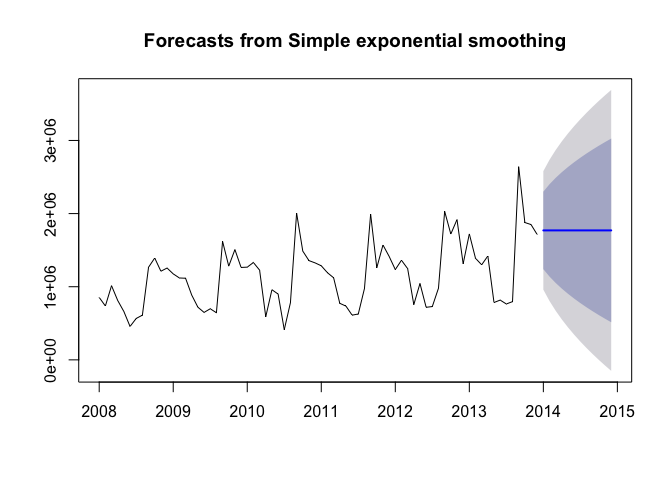
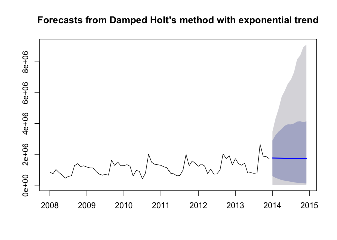
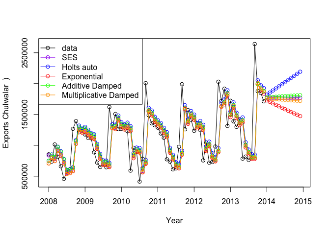

# Developing forecasting models with alternative model approaches
Nathan Mowat, Chris Woodard, Jessica Wheeler, Bill Kerneckel  
July 7, 2016  


****************************

#### Table of Contents

[Back to Home](https://github.com/wkerneck/CaseStudy2)

* 7.0   [Developing forecasting models with alternative model approaches](#id-section7)
* 7.1   [Exponential smoothing](#id-section7.1)
* 7.1.1 [Simple expontential smoothing](#id-section7.1.1)
* 7.1.2 [Holt's linear trend method](#id-section7.1.2)
* 7.1.3 [Holt-Winter's seasonal method](#id-section7.1.3)
* 7.1.4 [Innovations state space models for exponential smoothing](#id-section7.1.4) 

****************************
<div id='id-section7.0'/>
#### 7.0 Developing forecasting models with alternative model approaches
 
****************************
<div id='id-section7.1'/>
#### 7.1 Exponential Smoothing

Exponential Smoothing uses past values to calculate a forecast. The strength with which each value influences the forecast is weakened with help of a smoothing parameter. Thus we are dealing with a weighted average, whose values fade out the longer ago they were in the past.

****************************
<div id='id-section7.1'/>
#### 7.1 Exponential Smoothing

****************************
<div id='id-section7.1.1'/>
####  7.1.1 Simple expontential smoothing

Formula: ses(). It must be decided if alpha (the smoothing parameter should be automatically calculated. If initial=simple, the alpha value can be set to any chosen value, if initial=optimal (or nothing, as this is the 
default), alpha will be set to the optimal value based on ets(). h=12 gives the number of cycles for the forecast.


```r
Model_ses <- ses(RedEtelAsIs, h=12)
summary(Model_ses)
```

```
## 
## Forecast method: Simple exponential smoothing
## 
## Model Information:
## Simple exponential smoothing 
## 
## Call:
##  ses(x = RedEtelAsIs, h = 12) 
## 
##   Smoothing parameters:
##     alpha = 0.648 
## 
##   Initial states:
##     l = 836999.0103 
## 
##   sigma:  413366.4
## 
##      AIC     AICc      BIC 
## 2174.141 2174.315 2178.694 
## 
## Error measures:
##                    ME     RMSE      MAE       MPE     MAPE     MASE
## Training set 20001.51 413366.4 252927.7 -6.181153 22.74997 1.344677
##                    ACF1
## Training set 0.03177791
## 
## Forecasts:
##          Point Forecast     Lo 80   Hi 80        Lo 95   Hi 95
## Jan 2014        1770121 1240370.7 2299871  959937.8525 2580304
## Feb 2014        1770121 1138885.7 2401356  804729.9147 2735512
## Mar 2014        1770121 1051594.3 2488648  671229.2113 2869013
## Apr 2014        1770121  973815.0 2566427  552276.0266 2987966
## May 2014        1770121  902984.4 2637258  443949.9719 3096292
## Jun 2014        1770121  837517.9 2702724  343827.6177 3196414
## Jul 2014        1770121  776354.8 2763887  250286.7888 3289955
## Aug 2014        1770121  718743.9 2821498  162178.4493 3378064
## Sep 2014        1770121  664129.8 2876112   78653.4527 3461589
## Oct 2014        1770121  612088.6 2928153    -936.7859 3541179
## Nov 2014        1770121  562287.5 2977955  -77100.9408 3617343
## Dec 2014        1770121  514460.1 3025782 -150246.7033 3690489
```

```r
plot(Model_ses)
```

<!-- -->

The Akaike's Information Criterion(AIC/AICc) or the Bayesian Information 

Criterion (BIC) should be at minimum.


```r
plot(Model_ses, plot.conf=FALSE, ylab="Exports Chulwalar  )", xlab="Year", main="", fcol="white", type="o")
lines(fitted(Model_ses), col="green", type="o")
lines(Model_ses$mean, col="blue", type="o")
legend("topleft",lty=1, col=c(1,"green"), c("data", expression(alpha == 0.671)),pch=1)
```

<!-- -->

****************************
<div id='id-section7.1.2'/>
####  7.1.2 Holt's linear trend method

Holt added to the model in order to forecast using trends as well. For this it is necessary to add a beta, which determines the trend. If neither alpha nor beta is stated, both parameters will be optimised using ets(). 


```r
Model_holt_1 <- holt(RedEtelAsIs,h=12)
summary(Model_holt_1)
```

```
## 
## Forecast method: Holt's method
## 
## Model Information:
## Holt's method 
## 
## Call:
##  holt(x = RedEtelAsIs, h = 12) 
## 
##   Smoothing parameters:
##     alpha = 0.6522 
##     beta  = 1e-04 
## 
##   Initial states:
##     l = 715355.8102 
##     b = 33941.7078 
## 
##   sigma:  414153.4
## 
##      AIC     AICc      BIC 
## 2178.415 2179.012 2187.521 
## 
## Error measures:
##                     ME     RMSE      MAE       MPE     MAPE     MASE
## Training set -29025.55 414153.4 272406.1 -11.04551 25.39809 1.448233
##                    ACF1
## Training set 0.02746142
## 
## Forecasts:
##          Point Forecast     Lo 80   Hi 80     Lo 95   Hi 95
## Jan 2014        1821330 1290571.0 2352089 1009604.2 2633056
## Feb 2014        1855063 1221332.2 2488793  885855.6 2824270
## Mar 2014        1888795 1166604.1 2610987  784299.1 2993292
## Apr 2014        1922528 1121564.3 2723492  697559.7 3147496
## May 2014        1956261 1083585.3 2828936  621618.8 3290903
## Jun 2014        1989994 1051048.0 2928939  554000.2 3425987
## Jul 2014        2023726 1022870.7 3024582  493049.8 3554403
## Aug 2014        2057459  998288.7 3116629  437597.8 3677320
## Sep 2014        2091192  976737.4 3205646  386780.9 3795602
## Oct 2014        2124924  957786.1 3292063  339940.4 3909908
## Nov 2014        2158657  941097.2 3376217  296559.9 4020754
## Dec 2014        2192390  926400.4 3458379  256226.1 4128554
```

```r
plot(Model_holt_1)
```

<!-- -->

The trend is exponential if the intercepts(level) and the gradient (slope) are multiplied with eachother. The values are worse. As the Beta was very low in the optimisation, the forecast is very similar to the ses() model. 


```r
Model_holt_2<- holt(RedEtelAsIs, exponential=TRUE,h=12)
summary(Model_holt_2)
```

```
## 
## Forecast method: Holt's method with exponential trend
## 
## Model Information:
## Holt's method with exponential trend 
## 
## Call:
##  holt(x = RedEtelAsIs, h = 12, exponential = TRUE) 
## 
##   Smoothing parameters:
##     alpha = 0.666 
##     beta  = 1e-04 
## 
##   Initial states:
##     l = 717116.2129 
##     b = 0.9849 
## 
##   sigma:  0.516
## 
##      AIC     AICc      BIC 
## 2216.513 2217.110 2225.620 
## 
## Error measures:
##                    ME   RMSE      MAE       MPE     MAPE     MASE
## Training set 46496.26 412920 246562.3 -3.455583 21.85969 1.310835
##                   ACF1
## Training set 0.0117669
## 
## Forecasts:
##          Point Forecast     Lo 80   Hi 80     Lo 95   Hi 95
## Jan 2014        1729130 571395.40 2863346     0.000 3540201
## Feb 2014        1704186 450653.22 3132778  8479.432 4224854
## Mar 2014        1679601 391718.47 3373700     0.000 4728802
## Apr 2014        1655371 312280.41 3509751 13841.789 5309984
## May 2014        1631491 270068.14 3599188 27006.871 5828875
## Jun 2014        1607955 215321.78 3647163     0.000 6167787
## Jul 2014        1584758 184500.25 3782484     0.000 7085479
## Aug 2014        1561896 152751.87 3804700     0.000 7068759
## Sep 2014        1539364 129034.44 3870472     0.000 7575163
## Oct 2014        1517157 117313.45 3902485 10982.648 8030537
## Nov 2014        1495271  96787.26 3757740     0.000 7668926
## Dec 2014        1473700  83619.77 3862398     0.000 8220477
```

```r
plot(Model_holt_2)
```

<!-- -->

As such simple trends tend to forecast the future to positively, we have added a dampener.

Similar values to that of Model_holt_1 


```r
Model_holt_3 <- holt(RedEtelAsIs, damped=TRUE,h=12)
summary(Model_holt_3)
```

```
## 
## Forecast method: Damped Holt's method
## 
## Model Information:
## Damped Holt's method 
## 
## Call:
##  holt(x = RedEtelAsIs, h = 12, damped = TRUE) 
## 
##   Smoothing parameters:
##     alpha = 0.6455 
##     beta  = 1e-04 
##     phi   = 0.9702 
## 
##   Initial states:
##     l = 715353.5489 
##     b = 33941.6267 
## 
##   sigma:  413373.3
## 
##      AIC     AICc      BIC 
## 2180.143 2181.052 2191.527 
## 
## Error measures:
##                    ME     RMSE      MAE      MPE     MAPE     MASE
## Training set 1697.552 413373.3 261015.9 -8.17304 23.90524 1.387677
##                    ACF1
## Training set 0.03518858
## 
## Forecasts:
##          Point Forecast     Lo 80   Hi 80      Lo 95   Hi 95
## Jan 2014        1776370 1246610.5 2306129  966172.94 2586566
## Feb 2014        1780031 1149444.5 2410617  815632.21 2744429
## Mar 2014        1783583 1066180.1 2500985  686410.07 2880756
## Apr 2014        1787029  992216.8 2581841  571468.75 3002589
## May 2014        1790372  925030.1 2655714  466945.70 3113799
## Jun 2014        1793616  863058.0 2724174  370450.47 3216781
## Jul 2014        1796763  805254.8 2788271  280382.13 3313144
## Aug 2014        1799816  750879.9 2848752  195606.61 3404025
## Sep 2014        1802778  699386.3 2906170  115286.01 3490270
## Oct 2014        1805652  650356.9 2960947   38780.63 3572523
## Nov 2014        1808440  603464.6 3013415  -34410.88 3651291
## Dec 2014        1811145  558447.8 3063842 -104690.00 3726980
```

```r
plot(Model_holt_3)
```

<!-- -->

This also works for exponential trends. 

The values remain worse. 


```r
Model_holt_4 <- holt(RedEtelAsIs, exponential=TRUE, damped=TRUE,h=12)
summary(Model_holt_4)
```

```
## 
## Forecast method: Damped Holt's method with exponential trend
## 
## Model Information:
## Damped Holt's method with exponential trend 
## 
## Call:
##  holt(x = RedEtelAsIs, h = 12, damped = TRUE, exponential = TRUE) 
## 
##   Smoothing parameters:
##     alpha = 0.6592 
##     beta  = 1e-04 
##     phi   = 0.98 
## 
##   Initial states:
##     l = 717117.5528 
##     b = 0.9879 
## 
##   sigma:  0.5064
## 
##      AIC     AICc      BIC 
## 2217.710 2218.619 2229.094 
## 
## Error measures:
##                    ME     RMSE      MAE       MPE     MAPE     MASE
## Training set 31874.37 413290.8 251116.2 -4.840399 22.43398 1.335046
##                   ACF1
## Training set 0.0193486
## 
## Forecasts:
##          Point Forecast    Lo 80   Hi 80     Lo 95   Hi 95
## Jan 2014        1762017 587064.7 2895224 29479.096 3474618
## Feb 2014        1757732 479917.2 3242668     0.000 4320436
## Mar 2014        1753543 403758.4 3482050     0.000 4953545
## Apr 2014        1749447 332460.0 3637807 23311.798 5734975
## May 2014        1745443 290714.5 3853705 25542.604 6126208
## Jun 2014        1741528 261178.4 3948475 23203.694 6583188
## Jul 2014        1737699 219772.8 3942035  1288.816 6847228
## Aug 2014        1733956 184842.4 4001010  9351.907 7326647
## Sep 2014        1730295 157668.1 4125081 15660.570 8167072
## Oct 2014        1726714 141883.8 4144142  5737.849 8408203
## Nov 2014        1723213 124215.2 4093311     0.000 8948681
## Dec 2014        1719788 109412.4 4137038     0.000 9110137
```

```r
plot(Model_holt_4)
```

<!-- -->

level and slope can be plotted individually for each model. 


```r
plot(Model_holt_1$model$state)
```

<!-- -->

```r
plot(Model_holt_2$model$state)
```

<!-- -->

```r
plot(Model_holt_3$model$state)
```

<!-- -->

```r
plot(Model_holt_4$model$state)
```

<!-- -->

```r
plot(Model_holt_1, plot.conf=FALSE, ylab="Exports Chulwalar  )", xlab="Year", main="", fcol="white", type="o")
lines(fitted(Model_ses), col="purple", type="o")
lines(fitted(Model_holt_1), col="blue", type="o")
lines(fitted(Model_holt_2), col="red", type="o")
lines(fitted(Model_holt_3), col="green", type="o")
lines(fitted(Model_holt_4), col="orange", type="o")
lines(Model_ses$mean, col="purple", type="o")
lines(Model_holt_1$mean, col="blue", type="o")
lines(Model_holt_2$mean, col="red", type="o")
lines(Model_holt_3$mean, col="green", type="o")
lines(Model_holt_4$mean, col="orange", type="o")
legend("topleft",lty=1, col=c(1,"purple","blue","red","green","orange"), c("data", "SES","Holts auto", "Exponential", "Additive Damped", "Multiplicative Damped"),pch=1)
```

<!-- -->

As these forecasts are not very convincing at the moment, there is no need to export the data.

****************************
<div id='id-section7.1.3'/>
####  7.1.3 Holt-Winter's seasonal method

Holt and Winters have expanded Holt's model further to include the seasonality aspect. The parameter gamma, which is for smoothing the seasonality, was added to achieve this. The values are better than the models without seasonality. This logical matches our results from the regression approaches, the data is strongly influenced by seasonality. In the following model, none of the parameters are given so that they will be optimised automatically. There are two models: one using an additive error model method and one using a multiplicative error model.


```r
Model_hw_1 <- hw(RedEtelAsIs ,seasonal="additive",h=12)
summary(Model_hw_1)
```

```
## 
## Forecast method: Holt-Winters' additive method
## 
## Model Information:
## Holt-Winters' additive method 
## 
## Call:
##  hw(x = RedEtelAsIs, h = 12, seasonal = "additive") 
## 
##   Smoothing parameters:
##     alpha = 0.1018 
##     beta  = 0.0021 
##     gamma = 1e-04 
## 
##   Initial states:
##     l = 875196.7675 
##     b = 12001.059 
##     s=176515.2 378751.2 300132.2 699910.1 -314495.1 -493504.8
##            -454120.3 -335623.9 -289942.1 43249.71 132518.9 156608.9
## 
##   sigma:  166083.2
## 
##      AIC     AICc      BIC 
## 2070.835 2080.726 2107.262 
## 
## Error measures:
##                     ME     RMSE      MAE       MPE     MAPE     MASE
## Training set -17228.45 166083.2 129350.5 -4.111897 12.99967 0.687685
##                     ACF1
## Training set -0.09967069
## 
## Forecasts:
##          Point Forecast     Lo 80   Hi 80     Lo 95   Hi 95
## Jan 2014        1632869 1420024.5 1845713 1307351.6 1958386
## Feb 2014        1618146 1404109.2 1832183 1290804.9 1945487
## Mar 2014        1538317 1323047.0 1753588 1209089.8 1867545
## Apr 2014        1214539  997994.8 1431084  883363.0 1545716
## May 2014        1178243  960383.0 1396103  845055.0 1511431
## Jun 2014        1069135  849918.8 1288352  733872.7 1404398
## Jul 2014        1039133  818518.2 1259747  701732.0 1376533
## Aug 2014        1227529 1005475.5 1449583  887927.2 1567132
## Sep 2014        2251400 2027864.5 2474935 1909532.1 2593267
## Oct 2014        1860998 1635939.8 2086056 1516801.3 2205194
## Nov 2014        1949001 1722378.8 2175624 1602412.1 2295590
## Dec 2014        1756168 1527936.2 1984399 1407117.9 2105217
```

```r
plot(Model_hw_1)
```

<!-- -->

```r
#     AIC     AICc      BIC 
#2127.984 2137.875 2164.411 
```


```r
Model_hw_2 <- hw(RedEtelAsIs ,seasonal="multiplicative",h=12)
summary(Model_hw_2)
```

```
## 
## Forecast method: Holt-Winters' multiplicative method
## 
## Model Information:
## Holt-Winters' multiplicative method 
## 
## Call:
##  hw(x = RedEtelAsIs, h = 12, seasonal = "multiplicative") 
## 
##   Smoothing parameters:
##     alpha = 0.0917 
##     beta  = 0.023 
##     gamma = 1e-04 
## 
##   Initial states:
##     l = 879689.968 
##     b = 12472.9814 
##     s=1.1446 1.3097 1.271 1.6657 0.6903 0.5471
##            0.6126 0.7128 0.7822 1.0347 1.0913 1.1379
## 
##   sigma:  0.1409
## 
##      AIC     AICc      BIC 
## 2058.011 2067.902 2094.438 
## 
## Error measures:
##                     ME     RMSE      MAE       MPE     MAPE      MASE
## Training set -495.4941 142687.3 115050.2 -2.042696 11.56463 0.6116582
##                    ACF1
## Training set -0.1923664
## 
## Forecasts:
##          Point Forecast     Lo 80   Hi 80     Lo 95   Hi 95
## Jan 2014      1705091.2 1397204.1 2012978 1234218.6 2175964
## Feb 2014      1647487.9 1348043.8 1946932 1189527.7 2105448
## Mar 2014      1573557.9 1284916.0 1862200 1132118.1 2014998
## Apr 2014      1198289.9  975819.2 1420761  858050.3 1538530
## May 2014      1100027.3  892690.6 1307364  782933.2 1417121
## Jun 2014       952217.4  769436.2 1134998  672677.8 1231757
## Jul 2014       856616.9  688637.5 1024596  599714.5 1113519
## Aug 2014      1088511.8  869796.2 1307227  754015.2 1423008
## Sep 2014      2645161.1 2099030.4 3191292 1809926.2 3480396
## Oct 2014      2032634.9 1600306.6 2464963 1371445.8 2693824
## Nov 2014      2109088.5 1645914.3 2572263 1400724.7 2817452
## Dec 2014      1856142.4 1434441.5 2277843 1211206.5 2501078
```

```r
plot(Model_hw_2)
```

<!-- -->

```r
#     AIC     AICc      BIC 
#2137.673 2147.564 2174.100 
```

The multiplicative model gives slightly better results than the additive model.


```r
plot(Model_hw_1, ylab="Exports Chulwalar  ", plot.conf=FALSE, type="o", fcol="white", xlab="Year")
lines(fitted(Model_hw_1), col="red", lty=2)
lines(fitted(Model_hw_2), col="green", lty=2)
lines(Model_hw_1$mean, type="o", col="red")
lines(Model_hw_2$mean, type="o", col="green")
legend("topleft",lty=1, pch=1, col=1:3, c("data","Holt Winters' Additive","Holt Winters' Multiplicative"))
```

<!-- -->

In order to use the results later, they need to be converted into point forcasts.


```r
Model_hw_1_df <-as.data.frame(Model_hw_1) 
Model_hw_1_PointForecast <- ts(Model_hw_1_df$"Point Forecast", start=c(2014,1), end=c(2014,12), frequency=12)
Model_hw_1_PointForecast
```

```
##          Jan     Feb     Mar     Apr     May     Jun     Jul     Aug
## 2014 1632869 1618146 1538317 1214539 1178243 1069135 1039133 1227529
##          Sep     Oct     Nov     Dec
## 2014 2251400 1860998 1949001 1756168
```

```r
Model_hw_2_df <-as.data.frame(Model_hw_2) 
Model_hw_2_PointForecast <- ts(Model_hw_2_df$"Point Forecast", start=c(2014,1), end=c(2014,12), frequency=12)
Model_hw_2_PointForecast
```

```
##            Jan       Feb       Mar       Apr       May       Jun       Jul
## 2014 1705091.2 1647487.9 1573557.9 1198289.9 1100027.3  952217.4  856616.9
##            Aug       Sep       Oct       Nov       Dec
## 2014 1088511.8 2645161.1 2032634.9 2109088.5 1856142.4
```

Output instruction for the data export of the results for further use in Excel.


```r
write.csv(Model_hw_1_PointForecast,file='Model_hw_1_PointForecast.csv')
write.csv(Model_hw_2_PointForecast,file='Model_hw_2_PointForecast.csv')
```


```r
Model_ses_Comparison <- c(Model_ses$model$aic,Model_ses$model$aicc, Model_ses$model$bic)
Model_holt_1_Comparison <- c(Model_holt_1$model$aic,Model_holt_1$model$aicc, Model_holt_1$model$bic)
Model_holt_2_Comparison <- c(Model_holt_2$model$aic,Model_holt_2$model$aicc, Model_holt_2$model$bic)
Model_holt_3_Comparison <- c(Model_holt_3$model$aic,Model_holt_3$model$aicc, Model_holt_3$model$bic)
Model_holt_4_Comparison <- c(Model_holt_4$model$aic,Model_holt_4$model$aicc, Model_holt_4$model$bic)
Model_hw_1_Comparison <- c(Model_hw_1$model$aic,Model_hw_1$model$aicc, Model_hw_1$model$bic)
Model_hw_2_Comparison <- c(Model_hw_2$model$aic,Model_hw_2$model$aicc, Model_hw_2$model$bic)
Comparison <- c("AIC", "AICc", "BIC")
```


```r
ModelCompare <- data.frame(Comparison, Model_ses_Comparison, Model_holt_1_Comparison, Model_holt_2_Comparison, Model_holt_3_Comparison, Model_holt_4_Comparison, Model_hw_1_Comparison, Model_hw_2_Comparison)
str(ModelCompare)
```

```
## 'data.frame':	3 obs. of  8 variables:
##  $ Comparison             : Factor w/ 3 levels "AIC","AICc","BIC": 1 2 3
##  $ Model_ses_Comparison   : num  2174 2174 2179
##  $ Model_holt_1_Comparison: num  2178 2179 2188
##  $ Model_holt_2_Comparison: num  2217 2217 2226
##  $ Model_holt_3_Comparison: num  2180 2181 2192
##  $ Model_holt_4_Comparison: num  2218 2219 2229
##  $ Model_hw_1_Comparison  : num  2071 2081 2107
##  $ Model_hw_2_Comparison  : num  2058 2068 2094
```

We can see from the model comparison that the model that includes the seasonal multiplicative component has the lowest values for AIC, AICc, and BIC. This tells us that Model_hw_2 fits our data the best. We will proceed to use it to forecast the exports of the Red Etel.

<strong>Multiplicative Model</strong>


```r
plot(Model_hw_1, ylab="Red Etel Exports Chulwalar  ", plot.conf=FALSE, type="o", fcol="white", xlab="Year")
lines(fitted(Model_hw_1), col="red", lty=2)
lines(fitted(Model_hw_2), col="green", lty=2)
lines(Model_hw_1$mean, type="o", col="red")
lines(Model_hw_2$mean, type="o", col="green")
legend("topleft",lty=1, pch=1, col=1:3, c("data","Holt Winters' Additive","Holt Winters' Multiplicative"))
```

<!-- -->

Forecast Estimates for Red Etel


```r
Model_hw_2_df <-as.data.frame(Model_hw_2) 
Model_hw_2_PointForecast <- ts(Model_hw_2_df$"Point Forecast", start=c(2014,1), end=c(2014,12), frequency=12)
Model_hw_2_PointForecast
```

```
##            Jan       Feb       Mar       Apr       May       Jun       Jul
## 2014 1705091.2 1647487.9 1573557.9 1198289.9 1100027.3  952217.4  856616.9
##            Aug       Sep       Oct       Nov       Dec
## 2014 1088511.8 2645161.1 2032634.9 2109088.5 1856142.4
```

****************************
<div id='id-section7.1.4'/>
####  7.1.4 Innovations state space models for exponential smoothing

The function ets() produces a model with the same values as Model_hw_1. The reason for this is that all of the parameters in this model were optimised using the ets() function. The results are a ets(A,A,A) model which is an additive method for trend, seasonality and errors. The previous models also showed the type of ets() model in their summary. In this case the user parameters were either accepted or rejected. As the model has been set to 
"ZZZ", the best model will be automatically chosen. 


```r
Model_ets <-ets(RedEtelAsIs, model="ZZZ", damped=NULL, alpha=NULL, beta=NULL, gamma=NULL, phi=NULL, additive.only=FALSE, lambda=NULL, lower=c(rep(0.0001,3), 0.8), upper=c(rep(0.9999,3),0.98), opt.crit=c("lik","amse","mse","sigma","mae"), nmse=3, bounds=c("both","usual","admissible"), ic=c("aicc","aic","bic"), restrict=TRUE)
summary(Model_ets)
```

```
## ETS(M,A,M) 
## 
## Call:
##  ets(y = RedEtelAsIs, model = "ZZZ", damped = NULL, alpha = NULL,  
## 
##  Call:
##      beta = NULL, gamma = NULL, phi = NULL, additive.only = FALSE,  
## 
##  Call:
##      lambda = NULL, lower = c(rep(1e-04, 3), 0.8), upper = c(rep(0.9999,  
## 
##  Call:
##          3), 0.98), opt.crit = c("lik", "amse", "mse", "sigma",  
## 
##  Call:
##          "mae"), nmse = 3, bounds = c("both", "usual", "admissible"),  
## 
##  Call:
##      ic = c("aicc", "aic", "bic"), restrict = TRUE) 
## 
##   Smoothing parameters:
##     alpha = 0.1017 
##     beta  = 0.0047 
##     gamma = 1e-04 
## 
##   Initial states:
##     l = 882595.9844 
##     b = 12472.9902 
##     s=1.1841 1.33 1.2796 1.5894 0.6966 0.5595
##            0.606 0.7248 0.7888 1.0695 1.0717 1.1
## 
##   sigma:  0.138
## 
##      AIC     AICc      BIC 
## 2056.684 2066.575 2093.111 
## 
## Training set error measures:
##                     ME     RMSE      MAE       MPE     MAPE      MASE
## Training set -7911.566 149318.7 114346.4 -3.201877 11.34354 0.6079165
##                    ACF1
## Training set -0.1830494
```

```r
plot(Model_ets)
```

<!-- -->

```r
Model_ets_forecast <- forecast(Model_ets,h=12)
plot(Model_ets_forecast)
```

<!-- -->

```r
#     AIC     AICc      BIC 
#2127.984 2137.875 2164.411 
```

In order to use the results later, they need to be converted into point forcasts.


```r
Model_ets_forecast_df <-as.data.frame(Model_ets_forecast) 
Model_ets_PointForecast <- ts(Model_ets_forecast_df$"Point Forecast", start=c(2014,1), end=c(2014,12), frequency=12)
Model_ets_PointForecast
```

```
##            Jan       Feb       Mar       Apr       May       Jun       Jul
## 2014 1572997.9 1541721.9 1547801.7 1148218.4 1061301.5  892595.6  828865.6
##            Aug       Sep       Oct       Nov       Dec
## 2014 1037922.3 2381954.1 1928652.9 2015946.2 1804974.0
```

Output instruction for the data export of the results for further use in Excel.


```r
#write.csv(Model_ets_PointForecast,file='Model_ets_PointForecast.csv')
```

